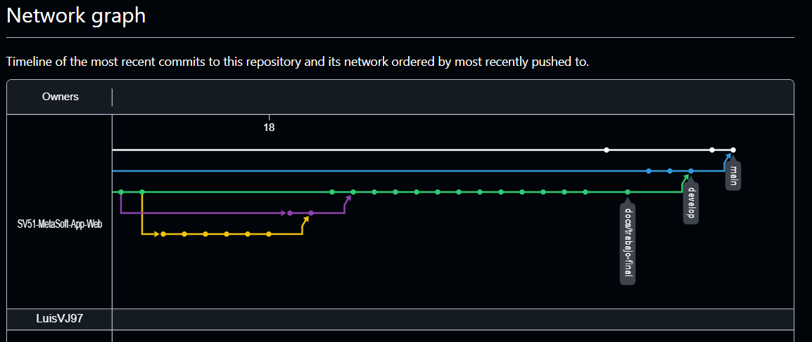

# Universidad Peruana De Ciencas Aplicadas
## SI730 Aplicaciones Web SV51 - Ingeniería de Software

 </img> 

# "Informe de Trabajo Final"
## Docente: Angel Augusto Velasquez Nuñez
## Startup: MetaSoft
## Producto: ElixirControl

 

## Relación de integrantes:

* **Janover Gonzalo Saldaña Vela    U20201B510**
* **Oscar Javier Armas Sánchez      U20211G192**
* **Luis Alfonso Villegas Jipa      U201717523**
* **Gustavo Esau Huanca Navarro     U202215285**
* **Vicente Quijandria Araneda      U201822697**

### 2024 - 02

---

 

## Registro de Versiones del Informe

<table>
    <thead>
        <tr>
            <th>Versión</th>
            <th>Fecha</th>
            <th>Autor</th>
            <th>Descripción de Modificación</th>
        </tr>
    </thead>
    <tbody>
        <!-- Fila 1-->
        <tr>
            <td>1.0</td>
            <td>17/08/2024</td>
            <td>Gonzalo Saldana</td>
            <td>Se creo la ramificación del repositorio y adicionó los documentos en su versión inicial previa a la investigacón</td>
        </tr>
         <!-- Fila 2-->
        <tr>
            <td>1.1</td>
            <td>22/08/2024</td>
            <td>Oscar Armas</td>
            <td>Se comenzó la redacción del capítulo 1 "Introducción"</td>
        </tr>
         <!-- Fila 3-->
        <tr>
            <td>1.2</td>
            <td>25/08/2024</td>
            <td>Gonzalo Saldana</td>
            <td>Se comenzó la redacción del capítulo 2 "Requirements Elicitation & Analysis"</td>
        </tr>
         <!-- Fila 4-->
        <tr>
            <td>1.3</td>
            <td>26/08/2024</td>
            <td>Juan Llamccaya</td>
            <td>Continuación de la redacción del capítulo 2 "Requirements Elicitation & Analysis"</td>
        </tr>
         <!-- Fila 5-->
        <tr>
            <td>1.4</td>
            <td>28/08/2024</td>
            <td>Gonzalo Saldaña, Jhordi  Carranza, Oscar Armas, Luis Villegas</td>
            <td>Se comenzó la redacción del capítulo 3 "Requirements Specification" , redacción de historias de usuario</td>
        </tr>
         <!-- Fila 6-->
        <tr>
            <td>1.5</td>
            <td>30/08/2024</td>
            <td>Gonzalo Saldaña</td>
            <td>Se comenzó la redacción del capítulo 4 "Product Design"</td>
        </tr>
         <!-- Fila 7-->
        <tr>
            <td>1.6</td>
            <td>31/08/2024</td>
            <td>Jhordi  Carranza, Juan Llamccaya </td>
            <td>Continuación de la redacción del capítulo 4 "Product Design"</td>
        </tr>
        <!-- Fila 8-->
        <tr>
            <td>1.7</td>
            <td>02/09/2024</td>
            <td>Gonzalo Saldaña, Oscar Armas, Luis Villegas </td>
            <td>Se comenzó la elaboración de wireframes y mockups de la aplicación del capítulo 4 "Product Design"</td>
        </tr>
        <!-- Fila 9-->  
        <tr>
            <td>1.8</td>
            <td>04/09/2024</td>
            <td>Juan Llamccaya</td>
            <td>Se comenzó la elaboración de wireflows del capítulo 4 "Product Design"</td>
        </tr>
        <!-- Fila 10--> 
        <tr>
            <td>1.9</td>
            <td>05/09/2024</td>
            <td>Gonzalo Saldaña, Jhordi  Carranza, Oscar Armas, Luis Villegas</td>
            <td>Se comenzó la elaboración de la landing page, documentación</td>   
        </tr>
        <!-- Fila 11-->
        <tr>
            <td>1.10</td>
            <td>06/09/2024</td>
            <td>Oscar Armas</td>
            <td>Se comenzó la redacción del capítulo 5 "Product Implementation, Validation & Deployment"</td>
        </tr>
        <!-- Fila 12-->
        <tr>
            <td>1.11</td>
            <td>06/09/2024</td>
            <td>Luis Villegas</td>
            <td>Continuación de la redacción del capítulo 5 "Product Implementation, Validation & Deployment"</td>
        </tr>
        <!-- Fila 13--> 
        <tr>
            <td>1.12</td>
            <td>07/09/2024</td>
            <td>Jhordi  Carranza</td>
            <td>Continuación de la redacción del 5 "Product Implementation, Validation & Deployment"</td>
        </tr>
        <!-- Fila 14-->
        <tr>
            <td>1.13</td>
            <td>08/09/2024</td>
            <td>Gonzalo Saldaña, Jhordi  Carranza, Oscar Armas, Luis Villegas</td>
            <td>Finalización de items del Capítulo 5 del documento</td>
        </tr>
        <!-- Fila 15 -->
<tr>
    <td>2.0</td>
    <td>02/09/2024</td>
    <td>Luis Villegas, Vicente Quijandria, Oscar Armas, Gustavo Huanca</td>
    <td>Se actualizó la redacción de los Product backlog en el capítulo 3</td>
</tr>
<!-- Fila 16 -->
<tr>
    <td>2.1</td>
    <td>02/09/2024</td>
    <td>Janover Saldaña</td>
    <td>Se actualizó la redacción de los Epic stories y User stories en el capítulo 3</td>
</tr>
<!-- Fila 17 -->
<tr>
    <td>2.2</td>
    <td>07/09/2024</td>
    <td>Oscar Armas</td>
    <td>Se actualizó la redacción de los Product backlog en el capítulo 3</td>
</tr>
<!-- Fila 18 -->
<tr>
    <td>2.3</td>
    <td>08/09/2024</td>
    <td>Oscar Armas</td>
    <td>Se agregó la redacción de los Technical stories en el capítulo 3</td>
</tr>
<!-- Fila 19 -->
<tr>
    <td>2.4</td>
    <td>09/09/2024</td>
    <td>Luis Villegas</td>
    <td>Se actualizó la redacción de los Technical stories en el capítulo 3</td>
</tr>
<!-- Fila 20 -->
<tr>
    <td>2.5</td>
    <td>09/09/2024</td>
    <td>Luis Villegas, Vicente Quijandria, Oscar Armas, Gustavo Huanca</td>
    <td>Se añadió la redacción del student outcome en el documento</td>
</tr>
<!-- Fila 21 -->
<tr>
    <td>2.6</td>
    <td>09/09/2024</td>
    <td>Luis Villegas</td>
    <td>Se actualizó la redacción de los User stories en el capítulo 3</td>
</tr>
<!-- Fila 22 -->
<tr>
    <td>2.7</td>
    <td>26/09/2024</td>
    <td>Janover Saldaña</td>
    <td>Se actualizaron los diagramas de clase, directorios de clase y el diagrama de base de datos en el capítulo 4</td>
</tr>
<!-- Fila 23 -->
<tr>
    <td>2.8</td>
    <td>26/09/2024</td>
    <td>Luis Villegas</td>
    <td>Se actualizó la redacción de las clases de directorio en el capítulo 4</td>
</tr>
<!-- Fila 24 -->
<tr>
    <td>2.9</td>
    <td>26/09/2024</td>
    <td>Luis Villegas</td>
    <td>Se actualizaron los diagramas de clase y diagrama de base de datos en el capítulo 4</td>
</tr>
<!-- Fila 25 -->
<tr>
    <td>2.10</td>
    <td>27/09/2024</td>
    <td>Vicente Quijandria</td>
    <td>Se agregó la redacción del Sprint Backlog 02 en el capítulo 5</td>
</tr>
<!-- Fila 26 -->
<tr>
    <td>2.11</td>
    <td>27/09/2024</td>
    <td>Luis Villegas</td>
    <td>Se actualizó la redacción del Sprint Backlog 02 en el capítulo 5</td>
</tr>
<!-- Fila 27 -->
<tr>
    <td>2.12</td>
    <td>27/09/2024</td>
    <td>Oscar Armas</td>
    <td>Se agregaron las conclusiones del proyecto en el capítulo 5</td>
</tr>
<!-- Fila 28 -->
<tr>
    <td>2.13</td>
    <td>27/09/2024</td>
    <td>Luis Villegas</td>
    <td>Se agregaron las bibliografías del proyecto en el capítulo 5</td>
</tr>
<!-- Fila 29 -->
<tr>
    <td>3.0</td>
    <td>23/10/2024</td>
    <td>Vicente Quijandria</td>
    <td>Se actualizó la redacción de los User stories en el capítulo 3</td>
</tr>
<!-- Fila 30 -->
<tr>
    <td>3.1</td>
    <td>27/10/2024</td>
    <td>Luis Villegas</td>
    <td>Se actualizó la redacción de los User stories 28 y 29 en el capítulo 3</td>
</tr>
<!-- Fila -->
<tr>
    <td>3.2</td>
    <td>27/10/2024</td>
    <td>Vicente Quijandria</td>
    <td>Se añadieron los user stories 30, 31 y TS 1, 2 y 3.</td>
</tr>
<!-- Fila 31 -->
<tr>
    <td>3.3</td>
    <td>01/11/2024</td>
    <td>Vicente Quijandria</td>
    <td>Se agregó la redacción en el Sprint Backlog 03 en el capítulo 5</td>
</tr>
<!-- Fila 32 -->
<tr>
    <td>3.4</td>
    <td>01/11/2024</td>
    <td>Luis Villegas</td>
    <td>Se agregó la redacción en la sección "5.2.3.2", "5.3.2" y "5.3.3" en el capítulo 5</td>
</tr>
<!-- Fila 33 -->
<tr>
    <td>3.5</td>
    <td>01/11/2024</td>
    <td>Oscar Armas</td>
    <td>Se agregaron imágenes de la entrevista con el vinicultor en el capítulo 5</td>
</tr>
<!-- Fila 34 -->
<tr>
    <td>3.6</td>
    <td>01/11/2024</td>
    <td>Luis Villegas</td>
    <td>Se realizaron correcciones de imágenes en el capítulo 5</td>
</tr>
<!-- Fila 35 -->
<tr>
    <td>3.7</td>
    <td>02/11/2024</td>
    <td>Vicente Quijandria</td>
    <td>Se actualizó la redacción en la sección "5.2.3.2" en el capítulo 5</td>
</tr>
<!-- Fila 36 -->
<tr>
    <td>3.8</td>
    <td>03/11/2024</td>
    <td>Luis Villegas</td>
    <td>Se actualizó la redacción en la sección "5.2.3.4" y "5.2.3.5" en el capítulo 5</td>
</tr>
<!-- Fila 37 -->
<tr>
    <td>3.9</td>
    <td>03/11/2024</td>
    <td>Janover Saldaña</td>
    <td>Se actualizaron las conclusiones del proyecto en el capítulo 5</td>
</tr>
<!-- Fila 38 -->
<tr>
    <td>3.10</td>
    <td>03/11/2024</td>
    <td>Luis Villegas</td>
    <td>Se actualizaron las bibliografías del proyecto en el capítulo 5</td>
</tr>
<!-- Fila 39 -->
<tr>
    <td>3.11</td>
    <td>03/11/2024</td>
    <td>Vicente Quijandria</td>
    <td>Se añadieron las evidencias con sus detalles de todos los servicios del backend del Sprint 3</td>
</tr>
<!-- Fila 40 -->
<tr>
    <td>3.12</td>
    <td>03/11/2024</td>
    <td>Luis Villegas</td>
    <td>Se actualizó la redacción en la sección "5.2.3.8" en el capítulo 5</td>
</tr>
<!-- Fila 41 -->
<tr>
    <td>3.13</td>
    <td>03/11/2024</td>
    <td>Gustavo Huanca</td>
    <td>Se agrego los pasos para el despliegue del servicio web</td>
</tr>
<!-- Fila 42 -->
<tr>
    <td>3.14</td>
    <td>03/11/2024</td>
    <td>Gustavo Huanca</td>
    <td>Se agrego la evidencia de documentación de servicios para el sprint 3.</td>
</tr>
<!-- Fila 43 -->
<tr>
    <td>3.15</td>
    <td>03/11/2024</td>
    <td>Gustavo Huanca</td>
    <td>Se implemento las evidencias del despliegue del servicio web del sprint 3</td>
</tr>
<!-- Fila 44 -->
<tr>
    <td>3.16</td>
    <td>03/11/2024</td>
    <td>Vicente Quijandria</td>
    <td>Se implemento las evidencias de los commits del frontend del Sprint 3</td>
</tr>
<!-- Fila 45 -->
<tr>
    <td>3.17</td>
    <td>03/11/2024</td>
    <td>Gustavo Huanca</td>
    <td>Se implemento las evidencias del despliegue de la base de datos del sprint 3</td>
</tr>
<!-- Fila 46 -->
<tr>
    <td>3.18</td>
    <td>03/11/2024</td>
    <td>Vicente Quijandria</td>
    <td>Se implemento las evidencias de los commits del backend del Sprint 3</td>
</tr>
<!-- Fila 47 -->
<tr>
    <td>3.19</td>
    <td>26/10/2024</td>
    <td>Oscar Armas</td>
    <td>Se implementó el video "About the Product".</td>
</tr>
<!-- Fila 48 -->
<tr>
    <td>3.20</td>
    <td>27/10/2024</td>
    <td>Oscar Armas</td>
    <td>Se actualizó el landing page con el video "About the Product".</td>
</tr>
<!-- Fila 49 -->
<tr>
    <td>3.21</td>
    <td>28/10/2024</td>
    <td>Oscar Armas</td>
    <td>Se añadieron evaluaciones de usabilidad según heurísticas.</td>
</tr>
<!-- Fila 50 -->
<tr>
    <td>3.22</td>
    <td>29/10/2024</td>
    <td>Oscar Armas</td>
    <td>Se implementaron entrevistas a los productores objetivos.</td>
</tr>
<!-- Fila 51 -->
<tr>
    <td>3.23</td>
    <td>30/10/2024</td>
    <td>Oscar Armas</td>
    <td>Se documentaron las entrevistas realizadas.</td>
</tr>
<!-- Fila 52 -->
<tr>
    <td>4.1</td>
    <td>12/11/2024</td>
    <td>Janover Saldaña</td>
    <td>Se corrigió la ruta de las imagenes que corresponden al Sprint 3 en el capitulo 5</td>
</tr>
<!-- Fila 53 -->
<tr>
    <td>4.2</td>
    <td>13/11/2024</td>
    <td>Janover Saldaña</td>
    <td> Se construyó y readactó la estructura base del Sprint Planning y sprint Backlog para el sprint 4  </td>
</tr>
<!-- Fila 54 -->
<tr>
    <td>4.3</td>
    <td>13/11/2024</td>
    <td>Luis Villegas</td>
    <td> Se agrego la redaccion de los sprint TS-15, TS-17, US-27 y US-31 en el sprint Backlog 4  </td>
</tr>
 <!-- Fila 55 -->
<tr>
    <td>4.4</td>
    <td>15/11/2024</td>
    <td>Luis Villegas</td>
    <td> Se implementó los videos de ejecucion del landing page y del frontend en el "Execution Evidence for Sprint Review" </td>
</tr> 
 <!-- Fila 56 -->
<tr>
    <td>4.5</td>
    <td>15/11/2024</td>
    <td>Luis Villegas</td>
    <td> Se creo la carpeta de "sprint-4" en la ruta de assets para la implementacion de imagenes </td>
</tr>
<!-- Fila 57 -->
<tr>
    <td>4.6</td>
    <td>17/11/2024</td>
    <td>Vicente Quijandria</td>
    <td>Se agrego la foto de Vicente en la ruta assets</td>
</tr>  
<!-- Fila 58 -->
<tr>
    <td>4.7</td>
    <td>17/11/2024</td>
    <td>Vicente Quijandria</td>
    <td>Se actualizo la sección de integrantes del equipo para añadir a Vicente</td>
</tr> 
<!-- Fila 59 -->
<tr>
    <td>4.8</td>
    <td>17/11/2024</td>
    <td>Vicente Quijandria</td>
    <td>Se añadieron las tasks de TS-12, TS-18, US-34 y US-35 en el Sprint backlog 4</td>
</tr> 
<!-- Fila 60 -->
<tr>
    <td>4.10</td>
    <td>17/11/2024</td>
    <td>Vicente Quijandria</td>
    <td>Se corrigieron errores de imagenes no mostrandose correctamente</td>
</tr>
<!-- Fila 61 -->
<tr>
    <td>4.11</td>
    <td>17/11/2024</td>
    <td>Gustavo Huanca</td>
    <td>Se actualizo la sección de integrantes del equipo para añadir a Gustavo</td>
</tr> 
<!-- Fila 62 -->
<tr>
    <td>4.12</td>
    <td>17/11/2024</td>
    <td>Luis Villegasa</td>
    <td>Se implementó el video de ejecucion del backend en el "Execution Evidence for Sprint Review </td>
</tr>
<!-- Fila 63 -->
<tr>
    <td>4.13</td>
    <td>17/11/2024</td>
    <td>Luis Villegas</td>
    <td>Se agrego la redaccion en la seccion "5.2.4.3"</td>
</tr> 
<!-- Fila 64 -->
<tr>
    <td>4.14</td>
    <td>18/11/2024</td>
    <td>Gustavo Huanca</td>
    <td>Se agrego el evidence documentation del sprint 4"</td>
</tr> 
<!-- Fila 65 -->       
<tr>
    <td>4.15</td>
    <td>11/11/2024</td>
    <td>Oscar Armas</td>
    <td>Actualización y corrección del reporte en el capítulo 5 del Sprint 4.</td>
</tr>
<!-- Fila 66 -->
<tr>
    <td>4.16</td>
    <td>12/11/2024</td>
    <td>Oscar Armas</td>
    <td>Corrección de enrutamiento de imágenes.</td>
</tr>
<!-- Fila 67 -->
<tr>
    <td>4.17</td>
    <td>14/11/2024</td>
    <td>Oscar Armas</td>
    <td>Edición de los videos en la sección "About the Team".</td>
</tr>
<!-- Fila 68 -->
<tr>
    <td>4.18</td>
    <td>16/11/2024</td>
    <td>Oscar Armas</td>
    <td>Agregación de 2 evaluaciones según heurísticas.</td>
</tr>
<!-- Fila 69 -->
<tr>
    <td>4.19</td>
    <td>17/11/2024</td>
    <td>Oscar Armas</td>
    <td>Actualización y corrección de los User Stories.</td>
</tr>
<!-- Fila 70 -->
<tr>
    <td>4.20</td>
    <td>17/11/2024</td>
    <td>Oscar Armas</td>
    <td>Agregación de mi parte en el Sprint Backlog 4.</td>
</tr>
<!-- Fila 71 -->
<tr>
    <td>4.21</td>
    <td>17/11/2024</td>
    <td>Luis Villegas</td>
    <td>Se actualizó la reddacion en la seccion "5.2.2.5" y "5.2.3.5" </td>
</tr>
<!-- Fila 72 -->
<tr>
    <td>4.22</td>
    <td>17/11/2024</td>
    <td>Luis Villegas</td>
    <td>Se agrego archivos ".feature" para el testing para el Sprint 4 </td>
</tr><!-- Fila 73 -->
<tr>
    <td>4.23</td>
    <td>17/11/2024</td>
    <td>Luis Villegas</td>
    <td>Se actualizó la reddacion en la seccion "5.2.4.4" </td>
</tr>
    </tbody>
</table>

## Project Report Collaboration Insights

**URL del repositorio para el reporte del proyecto:** https://github.com/SV51-MetaSoft-App-Web/MetaSoft-Project-Report

Github Collaboration Insights proporciona un cronograma que muestra las principales ramas y los procesos de fusión que han ocurrido. Todas las ramas se han generado siguiendo los principios de GitFlow, lo que garantiza una organización efectiva al utilizar un sistema de control de versiones.

* Janover Gonzalo Saldaña Vela (JanoverSaldana)
* Oscar Javier Armas Sánchez (Racso24k)
* Luis Alfonso Villegas Jipa (LuisVJ97)
* Gustavo Esau Huanca Navarro (petitavo)
* Vicente Quijandria Araneda (vquijandria)

Se dividieron las siguientes ramas para la colaboración en el proyecto:

* main
* capitulo-I
* capitulo-II
* capitulo-III
* capitulo-IV
* capitulo-V
* develop
* release-v1.0

### Entregable TB1

A continuación se presentan los gráficos de colaboración de los integrantes del equipo en el repositorio de nuestro primer sprint. Estos gráficos ofrecen una representación visual de la cantidad de contribuciones realizadas por cada miembro del equipo, junto con la fecha en que se llevaron a cabo. Además, se presenta información sobre la cantidad de líneas de código que se han modificado en cada uno de los commits.

**Gráficos de colaboración de los integrantes del equipo**

### Entregable TRABAJO PARCIAL (TP)

A continuación se presentan los gráficos de colaboración de los integrantes del equipo en el
repositorio de nuestro segundo sprint. Estos gráficos ofrecen una representación visual de la cantidad
de contribuciones realizadas por cada miembro del equipo, junto con la fecha en que se llevaron a
cabo. Además, se presenta información sobre la cantidad de líneas de código que se han modificado
en cada uno de los commits.

### Entregable TB2

A continuación se presentan los gráficos de colaboración de los integrantes del equipo en el repositorio de nuestro Tercer sprint. Estos gráficos ofrecen una representación visual de la cantidad de contribuciones realizadas por cada miembro del equipo, junto con la fecha en que se llevaron a cabo. Además, se presenta información sobre la cantidad de líneas de código que se han modificado en cada uno de los commits.

### Entregable TRABAJO FINAL (TF)

A continuación se presentan los gráficos de colaboración de los integrantes del equipo en el
repositorio de nuestro segundo sprint. Estos gráficos ofrecen una representación visual de la cantidad
de contribuciones realizadas por cada miembro del equipo, junto con la fecha en que se llevaron a
cabo. Además, se presenta información sobre la cantidad de líneas de código que se han modificado
en cada uno de los commits.

## Contenido 

# [Capítulo I: Introducción](https://github.com/SV51-MetaSoft-App-Web/MetaSoft-Project-Report/blob/main/docs/chapter-I.md#cap%C3%ADtulo-i-introducci%C3%B3n)

## [1.1. Startup Profile](https://github.com/SV51-MetaSoft-App-Web/MetaSoft-Project-Report/blob/main/docs/chapter-I.md#11-startup-profile)
### [1.1.1.Descripción de la Startup](https://github.com/SV51-MetaSoft-App-Web/MetaSoft-Project-Report/blob/main/docs/chapter-I.md#111-descripci%C3%B3n-de-la-startup)
### [1.1.2. Perfiles de integrantes del equipo](https://github.com/SV51-MetaSoft-App-Web/MetaSoft-Project-Report/blob/main/docs/chapter-I.md#112-perfiles-de-integrantes-del-equipo)
## [1.2. Solution Profile](https://github.com/SV51-MetaSoft-App-Web/MetaSoft-Project-Report/blob/main/docs/chapter-I.md#12-solution-profile)
### [1.2.1 Antecedentes y problemática](https://github.com/SV51-MetaSoft-App-Web/MetaSoft-Project-Report/blob/main/docs/chapter-I.md#121-antecedentes-y-problem%C3%A1tica)
### [1.2.2 Lean UX Process.](https://github.com/SV51-MetaSoft-App-Web/MetaSoft-Project-Report/blob/main/docs/chapter-I.md#122-lean-ux-process)
#### [1.2.2.1. Lean UX Problem Statements.](https://github.com/SV51-MetaSoft-App-Web/MetaSoft-Project-Report/blob/main/docs/chapter-I.md#1221-lean-ux-problem-statements)
#### [1.2.2.2. Lean UX Assumptions.](https://github.com/SV51-MetaSoft-App-Web/MetaSoft-Project-Report/blob/main/docs/chapter-I.md#1222-lean-ux-assumptions)
#### [1.2.2.3. Lean UX Hypothesis Statements.](https://github.com/SV51-MetaSoft-App-Web/MetaSoft-Project-Report/blob/main/docs/chapter-I.md#1223-lean-ux-hypothesis-statements)
#### [1.2.2.4. Lean UX Canvas.](https://github.com/SV51-MetaSoft-App-Web/MetaSoft-Project-Report/blob/main/docs/chapter-I.md#1224-lean-ux-canvas)
## [1.3. Segmentos objetivo](https://github.com/SV51-MetaSoft-App-Web/MetaSoft-Project-Report/blob/main/docs/chapter-I.md#13-segmentos-objetivo)

# [Capítulo II: Requirements Elicitation & Analysis](https://github.com/SV51-MetaSoft-App-Web/MetaSoft-Project-Report/blob/main/docs/chapter-II.md#cap%C3%ADtulo-ii-requirements-elicitation--analysis)

## [2.1. Competidores.](https://github.com/SV51-MetaSoft-App-Web/MetaSoft-Project-Report/blob/main/docs/chapter-II.md#21-competidores)
### [2.1.1. Análisis competitivo.](https://github.com/SV51-MetaSoft-App-Web/MetaSoft-Project-Report/blob/main/docs/chapter-II.md#211-an%C3%A1lisis-competitivo)
### [2.1.2. Estrategias y tácticas frente a competidores.](https://github.com/SV51-MetaSoft-App-Web/MetaSoft-Project-Report/blob/main/docs/chapter-II.md#212-estrategias-y-t%C3%A1cticas-frente-a-competidores)
## [2.2. Entrevistas.](https://github.com/SV51-MetaSoft-App-Web/MetaSoft-Project-Report/blob/main/docs/chapter-II.md#22-entrevistas)
### [2.2.1. Diseño de entrevistas.](https://github.com/SV51-MetaSoft-App-Web/MetaSoft-Project-Report/blob/main/docs/chapter-II.md#221-dise%C3%B1o-de-entrevistas)
### [2.2.2. Registro de entrevistas.](https://github.com/SV51-MetaSoft-App-Web/MetaSoft-Project-Report/blob/main/docs/chapter-II.md#222-registro-de-entrevistas)
### [2.2.3. Análisis de entrevistas.](https://github.com/SV51-MetaSoft-App-Web/MetaSoft-Project-Report/blob/main/docs/chapter-II.md#223-an%C3%A1lisis-de-entrevistas)
## [2.3. Needfinding.](https://github.com/SV51-MetaSoft-App-Web/MetaSoft-Project-Report/blob/main/docs/chapter-II.md#23-needfinding)
### [2.3.1. User Personas.](https://github.com/SV51-MetaSoft-App-Web/MetaSoft-Project-Report/blob/main/docs/chapter-II.md#231-user-personas)
### [2.3.2. User Task Matrix.](https://github.com/SV51-MetaSoft-App-Web/MetaSoft-Project-Report/blob/main/docs/chapter-II.md#232-user-task-matrix)
### [2.3.3. User Journey Mapping.](https://github.com/SV51-MetaSoft-App-Web/MetaSoft-Project-Report/blob/main/docs/chapter-II.md#233-user-journey-mapping)
### [2.3.4. Empathy Mapping.](https://github.com/SV51-MetaSoft-App-Web/MetaSoft-Project-Report/blob/main/docs/chapter-II.md#234-empathy-mapping)
### [2.3.5. As-is Scenario Mapping](https://github.com/SV51-MetaSoft-App-Web/MetaSoft-Project-Report/blob/main/docs/chapter-II.md#235-as-is-scenario-mapping)
## [2.4. Ubiquitous Language.](https://github.com/SV51-MetaSoft-App-Web/MetaSoft-Project-Report/blob/main/docs/chapter-II.md#24-ubiquitous-language)

# [Capítulo III: Requirements Specification](https://github.com/SV51-MetaSoft-App-Web/MetaSoft-Project-Report/blob/main/docs/chapter-III.md#cap%C3%ADtulo-iii-requirements-specification)

## [3.1. To-Be Scenario Mapping.](https://github.com/SV51-MetaSoft-App-Web/MetaSoft-Project-Report/blob/main/docs/chapter-III.md#31-to-be-scenario-mapping)
## [3.2. User Stories.](https://github.com/SV51-MetaSoft-App-Web/MetaSoft-Project-Report/blob/main/docs/chapter-III.md#32-user-stories)
## [3.3. Impact Mapping.](https://github.com/SV51-MetaSoft-App-Web/MetaSoft-Project-Report/blob/main/docs/chapter-III.md#33-impact-mapping)
## [3.4. Product Backlog.](https://github.com/SV51-MetaSoft-App-Web/MetaSoft-Project-Report/blob/main/docs/chapter-III.md#34-product-backlog)

# [Capítulo IV: Product Design](https://github.com/SV51-MetaSoft-App-Web/MetaSoft-Project-Report/blob/main/docs/chapter-IV.md#cap%C3%ADtulo-iv-product-design)

##  [4.1. Style Guidelines.](https://github.com/SV51-MetaSoft-App-Web/MetaSoft-Project-Report/blob/main/docs/chapter-IV.md#41-style-guidelines)
### [4.1.1. General Style Guidelines.](https://github.com/SV51-MetaSoft-App-Web/MetaSoft-Project-Report/blob/main/docs/chapter-IV.md#411-general-style-guidelines)
### [4.1.2. Web Style Guidelines.](https://github.com/SV51-MetaSoft-App-Web/MetaSoft-Project-Report/blob/main/docs/chapter-IV.md#412-web-style-guidelines)
##  [4.2. Information Architecture.](https://github.com/SV51-MetaSoft-App-Web/MetaSoft-Project-Report/blob/main/docs/chapter-IV.md#42-information-architecture)
### [ 4.2.1. Organization Systems.](https://github.com/SV51-MetaSoft-App-Web/MetaSoft-Project-Report/blob/main/docs/chapter-IV.md#421-organization-systems)
### [ 4.2.2. Labeling Systems.](https://github.com/SV51-MetaSoft-App-Web/MetaSoft-Project-Report/blob/main/docs/chapter-IV.md#422-labeling-systems)
### [ 4.2.3. SEO Tags and Meta Tags](https://github.com/SV51-MetaSoft-App-Web/MetaSoft-Project-Report/blob/main/docs/chapter-IV.md#423-seo-tags-and-meta-tags)
### [ 4.2.4. Searching Systems.](https://github.com/SV51-MetaSoft-App-Web/MetaSoft-Project-Report/blob/main/docs/chapter-IV.md#424-searching-systems)
### [ 4.2.5. Navigation Systems.](https://github.com/SV51-MetaSoft-App-Web/MetaSoft-Project-Report/blob/main/docs/chapter-IV.md#425-navigation-systems)
##  [4.3. Landing Page UI Design.](https://github.com/SV51-MetaSoft-App-Web/MetaSoft-Project-Report/blob/main/docs/chapter-IV.md#43-landing-page-ui-design)
### [ 4.3.1. Landing Page Wireframe.](https://github.com/SV51-MetaSoft-App-Web/MetaSoft-Project-Report/blob/main/docs/chapter-IV.md#431-landing-page-wireframe)
### [ 4.3.2. Landing Page Mock-up.](https://github.com/SV51-MetaSoft-App-Web/MetaSoft-Project-Report/blob/main/docs/chapter-IV.md#432-landing-page-mock-up)
##  [4.4. Web Applications UX/UI Design.](https://github.com/SV51-MetaSoft-App-Web/MetaSoft-Project-Report/blob/main/docs/chapter-IV.md#44-web-applications-uxui-design)
### [ 4.4.1. Web Applications Wireframes.](https://github.com/SV51-MetaSoft-App-Web/MetaSoft-Project-Report/blob/main/docs/chapter-IV.md#441-web-applications-wireframes)
### [ 4.4.2. Web Applications Wireflow Diagrams.](https://github.com/SV51-MetaSoft-App-Web/MetaSoft-Project-Report/blob/main/docs/chapter-IV.md#442-web-applications-wireflow-diagrams)
### [ 4.4.2. Web Applications Mock-ups.](https://github.com/SV51-MetaSoft-App-Web/MetaSoft-Project-Report/blob/main/docs/chapter-IV.md#442-web-applications-mock-ups)
### [ 4.4.3. Web Applications User Flow Diagrams.](https://github.com/SV51-MetaSoft-App-Web/MetaSoft-Project-Report/blob/main/docs/chapter-IV.md#443-web-applications-user-flow-diagrams)
##  [4.5. Web Applications Prototyping.](https://github.com/SV51-MetaSoft-App-Web/MetaSoft-Project-Report/blob/main/docs/chapter-IV.md#45-web-applications-prototyping)
##  [4.6. Domain-Driven Software Architecture.](https://github.com/SV51-MetaSoft-App-Web/MetaSoft-Project-Report/blob/main/docs/chapter-IV.md#46-domain-driven-software-architecture)
##  [4.6.1. Software Architecture Context Diagram.](https://github.com/SV51-MetaSoft-App-Web/MetaSoft-Project-Report/blob/main/docs/chapter-IV.md#461-software-architecture-context-diagram)
### [ 4.6.2. Software Architecture Container Diagrams.](https://github.com/SV51-MetaSoft-App-Web/MetaSoft-Project-Report/blob/main/docs/chapter-IV.md#462-software-architecture-container-diagrams)
### [ 4.6.3. Software Architecture Components Diagrams.](https://github.com/SV51-MetaSoft-App-Web/MetaSoft-Project-Report/blob/main/docs/chapter-IV.md#463-software-architecture-components-diagrams)
##  [4.7. Software Object-Oriented Design.](https://github.com/SV51-MetaSoft-App-Web/MetaSoft-Project-Report/blob/main/docs/chapter-IV.md#47-software-object-oriented-design)
### [ 4.7.1. Class Diagrams.](https://github.com/SV51-MetaSoft-App-Web/MetaSoft-Project-Report/blob/main/docs/chapter-IV.md#471-class-diagrams)
### [ 4.7.2. Class Dictionary.](https://github.com/SV51-MetaSoft-App-Web/MetaSoft-Project-Report/blob/main/docs/chapter-IV.md#472-class-dictionary)
##  [4.8. Database Design.](https://github.com/SV51-MetaSoft-App-Web/MetaSoft-Project-Report/blob/main/docs/chapter-IV.md#48-database-design)
### [ 4.8.1. Database Diagram](https://github.com/SV51-MetaSoft-App-Web/MetaSoft-Project-Report/blob/main/docs/chapter-IV.md#481-database-diagram)

# [Capítulo V: Product Implementation, Validation & Deployment](https://github.com/SV51-MetaSoft-App-Web/MetaSoft-Project-Report/blob/main/docs/chapter-V.md#cap%C3%ADtulo-v-product-implementation-validation--deployment)

### [5.1. Software Configuration Management.](https://github.com/SV51-MetaSoft-App-Web/MetaSoft-Project-Report/blob/main/docs/chapter-V.md#51-software-configuration-management)
### [5.1.1. Software Development Environment Configuration.](https://github.com/SV51-MetaSoft-App-Web/MetaSoft-Project-Report/blob/main/docs/chapter-V.md#511-software-development-environment-configuration)
### [5.1.2. Source Code Management.](https://github.com/SV51-MetaSoft-App-Web/MetaSoft-Project-Report/blob/main/docs/chapter-V.md#512-source-code-management)
### [5.1.3. Source Code Style Guide & Conventions.](https://github.com/SV51-MetaSoft-App-Web/MetaSoft-Project-Report/blob/main/docs/chapter-V.md#513-source-code-style-guide--conventions)
### [5.1.4. Software Deployment Configuration.](https://github.com/SV51-MetaSoft-App-Web/MetaSoft-Project-Report/blob/main/docs/chapter-V.md#514-software-deployment-configuration)
## [5.2. Landing Page, Services & Applications Implementation.](https://github.com/SV51-MetaSoft-App-Web/MetaSoft-Project-Report/blob/main/docs/chapter-V.md#52-landing-page-services--applications-implementation)
### [5.2.1. Sprint 1](https://github.com/SV51-MetaSoft-App-Web/MetaSoft-Project-Report/blob/main/docs/chapter-V.md#521-sprint-n)
#### [5.2.1.1. Sprint Planning 1.](https://github.com/SV51-MetaSoft-App-Web/MetaSoft-Project-Report/blob/main/docs/chapter-V.md#5211-sprint-planning-1)
##### [5.2.1.2. Sprint Backlog 1.](https://github.com/SV51-MetaSoft-App-Web/MetaSoft-Project-Report/blob/main/docs/chapter-V.md#5212-sprint-backlog-1)
##### [5.2.1.3. Development Evidence for Sprint Review.](https://github.com/SV51-MetaSoft-App-Web/MetaSoft-Project-Report/blob/main/docs/chapter-V.md#5213-development-evidence-for-sprint-review)
##### [5.2.1.4. Testing Suite Evidence for Sprint Review.](https://github.com/SV51-MetaSoft-App-Web/MetaSoft-Project-Report/blob/main/docs/chapter-V.md#5214-testing-suite-evidence-for-sprint-review)
##### [5.2.1.5. Execution Evidence for Sprint Review.](https://github.com/SV51-MetaSoft-App-Web/MetaSoft-Project-Report/blob/main/docs/chapter-V.md#5215-execution-evidence-for-sprint-review)
##### [5.2.1.6. Services Documentation Evidence for Sprint Review.](https://github.com/SV51-MetaSoft-App-Web/MetaSoft-Project-Report/blob/main/docs/chapter-V.md#5216-services-documentation-evidence-for-sprint-review)
##### [5.2.1.7. Software Deployment Evidence for Sprint Review.](https://github.com/SV51-MetaSoft-App-Web/MetaSoft-Project-Report/blob/main/docs/chapter-V.md#5217-software-deployment-evidence-for-sprint-review)
##### [5.2.1.8. Team Collaboration Insights during Sprint.](https://github.com/SV51-MetaSoft-App-Web/MetaSoft-Project-Report/blob/main/docs/chapter-V.md#5218-team-collaboration-insights-during-sprint)

### [5.2.2. Sprint 2](https://github.com/SV51-MetaSoft-App-Web/MetaSoft-Project-Report/blob/main/docs/chapter-V.md#521-sprint-n)
#### [5.2.2.1. Sprint Planning 2.](https://github.com/SV51-MetaSoft-App-Web/MetaSoft-Project-Report/blob/main/docs/chapter-V.md#5211-sprint-planning-1)
##### [5.2.2.2. Sprint Backlog 2.](https://github.com/SV51-MetaSoft-App-Web/MetaSoft-Project-Report/blob/main/docs/chapter-V.md#5212-sprint-backlog-1)
##### [5.2.2.3. Development Evidence for Sprint Review.](https://github.com/SV51-MetaSoft-App-Web/MetaSoft-Project-Report/blob/main/docs/chapter-V.md#5213-development-evidence-for-sprint-review)
##### [5.2.2.4. Testing Suite Evidence for Sprint Review.](https://github.com/SV51-MetaSoft-App-Web/MetaSoft-Project-Report/blob/main/docs/chapter-V.md#5214-testing-suite-evidence-for-sprint-review)
##### [5.2.2.5. Execution Evidence for Sprint Review.](https://github.com/SV51-MetaSoft-App-Web/MetaSoft-Project-Report/blob/main/docs/chapter-V.md#5215-execution-evidence-for-sprint-review)
##### [5.2.2.6. Services Documentation Evidence for Sprint Review.](https://github.com/SV51-MetaSoft-App-Web/MetaSoft-Project-Report/blob/main/docs/chapter-V.md#5216-services-documentation-evidence-for-sprint-review)
##### [5.2.2.7. Software Deployment Evidence for Sprint Review.](https://github.com/SV51-MetaSoft-App-Web/MetaSoft-Project-Report/blob/main/docs/chapter-V.md#5217-software-deployment-evidence-for-sprint-review)
##### [5.2.2.8. Team Collaboration Insights during Sprint.](https://github.com/SV51-MetaSoft-App-Web/MetaSoft-Project-Report/blob/main/docs/chapter-V.md#5218-team-collaboration-insights-during-sprint)

### [5.2.3. Sprint 3](https://github.com/SV51-MetaSoft-App-Web/MetaSoft-Project-Report/blob/main/docs/chapter-V.md#521-sprint-n)
#### [5.2.3.1. Sprint Planning 3.](https://github.com/SV51-MetaSoft-App-Web/MetaSoft-Project-Report/blob/main/docs/chapter-V.md#5211-sprint-planning-1)
##### [5.2.3.2. Sprint Backlog 3.](https://github.com/SV51-MetaSoft-App-Web/MetaSoft-Project-Report/blob/main/docs/chapter-V.md#5212-sprint-backlog-1)
##### [5.2.3.3. Development Evidence for Sprint Review.](https://github.com/SV51-MetaSoft-App-Web/MetaSoft-Project-Report/blob/main/docs/chapter-V.md#5213-development-evidence-for-sprint-review)
##### [5.2.3.4. Testing Suite Evidence for Sprint Review.](https://github.com/SV51-MetaSoft-App-Web/MetaSoft-Project-Report/blob/main/docs/chapter-V.md#5214-testing-suite-evidence-for-sprint-review)
##### [5.2.3.5. Execution Evidence for Sprint Review.](https://github.com/SV51-MetaSoft-App-Web/MetaSoft-Project-Report/blob/main/docs/chapter-V.md#5215-execution-evidence-for-sprint-review)
##### [5.2.3.6. Services Documentation Evidence for Sprint Review.](https://github.com/SV51-MetaSoft-App-Web/MetaSoft-Project-Report/blob/main/docs/chapter-V.md#5216-services-documentation-evidence-for-sprint-review)
##### [5.2.3.7. Software Deployment Evidence for Sprint Review.](https://github.com/SV51-MetaSoft-App-Web/MetaSoft-Project-Report/blob/main/docs/chapter-V.md#5217-software-deployment-evidence-for-sprint-review)
##### [5.2.3.8. Team Collaboration Insights during Sprint.](https://github.com/SV51-MetaSoft-App-Web/MetaSoft-Project-Report/blob/main/docs/chapter-V.md#5218-team-collaboration-insights-during-sprint)
## [5.3. Validation Interviews.]()
### [5.3.1. Diseño de Entrevistas.]()
### [5.3.2. Registro de Entrevistas.]()
### [5.3.3. Evaluaciones según heurísticas.]()
## [5.4. Video About-the-Product.]()

### [5.2.4. Sprint 4](https://github.com/SV51-MetaSoft-App-Web/MetaSoft-Project-Report/blob/main/docs/chapter-V.md#521-sprint-n)
#### [5.2.4.1. Sprint Planning 4.](https://github.com/SV51-MetaSoft-App-Web/MetaSoft-Project-Report/blob/main/docs/chapter-V.md#5211-sprint-planning-1)
##### [5.2.4.2. Sprint Backlog 4.](https://github.com/SV51-MetaSoft-App-Web/MetaSoft-Project-Report/blob/main/docs/chapter-V.md#5212-sprint-backlog-1)
##### [5.2.4.3. Development Evidence for Sprint Review.](https://github.com/SV51-MetaSoft-App-Web/MetaSoft-Project-Report/blob/main/docs/chapter-V.md#5213-development-evidence-for-sprint-review)
##### [5.2.4.4. Testing Suite Evidence for Sprint Review.](https://github.com/SV51-MetaSoft-App-Web/MetaSoft-Project-Report/blob/main/docs/chapter-V.md#5214-testing-suite-evidence-for-sprint-review)
##### [5.2.4.5. Execution Evidence for Sprint Review.](https://github.com/SV51-MetaSoft-App-Web/MetaSoft-Project-Report/blob/main/docs/chapter-V.md#5215-execution-evidence-for-sprint-review)
##### [5.2.4.6. Services Documentation Evidence for Sprint Review.](https://github.com/SV51-MetaSoft-App-Web/MetaSoft-Project-Report/blob/main/docs/chapter-V.md#5216-services-documentation-evidence-for-sprint-review)
##### [5.2.4.7. Software Deployment Evidence for Sprint Review.](https://github.com/SV51-MetaSoft-App-Web/MetaSoft-Project-Report/blob/main/docs/chapter-V.md#5217-software-deployment-evidence-for-sprint-review)
##### [5.2.4.8. Team Collaboration Insights during Sprint.](https://github.com/SV51-MetaSoft-App-Web/MetaSoft-Project-Report/blob/main/docs/chapter-V.md#5218-team-collaboration-insights-during-sprint)

## [Conclusiones]()

## [Referencias Bibliográficas]()

## Student Outcome

<table>
    <thead>
        <tr>
            <th>Criterio Específico</th>
            <th>Acciones Realizadas</th>
            <th>Conclusiones</th>
        </tr>
    </thead>
    <tbody>
        <tr>
            <td>
                <h4>Trabaja en equipo para proporcionar liderazgo en forma conjunta.</h4>
            </td>
            <td>
                
<strong>Presentable del TB1</strong>

                 
                <strong>Janover Gonzalo Saldaña Vela:</strong>
                  Durante el desarrollo de esta primera entrega, trabajar en equipo de manera conjunta fue un factor crucial para nuestra determinación en acabar con los entregables a tiempo y cumpliendo con los requisitos que nos pide el usuario final.
                  
                <strong>Luis Alfonso Villegas Jipa:</strong>
                  En la elaboración de la primera entrega, he realizado el análisis de competencia, los user stories sobre la funcionalidad de la aplicación, el product backlog y los diagramas de clase, comunicándome con mis compañeros para ir mejorando y agregando las secciones consecuentes que se requerían. Dando así, la culminación de esta primera entrega.
                  
                <strong>Jhordi Luis Carranza Pérez:</strong>
                  El desarrollo de esta primera parte del trabajo marcó un lazo importante entre los integrantes del equipo, la expresión de ideas claras y comunicación asertiva nos ayudó a poder desarrollar el proyecto de la mejor manera posible.
                  
                <strong>Oscar Javier Armas Sánchez:</strong>
                  En esta primera entrega, me enfoqué en desarrollar el Capítulo 1, abordando las secciones de Segmentos Objetivo y Solution Profile. Junto a mis compañeros, participamos activamente en la toma de decisiones para definir los segmentos clave y las características principales de la solución, asegurando su alineación con las necesidades identificadas. También me mantuve en constante comunicación con el equipo, lo que permitió mejorar y completar las secciones necesarias, logrando así finalizar esta etapa del proyecto.
                  
                <strong>Juan Paul Llamccaya Arone:</strong>
                  Durante esta primera entrega, me enfoqué principalmente en la Requirements Specification. Me aseguré de que todos los documentos del capítulo estén bien documentados y alineados con las necesidades del usuario. Colaboré estrechamente con el equipo para clarificar cualquier duda en cuanto a los Requirements Specification, lo que facilitó una mejor comprensión del proyecto y permitió que el desarrollo se realizara conforme a las expectativas del usuario.
                  
                
<strong>Presentable del TB2</strong>

                  
                <strong>Janover Gonzalo Saldaña Vela:</strong>
                  En este presentable se delegaron funciones con el fin de que podamos crecer profesionalmente como tener un entorno en el cual todos podamos colaborar.
                  
                <strong>Luis Alfonso Villegas Jipa:</strong>
                  El establecimiento de un entorno colaborativo también se extendió a nuestra relación con los clientes, donde la comunicación abierta y transparente fue esencial. Mantener a los clientes informados sobre el progreso del proyecto y recibir su retroalimentación en tiempo real permitió ajustar nuestras estrategias y soluciones de manera proactiva. Esta interacción no solo fortaleció la confianza, sino que también garantizó que el producto final se alineara perfectamente con sus expectativas y necesidades.
                  
                <strong>Gustavo Esau Huanca Navarro:</strong>
                  He experimentado un liderazgo compartido con el equipo Metasot, donde cada miembro contribuye desde sus habilidades y se apoya en los demás. Esto ha mejorado nuestra toma de decisiones y ha fortalecido la confianza mutua.
                  
                <strong>Oscar Javier Armas Sánchez:</strong>  
                  Establecer un entorno colaborativo fue clave para el desarrollo del proyecto. La comunicación constante y la distribución clara de tareas aseguraron un enfoque alineado hacia los objetivos. Esto no solo fortaleció la dinámica del equipo, sino que también garantizó resultados efectivos y ajustados a las necesidades del cliente.
            </td>
            <td>
                
<strong>Conclusión General TB1</strong>

                  En este entregable se logró crear un entorno colaborativo e inclusivo, donde todos los miembros del equipo participaron activamente. Las metas fueron claramente definidas al principio del proyecto, la asignación de tareas se planificaron de manera estratégica según las habilidades de los integrantes del equipo y se hizo un seguimiento constante del progreso. Gracias a la comunicación efectiva y la flexibilidad, se alcanzaron los objetivos de manera eficiente y exitosa.
                  
                
<strong>Conclusión General TB2</strong>

                  Descripción de conclusión TB2
            </td>
        </tr>
        <tr>
            <td>
                <h4>Crea un entorno colaborativo e inclusivo, establece metas, planifica tareas y cumple objetivos.</h4>
            </td>
            <td>
                
<strong>Presentable del TB1</strong>

                 
                <strong>Janover Gonzalo Saldaña Vela:</strong>
                  Durante el proceso de la primera entrega del TF, nuestro equipo se mantuvo en comunicación constante y establecimos tareas para cada integrante con el fin de que podamos cumplir con el objetivo en común de acabar de manera satisfactoria el primer sprint (Landing Page).
                  
                <strong>Luis Alfonso Villegas Jipa:</strong>
                  Durante la elaboración del Landing Page, he apoyado con el desarrollo de la App web y Mobile Wireframes. Ya que, mantuve una comunicación asertiva y planificando una solución ágil en nuestros objetivos colaborativos.
                  
                <strong>Jhordi Luis Carranza Pérez:</strong>
                  Durante la elaboración previa al diseño del entorno general de la plataforma, se analizó de manera concreta el estilo general que esta llevaría: colores primarios y secundarios, tamaños de fuente, ubicación de iconos y botones, fonts y demás consideraciones. En conjunto con el equipo de trabajo se logró desarrollarlo de manera efectiva gracias a la comunicación constante y la ayuda mutua.
                  
                <strong>Oscar Javier Armas Sánchez:</strong>  
                  Me enfoqué en cumplir con las tareas asignadas y colaborar con el equipo para definir el Segmento Objetivo de los vinicultores. Aporté al desarrollo del Landing Page y los wireframes para las versiones web y móvil. Mantuvimos una comunicación constante, lo que permitió avanzar de manera alineada y eficiente hacia los objetivos del proyecto.
                  
                <strong>Juan Paul Llamccaya Arone:</strong>
                  En esta primera entrega, trabajé en el User Journey Mapping para entender el recorrido del usuario y en el Empathy Mapping para captar sus necesidades. También realicé el As-is Scenario Mapping para analizar el estado actual del sistema y establecí el Ubiquitous Language para alinear al equipo. Finalmente, desarrollé el To-Be Scenario Mapping y el Impact Mapping para visualizar mejoras y conectar los objetivos del proyecto con los resultados esperados. Mantuvimos una comunicación constante para cumplir los objetivos en conjunto.
                  
                
<strong>Presentable del TB2</strong>

                  
                <strong>Oscar Javier Armas Sánchez:</strong>  
                  La colaboración en el equipo fue esencial, con tareas asignadas estratégicamente y objetivos claros. La inclusión de los clientes en el proceso, a través de retroalimentación constante, permitió avanzar eficientemente, enriquecer el desarrollo con sus sugerencias y cumplir con los hitos del proyecto, preparando el camino para la siguiente fase.
                  
                <strong>Gustavo Esau Huanca Navarro:</strong>
                  He creado un entorno colaborativo en Metasot, con metas claras y planificación conjunta. La comunicación abierta y el compromiso de cada miembro nos han permitido cumplir nuestros objetivos de manera eficiente.
                  
                <strong>Luis Alfonso Villegas Jipa:</strong>
                  La inclusión de los clientes en el proceso creativo fue otro factor determinante para el éxito del proyecto. Al involucrarlos en sesiones de brainstorming y revisiones periódicas, logramos captar sus perspectivas y sugerencias, lo que enriqueció nuestras propuestas. Esta colaboración no solo mejoró la calidad del producto final, sino que también fomentó un sentido de pertenencia y satisfacción en los clientes, asegurando que se sintieran parte integral del proceso de desarrollo.
                  
                <strong>Janover Gonzalo Saldaña Vela:</strong>
                  En este presentable se delegaron funciones con el fin de que podamos crecer profesionalmente como tener un entorno en el cual todos podamos colaborar.
            </td>
            <td>
                
<strong>Conclusión General TB1</strong>

                  Se creó un entorno colaborativo e inclusivo, en el que cada miembro del equipo tuvo la oportunidad de aportar sus ideas y habilidades. Las metas se establecieron de forma clara y alineadas con las capacidades del equipo, las tareas se planificaron estratégicamente y se realizó un seguimiento constante del avance. Como resultado, los objetivos se cumplieron de manera efectiva, fomentando una dinámica de trabajo productiva y armónica.
                  
                
<strong>Conclusión General TB2</strong>

                  Descripción de conclusión TB2
            </td>
        </tr>
    </tbody>
</table>
