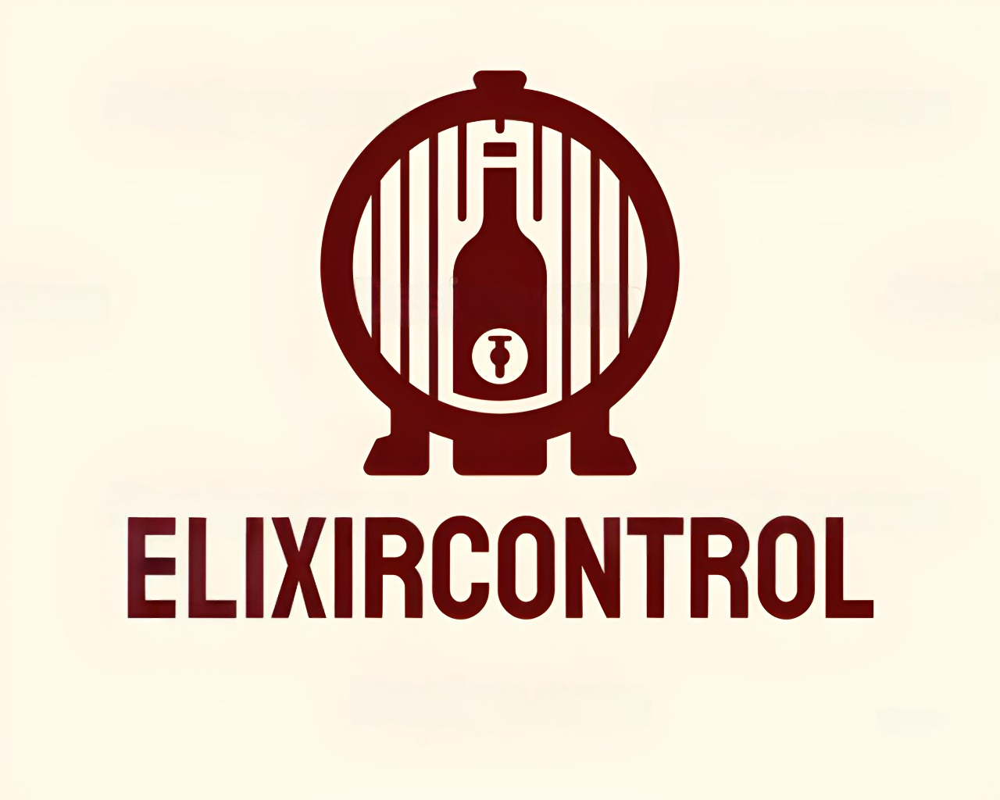
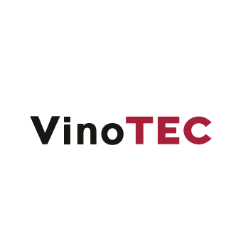
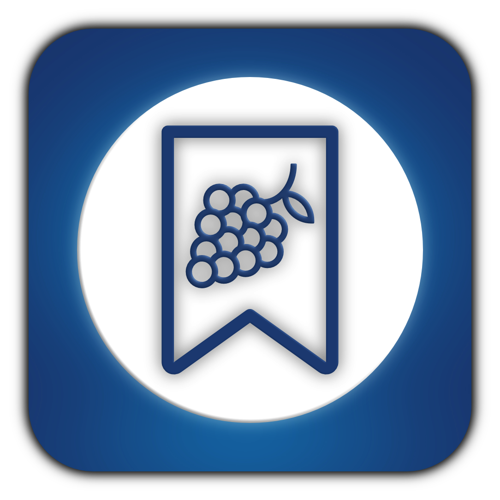
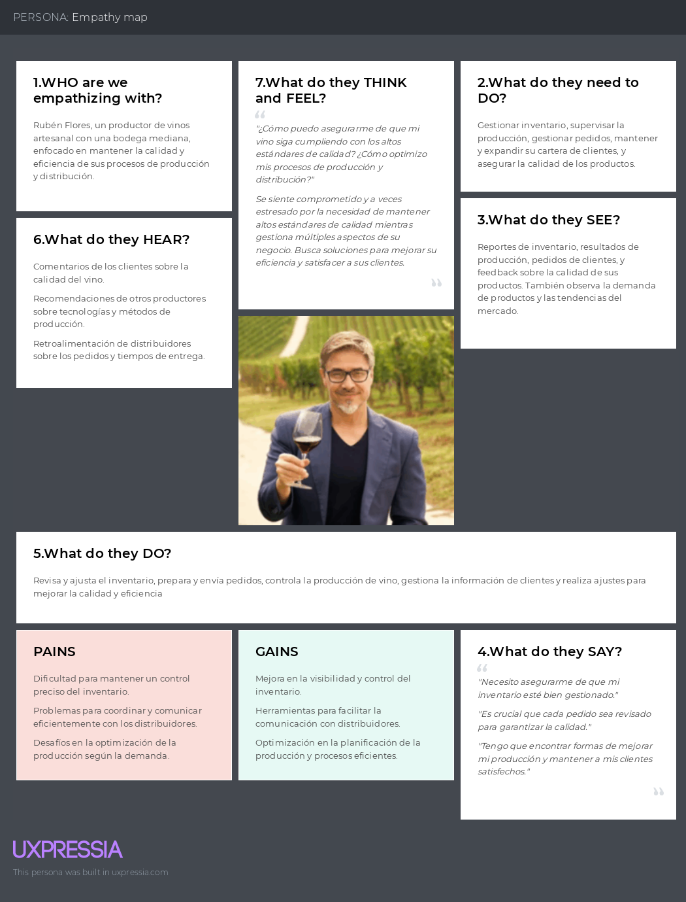
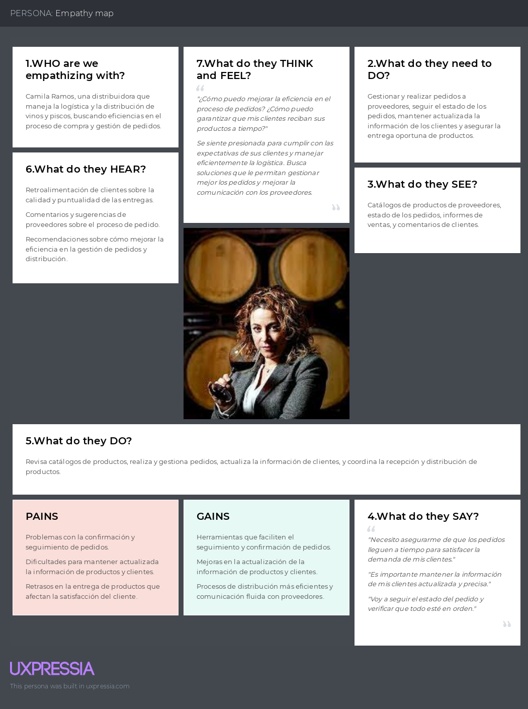

# Capítulo II: Requirements Elicitation & Analysis

## 2.1. Competidores.

En este punto el equipo realizará investigaciones sobre nuestros potenciales competidores en el mercado.

### 2.1.1. Análisis competitivo.

En este apartado el equipo realizará un analisis competitivo de nuestras 3 principales competidores identificados para posteriormente identificar y plantear estrategias que habrá que poner en marcha con respecto a nuestros competidrores.

<table>  
    <thead>
        <tr>
            <th colspan="6">Competitive Analysis Landscape</th>
        </tr>
        <tr>
            <th colspan="2">Competitive Analysis Landscape</th>
            <td colspan="5" style="text-align: justify"> Se realiza con el objetivo de reconocer y comprender mejor las fortalezas, debilidades y estrategias de nuestros principales competidores y a partir de ello identificar oportunidades y amenazas en el mercado, para desarrollar estrategias para obtener una ventaja competitiva.</td>
        </tr>
    </thead>
    <tbody style="text-align: center">
        <tr>
            <th colspan="2"></th>
            <th>  </th>
            <th></th>
            <th></th>
            <th></th>
        </tr>
        <!-- Este apartado pertenece al PERFIL se fucionó dos filas -->
        <tr>
            <th rowspan="2"> <strong> Perfil </strong> </th>
            <td> Overview</td>
            <td>ElixirControl es una solución integral diseñada específicamente para la gestión del proceso productivo de vinos y pisco. Ofrece herramientas avanzadas para la administración del ciclo de 
            producción y distribución, optimizando la gestión de inventario, seguimiento de pedidos, administración de la cartera de clientes y el proceso de vinificación. Su enfoque está en mejorar la 
            eficiencia operativa y la toma de decisiones informadas. </td>
            <td>Vinotec es un software de gestión integral para bodegas y productores de vino. Se enfoca en optimizar el proceso productivo y la gestión de ventas, ofreciendo herramientas para el seguimiento de la 
            producción y la administración de la cartera de clientes.</td>
            <td>WineManager proporciona soluciones específicas para la industria vitivinícola. Incluye funcionalidades como gestión de inventarios, seguimiento de pedidos y análisis de ventas. Su enfoque está en la 
            integración de datos para facilitar la toma de decisiones estratégicas.</td>
            <td>VinTrace se especializa en la gestión de viñedos y la trazabilidad de la producción de vinos. Ofrece herramientas para la planificación agrícola, registro de actividades y documentación de la 
            cosecha, enfocándose en el control de calidad y el cumplimiento de normativas en el sector vitivinícola.</td>
        </tr>
        <tr>
            <td>Ventaja competitiva ¿Que valor ofrece a los clientes?</td>
            <td>Ofrece una solución integral que abarca desde la gestión de inventario hasta el seguimiento de pedidos y la administración de la cartera de clientes, adaptándose a las necesidades específicas de 
            productores y distribuidores de vinos y pisco.</td>
            <td>Proporciona un enfoque centrado en la optimización del proceso productivo y la gestión de ventas, pero carece de funcionalidades específicas para la producción de pisco.</td>  
            <td>Su fortaleza radica en la integración de datos, lo que permite a las empresas tomar decisiones informadas basadas en análisis detallados.</td>  
            <td>Se especializa en pisco, pero su enfoque limitado podría no satisfacer las necesidades de los productores de vino.</td>  
        </tr>
        <!-- ------------------------------------------------------- -->
        <!-- ----Este apartado pertenece al PERFIL DE MARKETING---- -->
        <tr>
            <th rowspan="2"> <strong> Perfil de Marketing </strong> </th>
            <td> Mercado objetivo</td>
            <td>Productores y distribuidores de vinos y pisco que buscan una gestión eficiente y adaptada a sus procesos productivos.</td>  
            <td>Bodegas y productores de vino que requieren optimización en la gestión de ventas y producción.</td>  
            <td>Empresas vitivinícolas que necesitan soluciones integradas para la toma de decisiones.</td>  
            <td>Productores de vino que buscan herramientas específicas para la gestión de viñedos y la trazabilidad de la producción.</td>
        </tr>
        <tr>
            <td>Estrategias de Marketing</td>
            <td>Se posiciona como una solución integral y flexible para la gestión de la producción de vinos y pisco, destacando su adaptabilidad y facilidad de uso.</td>  
            <td>Se enfoca en la optimización de procesos y la gestión de ventas a través de su plataforma.</td>  
            <td>Utiliza marketing de contenido y análisis de datos para posicionarse como líder en soluciones integradas.</td>  
            <td>Se centra en la especialización en la gestión de viñedos, destacando su conocimiento del sector y su capacidad para asegurar la calidad del producto.</td>  
        </tr>
        <!-- ------------------------------------------------------- -->
        <!-- ----Este apartado pertenece al PERFIL DEL PRODUCTO----- -->
        <tr>
            <th rowspan="3"> <strong> Perfil del producto </strong> </th>
            <td> Producto & servicios</td>
            <td>Incluye control de inventario, gestión de clientes, seguimiento de pedidos y herramientas para la vinificación y gestión del viñedo.</td>  
            <td>Ofrece herramientas para la gestión de ventas y producción, pero con menos enfoque en la vinificación.</td>  
            <td>Proporciona soluciones integradas, pero puede carecer de funcionalidades específicas para la producción de pisco.</td>  
            <td>Se especializa en la gestión de viñedos, ofreciendo herramientas para la planificación agrícola y el control de calidad.</td>  
        </tr>
        <tr>
            <td>precio y costos</td>
            <td>Ofrece tres planes de pago (Básico, Intermedio, Avanzado) que se adaptan a diferentes tamaños de productores y distribuidores.</td>  
            <td>Utiliza un modelo de suscripción con precios variables según las funcionalidades requeridas.</td>  
            <td>Ofrece precios basados en la cantidad de usuarios y funcionalidades, con un enfoque en la personalización.</td>  
            <td>Modelo de suscripción con precios fijos, pero limitado a las funcionalidades específicas de gestión de viñedos.</td>  
        </tr>
        <tr>
            <td>Canales de distribución (Web y/o movil)</td>
            <td>Disponible en web y dispositivos móviles, facilitando el acceso a los usuarios.</td>  
            <td>Principalmente en web, con algunas funcionalidades móviles.</td>  
            <td>Ofrece una plataforma web robusta, pero con limitaciones en dispositivos móviles.</td>  
            <td>Enfocado en web, con un diseño amigable para el usuario.</td> 
        </tr>
        <!-- ------------------------------------------------------ -->
        <!-- ----Este apartado pertenece al ANÁLISIS SWOT --------- -->
        <tr>
            <th rowspan="4"> <strong> Análisis SWOT </strong> </th>
            <td>Fortalezas</td>
            <td>Solución integral y adaptativa, interfaz amigable, y enfoque en la eficiencia operativa.</td>  
            <td>Optimización de procesos y experiencia en el sector.</td>  
            <td>Integración de datos para la toma de decisiones.</td>  
            <td>Especialización en la gestión de viñedos y trazabilidad.</td> 
        </tr>
        <tr>
            <td>Debilidades</td>
            <td>Necesidad de establecer confianza en un mercado competitivo y la dependencia de la tecnología.</td>  
            <td>Limitaciones en la personalización para productores de pisco.</td>  
            <td>Puede ser percibido como demasiado técnico para algunos usuarios.</td>  
            <td>Enfoque limitado que puede no atraer a los productores de vino.</td> 
        </tr>
        <tr>
            <td>Oportunidades</td>
            <td>Creciente demanda de soluciones tecnológicas en la producción de vinos y pisco, y posibilidad de expansión a mercados internacionales.</td>  
            <td>Aumento en la producción de vino y necesidad de optimización en el sector.</td>  
            <td>Oportunidad de diversificación en servicios ofrecidos.</td>  
            <td>Crecimiento en la popularidad de la gestión de viñedos y control de calidad.</td> 
        </tr>
        <tr>
            <td>Amenazas</td>
            <td>Competencia de nuevas plataformas y cambios en regulaciones del sector.</td>  
            <td>Aumento de competidores con tecnologías avanzadas.</td>  
            <td>Innovaciones rápidas en el sector que pueden dejar atrás a los competidores.</td>  
            <td>Cambios en preferencias del consumidor y aumento de la competencia en la gestión de viñedos.</td> 
        </tr>
         <tr>
            <td colspan="6"></td>
        </tr>
        <!-- ---------------------------------------------------- -->   
    </tbody>
</table>

### 2.1.2. Estrategias y tácticas frente a competidores.

Luego de haber realizado el análisis de nuestra solución con respecto a soluciones ya existentes, nuestero equipo procederá a planteaer estrategias y tácnicas que debemos poner en marcha para sobresalir de las otras soluciones.

<table>
    <thead>
        <tr>
            <th colspan="3"> Matriz CAME para el desarrollo de estrategias en base al análisis FODA </th>
        </tr>
    </thead>
    <body>
        <tr>
            <th rowspan="2"> Análisis FODA cruzado</th>
            <th> Oportunidades </th>
            <th> Amenazas </th>
        </tr>
        <tr>
            <td> 1. Mayor demanda de servicios de gestión para la producción de vinos y pisco: El mercado está en auge, lo que representa una gran oportunidad para ElixirControl. 
            2. Capacidad de expandirse a otras ciudades y países: El software puede expandirse a nuevos mercados, ampliando su alcance y base de clientes. 
            3. Mejora continua de la tecnología y la experiencia del usuario: ElixirControl puede mejorar continuamente su tecnología y la experiencia del usuario para brindar servicios más atractivos y 
            competitivos. 
            4. Alianzas estratégicas con empresas del sector: Se pueden establecer alianzas con bodegas y distribuidores para ofrecer servicios más completos y competitivos. 
            5. Posicionar ElixirControl como la mejor opción para la gestión de vinos y pisco: Desarrollar una estrategia de marketing para posicionarse como la mejor opción en el mercado. 
            6. Colaborar con instituciones educativas: Asociarse con universidades o centros de formación en enología para ofrecer capacitaciones y certificaciones. </td>
            <td>  1. Aparición de nuevas plataformas con tecnologías avanzadas: El mercado es altamente competitivo, y pueden surgir nuevas soluciones que ofrezcan mejores funcionalidades. 
            2. Cambios en regulaciones del sector: La industria vitivinícola puede enfrentar cambios normativos que afecten la operación del software. 
            3. Problemas de seguridad cibernética: La plataforma puede ser vulnerable a ataques que comprometan la información de los usuarios. 
            4. Competencia de precios: Otras plataformas pueden ofrecer precios más bajos, lo que podría atraer a clientes potenciales. 
            5. Dificultades en la integración con otros sistemas: La falta de compatibilidad con herramientas existentes puede ser un obstáculo para los usuarios. </td>
        </tr>
        <!-------------------------------------------->
        <!--------------Separación Fila--------------->
        <tr>
            <th>Fortalezas</th>
            <th>Estrategia (FO) E. Ofensivas</th>
            <th>Estrategia (FA) E. Defensivas</th>
        </tr>
        <!-------------------------------------------->
        <!--------------Separación Fila--------------->
        <tr>
            <td>
                 1. Conexión directa entre empresa y cliente: Permite una comunicación fluida y transparente, generando confianza y mejorando la experiencia del cliente. 
                 2. Brinda transparencia y control sobre el avance del proceso: Los clientes pueden seguir en tiempo real el progreso de su producción, lo que reduce la incertidumbre y aumenta la satisfacción. 
                 3. Enfoque en un solo rubro: Permite a ElixirControl especializarse en el sector vitivinícola, ofreciendo un servicio más preciso y eficiente. 
                 4. Reduce el tiempo y esfuerzo del cliente: La plataforma automatiza tareas y simplifica el proceso, liberando tiempo y recursos para el cliente. 
            </td>
            <td>
                1. Aprovechar la creciente demanda de soluciones tecnológicas en la producción de vinos y pisco: Implementar campañas de marketing que destaquen la facilidad de uso y eficiencia de ElixirControl 
                para atraer nuevos clientes. 
                2. Expandirse a nuevos mercados: Realizar estudios de mercado en países con tradición vitivinícola para adaptar la oferta a sus necesidades. 
                3. Mejora continua de la tecnología y la experiencia del usuario: Invertir en I+D para mantener la plataforma actualizada con las últimas tendencias tecnológicas y mejorar la experiencia del usuario  
                4. Establecer alianzas estratégicas con empresas del sector: Colaborar con bodegas y distribuidores para ofrecer paquetes de servicios que integren la gestión de producción y distribución. 
                5. Posicionar ElixirControl como la mejor opción para la gestión de vinos y pisco: Desarrollar una campaña de branding que resalte las características únicas del software y su valor añadido. 
                6. Colaborar con instituciones educativas: Asociarse con universidades o centros de formación en enología para ofrecer capacitaciones y certificaciones que respalden el uso de ElixirControl. 
            </td>
            <td>
                1. Mantener la innovación constante en la plataforma: Para no quedar rezagados frente a la competencia y ofrecer funcionalidades de vanguardia que atraigan a los clientes. 
                2. Implementar medidas de seguridad robustas: Para proteger la información de los usuarios y mitigar el riesgo de ataques cibernéticos que puedan comprometer la confianza en el software. 
                3. Monitorear continuamente el entorno legal: Ajustar la plataforma para cumplir con nuevas normativas y regulaciones que puedan surgir en la industria vitivinícola. 
                4. Ofrecer precios competitivos: Realizar un análisis de precios del mercado y ajustar las tarifas para ser atractivos sin sacrificar la calidad del servicio. 
                5. Desarrollar APIs para facilitar la integración: Con otras herramientas y plataformas utilizadas por los clientes, reduciendo las barreras de adopción. 
                6, Implementar programas de innovación: Para fomentar la creatividad y el desarrollo de nuevas ideas que permitan a ElixirControl mantenerse a la vanguardia.
            </td>
        </tr>
        <!-------------------------------------------->
        <!--------------Separación Fila--------------->
        <tr>
            <th>Debilidad (D)</th>
            <th>Estrategia(DO) de Reorientación</th>
            <th>Estrategia(DA) de Superviciencia</th>
        </tr>
        <!-------------------------------------------->
        <!--------------Separación Fila--------------->
        <tr>
                <td>
                1. Clientes que desconfían de contratar servicios sin conocer la empresa: Implementar un programa de testimonios y casos de éxito que muestre la eficacia de ElixirControl. 
                2. Control de calidad del servicio: Establecer un sistema de evaluación de la satisfacción del cliente y realizar mejoras continuas basadas en su retroalimentación. 
                3. Falta de visibilidad de la marca: Desarrollar una estrategia de marketing digital que incluya SEO, SEM y marketing en redes sociales para aumentar el reconocimiento de la marca. 
                4. Dependencia de la tecnología: Capacitar al equipo en el uso de nuevas tecnologías y tendencias del sector para mejorar la oferta del servicio.  
            </td>
            <td>
                 1. Generar confianza en nuevos clientes: Implementar un programa de testimonios y casos de éxito que muestre la eficacia de ElixirControl, destacando historias de clientes satisfechos y resultados 
                 exitosos. 
                 2. Control de calidad del servicio: Establecer un sistema de evaluación de la satisfacción del cliente y realizar mejoras continuas basadas en su retroalimentación, asegurando que los estándares de 
                 calidad se mantengan altos. 
                 3. Aumentar la visibilidad de la marca: Desarrollar una estrategia de marketing digital que incluya SEO, SEM y marketing en redes sociales para aumentar el reconocimiento de la marca y atraer a más 
                 clientes potenciales. 
                 4. Capacitación del equipo: Invertir en la formación continua del equipo para asegurar que estén al tanto de las últimas tendencias y tecnologías del sector, mejorando así la calidad del servicio 
                 ofrecido.
            </td>
            <td>
                1. Diversificar los servicios ofrecidos: Ampliar las funcionalidades de ElixirControl para cubrir más aspectos del proceso productivo y de distribución, aumentando así su atractivo frente a la 
                competencia y reduciendo riesgos. 
                2. Desarrollar planes de contingencia: Preparar estrategias para responder rápidamente a la aparición de nuevas plataformas y cambios en el mercado, como regulaciones o amenazas de seguridad. 
                3. Mantener una comunicación constante con los usuarios: Establecer canales de comunicación efectivos para recibir retroalimentación de los clientes y mantener su confianza en momentos de 
                incertidumbre. 
                4. Capacitar al equipo: Invertir en la formación continua del equipo para asegurar que estén al tanto de las últimas tendencias y tecnologías del sector, mejorando así la calidad del servicio 
                ofrecido. 
                5. Diversificar proveedores y planes de contingencia: Negociar contratos favorables con proveedores y tener planes de respaldo para asegurar la estabilidad tecnológica y la calidad del servicio ante 
                posibles cambios. 
                6. Establecer un sistema de gestión de quejas y comentarios: Implementar procesos para recibir, analizar y responder a la retroalimentación de los clientes, mejorando continuamente el servicio y 
                obteniendo reseñas positivas.
            </td>
        </tr>
    </body>
</table>

## 2.2. Entrevistas.

En este punto el equipo realizará entrevistas a nuestros segmentos objetivos previamente
identificados con el fin de poder conocer y empatizar con las necesidades de estos.

### 2.2.1. Diseño de entrevistas.

### Preguntas para Productores de Vinos y Piscos Artesanales

**1. Introducción (30 segundos)**

   Saludo y Presentación 

   Breve introducción tuya y del propósito de la entrevista. 

   Asegurar confidencialidad y explicar el tiempo estimado.

**2. Aspectos Demográficos (1 minuto)**
   
_**Datos Básicos**_

* ¿Cuál es tu nombre y cuál es el nombre de tu empresa?

* ¿Cuál es tu rol específico en la producción de vinos/piscos? 

**_Ubicación_**

* ¿Dónde está ubicada tu empresa o tu lugar de producción? 

_**Experiencia**_

* ¿Cuánto tiempo llevas en la industria de la producción de vinos/piscos?

**3. Información General sobre el Negocio (1 minuto)**

**_Tipo de Producto_**

* ¿Qué tipo de vinos/piscos produces?

**_Proceso de Producción_**

* ¿Cuál es la etapa más desafiante de tu proceso de producción?

**4. Desafíos y Necesidades (1 minuto)**
   
**_Desafíos_**

* ¿Cuál es el mayor desafío que enfrentas en la producción?

**_Necesidades_**

* ¿Qué tipo de apoyo o recursos te gustaría tener para superar esos desafíos?

**5. Uso de Tecnología (1 minuto)**

**_Tecnología Actual_**

* ¿Qué herramientas o tecnologías utilizas actualmente en tu producción?

_**Interés en Nuevas Herramientas**_

* ¿Estarías interesado en nuevas herramientas que te ayuden a gestionar tu producción? ¿Qué características te gustaría que tuvieran?

**6. Cierre (30 segundos)**
   
_**Agradecimientos**_

_**Agradecer al entrevistado por su tiempo**_

**_Información de Contacto_**

_**Preguntar si están dispuestos a ser contactados para más detalles o futuras pruebas.**_

### Preguntas para Distribuidores de Vinos

**1. Introducción (30 segundos)**

_**Saludo y Presentación**_

**_Breve presentación tuya y del propósito de la entrevista._**

**_Explicar cómo se utilizará la información y asegurar confidencialidad._**

**2. Aspectos Demográficos (1 minuto)**

_**Datos Básicos**_

* ¿Cuál es tu nombre y el nombre de tu empresa?

* ¿Cuál es tu rol en la empresa?

_**Ubicación**_

* ¿Dónde está ubicada tu empresa o tu tienda?

**_Experiencia_**

* ¿Cuánto tiempo llevas en el negocio de la distribución de vinos?

**3. Información General sobre el Negocio (1 minuto)**

**_Tipo de Vinos_**

* ¿Qué tipo de vinos compras y vendes (por ejemplo, nacionales, importados, artesanales)?

**_Proceso de Adquisición_**

* ¿Cómo decides qué vinos comprar y vender?

**4. Desafíos y Necesidades (1 minuto)**

**_Desafíos_**

* ¿Cuál es el mayor desafío que enfrentas en la compra y venta de vinos?

**_Necesidades_**

* ¿Qué tipo de apoyo o recursos te gustaría tener para mejorar tu negocio de distribución?

**5. Uso de Tecnología (1 minuto)**

**_Tecnología Actual_**

* ¿Qué herramientas o tecnologías utilizas para gestionar la compra y venta de vinos?

**_Interés en Nuevas Herramientas_**

* ¿Estás interesado en nuevas tecnologías o herramientas que podrían mejorar la gestión de tu negocio? ¿Qué características buscarías?

**6. Cierre (30 segundos)**

**_Agradecimientos_**

_**Agradecer al entrevistado por su tiempo y participación.**_

**_Información de Contacto_**

**_Preguntar si están dispuestos a participar en futuras investigaciones o pruebas de producto._**

### 2.2.2. Registro de entrevistas.

### Segmento objetivo 1: Productores de Vinos y Piscos Artesanales

<table>
        <thead>
            <tr>
                <th>Entrevistado 1</th>
                <th>Joaquín Enrique Carranza Tesén</th>
            </tr>
            <tr>
                <th>Entrevistador </th>
                <th>Oscar Javier Armas Sánchez</th>
            </tr>
        </thead>
        <tbody>
            <tr>
                <td>Edad </td>
                <td>25 años</td>
            </tr>
            <tr>
                <td>Distrito</td>
                <td>Chorrilos</td>
            </tr>
            <tr>
                <td>
                    
                </td>
                <td>
                <strong>
                    Resumen:</strong> 
                    Dado que el presente entrevistado nos comento que se dedicaba al campo de la vitivinícultura, siendo el asistente de una Bodega en Lunahúana, el cual el se dedicaba al area de inventario, para lo cual utilizaba el Excel como ayuda para registrar datos de su almacen, asi como tambien un cuaderno de apuntes el cual lo usaba para datos que no les parecia reelevante. Ademas nos menciono que estaria interesado en nuestra propuesta de un programa que le ayudara a poeder almacenar sus datos y tambien que pudiera llevar un control de las mismas.
                </td>
            </tr>
            <tr>
                <td>Tiempo que empieza</td>
                <td>0:00 minutos</td>
            </tr>
            <tr>
                <td>Tiempo de la entrevista</td>
                <td> 5:30 minuntos  </td>
            </tr>
            <tr>
                <td>URL de la entrevista</td>
                <td> https://upcedupe-my.sharepoint.com/:v:/g/personal/u201923571_upc_edu_pe/Ee84qx8cO_RLuiQAY5NyaSEBlDSvwnXt1bqG67H7Ie0IlA?nav=eyJyZWZlcnJhbEluZm8iOnsicmVmZXJyYWxBcHAiOiJPbmVEcml2ZUZvckJ1c2luZXNzIiwicmVmZXJyYWxBcHBQbGF0Zm9ybSI6IldlYiIsInJlZmVycmFsTW9kZSI6InZpZXciLCJyZWZlcnJhbFZpZXciOiJNeUZpbGVzTGlua0NvcHkifX0&e=fe2JMf </td>
            </tr>
        </tbody>
</table>

<table>
        <thead>
            <tr>
                <th>Entrevistado 2</th>
                <th>Mirian Sánchez</th>
            </tr>
            <tr>
                <th>Entrevistador </th>
                <th>Oscar Javier Armas Sánchez</th>
            </tr>
        </thead>
        <tbody>
            <tr>
                <td>Edad</td>
                <td>58 años</td>
            </tr>
            <tr>
                <td>Distrito</td>
                <td>Pacaran</td>
            </tr>
            <tr>
                <td>
                    
                </td>
                <td>
                <strong>
                    Resumen:</strong> 
                    La presente intrevistada menciona que era la dueña de un viñedo, el cua ella acordaba con sus ayudantes lo que tenian que hacer para pioder mantener a cuidado si viñedo, ademas menciono que que utilizaba el programa excel para sus cuentas asi como un cuaderno de sus gastos y sus posibles ventas. Nos aclaro que ella lleva en nombre de su familia casi 6 años el viñedo que les heredo sus padres el cual tenia una gran tiempo de produccion de vinos el cual era mas de 50 años de trayectoria, y queria seguir manteniendolo en trayectoria.  
                </td>
            </tr>
            <tr>
                <td>Tiempo que empieza</td>
                <td> 0:05 minutos</td>
            </tr>
            <tr>
                <td>Tiempo de la entrevista</td>
                <td> 8:13 minutos </td>
            </tr>
            <tr>
                <td>URL de la entrevista</td>
                <td>    https://upcedupe-my.sharepoint.com/:v:/g/personal/u201923571_upc_edu_pe/EUJRH1TnmRZIq13cyEp07RsB6ixOH6U_eU9az7MytczEXw?nav=eyJyZWZlcnJhbEluZm8iOnsicmVmZXJyYWxBcHAiOiJPbmVEcml2ZUZvckJ1c2luZXNzIiwicmVmZXJyYWxBcHBQbGF0Zm9ybSI6IldlYiIsInJlZmVycmFsTW9kZSI6InZpZXciLCJyZWZlcnJhbFZpZXciOiJNeUZpbGVzTGlua0NvcHkifX0&e=XO639h</td>
            </tr>
        </tbody>
</table>

<table>
        <thead>
            <tr>
                <th>Entrevistado 3</th>
                <th>Fabricio Candela</th>
            </tr>
            <tr>
                <th>Entrevistador </th>
                <th>Oscar Javier Armas Sánchez</th>
            </tr>
        </thead>
        <tbody>
            <tr>
                <td>Edad</td>
                <td>26</td>
            </tr>
            <tr>
                <td>Distrito</td>
                <td>San Juan de Miraflores</td>
            </tr>
            <tr>
                <td>
                    
                </td>
                <td>
                <strong>
                    Resumen:</strong> 
                    Durante la entrevista, el entrevistado nos informó que trabaja en el ámbito de la vitivinicultura como asistente en una bodega ubicada en Lunahuaná. Su principal responsabilidad está en el área de inventario, donde emplea Excel para registrar los datos de su almacén. Además, utiliza un cuaderno de apuntes para llevar información que considera de menor relevancia. Nos mencionó que estaría interesado en nuestra propuesta de un sistema que le permitiera almacenar y gestionar sus datos de manera más eficiente, con una funcionalidad que le facilite el control sobre el inventario.
                </td>
            </tr>
            <tr>
                <td>Tiempo que empieza</td>
                <td> 0:04 minutos</td>
            </tr>
            <tr>
                <td>Tiempo de la entrevista</td>
                <td> 4:21 minutos </td>
            </tr>
            <tr>
                <td>URL de la entrevista</td>
                <td> https://upcedupe-my.sharepoint.com/:v:/g/personal/u201923571_upc_edu_pe/EfZVpAdvdvxGjOuLCSm8PuIBtXUHGDLTcAcdAZowxFqyJA?nav=eyJyZWZlcnJhbEluZm8iOnsicmVmZXJyYWxBcHAiOiJPbmVEcml2ZUZvckJ1c2luZXNzIiwicmVmZXJyYWxBcHBQbGF0Zm9ybSI6IldlYiIsInJlZmVycmFsTW9kZSI6InZpZXciLCJyZWZlcnJhbFZpZXciOiJNeUZpbGVzTGlua0NvcHkifX0&e=ZV6NhE </td>
            </tr>
        </tbody>
</table>

### Segmento objetivo 2: Distribuidores de Vinos

<table>
        <thead>
            <tr>
                <th>Entrevistado 1</th>
                <th>Jazzy Adolfo Benites Morales </th>
            </tr>
            <tr>
                <th>Entrevistador </th>
                <th>Oscar Javier Armas Sánchez</th>
            </tr>
        </thead>
        <tbody>
            <tr>
                <td>Edad</td>
                <td>25</td>
            </tr>
            <tr>
                <td>Distrito</td>
                <td>San Juan de Miraflores</td>
            </tr>
            <tr>
                <td>
                    
                </td>
                <td>
                <strong>
                    Resumen:</strong> 
                    En la entrevista, el entrevistado nos comentó que se desempeña como distribuidor de vinos y piscos. Su labor principal consiste en gestionar la distribución de estos productos a diferentes puntos de venta y clientes. Para ello, utiliza herramientas como programas para llevar un control de los pedidos y la distribución de su inventario. Sin embargo, mencionó que le gustaría contar con un sistema más automatizado que le permitiera gestionar de manera más eficiente sus productos, realizar un seguimiento de las entregas, y mejorar la planificación de sus rutas de distribución.
                </td>
            </tr>
            <tr>
                <td>Tiempo que empieza</td>
                <td> 0:03 minutos</td>
            </tr>
            <tr>
                <td>Tiempo de la entrevista</td>
                <td> 3:55 minutos </td>
            </tr>
            <tr>
                <td>URL de la entrevista</td>
                <td> https://upcedupe-my.sharepoint.com/:v:/g/personal/u201923571_upc_edu_pe/EdzpSOgNqA9GiF7jhrRvbO4B7CLsnh2LjmDFwGgBt8Rddg?nav=eyJyZWZlcnJhbEluZm8iOnsicmVmZXJyYWxBcHAiOiJPbmVEcml2ZUZvckJ1c2luZXNzIiwicmVmZXJyYWxBcHBQbGF0Zm9ybSI6IldlYiIsInJlZmVycmFsTW9kZSI6InZpZXciLCJyZWZlcnJhbFZpZXciOiJNeUZpbGVzTGlua0NvcHkifX0&e=qbcCz5 </td>
            </tr>
        </tbody>
</table>

<table>
        <thead>
            <tr>
                <th>Entrevistado 2</th>
                <th>Nombre del entrevistado</th>
            </tr>
            <tr>
                <th>Entrevistador </th>
                <th>Nombre</th>
            </tr>
        </thead>
        <tbody>
            <tr>
                <td>Edad</td>
                <td>ingresa edad</td>
            </tr>
            <tr>
                <td>Distrito</td>
                <td>ingresa Distrito</td>
            </tr>
            <tr>
                <td>
                    
                </td>
                <td>
                <strong>
                    Resumen:</strong> 
                    Escribe el resumen de la entrevista
                </td>
            </tr>
            <tr>
                <td>Tiempo que empieza</td>
                <td> Ingresa el tiempo de inicio de tú entrevista</td>
            </tr>
            <tr>
                <td>Tiempo de la entrevista</td>
                <td> Ejemplo -> 4:41min </td>
            </tr>
            <tr>
                <td>URL de la entrevista</td>
                <td> Ingresa URL </td>
            </tr>
        </tbody>
</table>

<table>
        <thead>
            <tr>
                <th>Entrevistado 3</th>
                <th>Nombre del entrevistado</th>
            </tr>
            <tr>
                <th>Entrevistador </th>
                <th>Nombre</th>
            </tr>
        </thead>
        <tbody>
            <tr>
                <td>Edad</td>
                <td>ingresa edad</td>
            </tr>
            <tr>
                <td>Distrito</td>
                <td>ingresa Distrito</td>
            </tr>
            <tr>
                <td>
                    
                </td>
                <td>
                <strong>
                    Resumen:</strong> 
                    Escribe el resumen de la entrevista
                </td>
            </tr>
            <tr>
                <td>Tiempo que empieza</td>
                <td> Ingresa el tiempo de inicio de tú entrevista</td>
            </tr>
            <tr>
                <td>Tiempo de la entrevista</td>
                <td> Ejemplo -> 4:41min </td>
            </tr>
            <tr>
                <td>URL de la entrevista</td>
                <td> Ingresa URL </td>
            </tr>
        </tbody>
</table>

### 2.2.3. Análisis de entrevistas.

#### Análisis del segmento: Productores de Vinos y Piscos Artesanales

Después de realizar las entrevistas, se identificaron las siguientes conclusiones para este segmento:

El **100%** de los entrevistados utiliza herramientas básicas como **Excel** y **cuadernos** para gestionar el inventario y las finanzas de sus bodegas. Además, el **66.7%** de los entrevistados indicaron que estarían interesados en una solución tecnológica que les ayude a automatizar y optimizar la gestión de sus inventarios y datos.

Respecto a la solución propuesta, el **100%** de los entrevistados manifestó su interés en un sistema que les ayude a gestionar de forma más eficiente sus inventarios y datos.

#### Análisis del segmento: Distribuidores de Vinos

Se realizó una evaluación a partir de las entrevistas en este segmento. Se determinaron las siguientes estadísticas:

El **100%** de los entrevistados utiliza herramientas tecnológicas para llevar el control de los pedidos y la distribución de su inventario. Además, el **100%** de los entrevistados mostró interés en una solución más automatizada que les permita mejorar la planificación de sus rutas de distribución y seguimiento de entregas.

## 2.3. Needfinding.

La identificación y comprensión profunda de las necesidades de los usuarios es crucial para el éxito de ElixirControl, una plataforma diseñada para la gestión del proceso productivo en la industria del vino y pisco. Mediante un enfoque meticuloso de *needfinding*, se recolecta y analiza información clave sobre las operaciones y desafíos específicos que enfrentan tanto los productores de vino como los distribuidores de pisco. Este enfoque permite descubrir puntos críticos y oportunidades significativas que informan el desarrollo y diseño de la solución. Al explorar a fondo los comportamientos, preferencias y dificultades de estos usuarios, ElixirControl se orienta a crear una herramienta que no solo optimiza la eficiencia, sino que también proporciona una experiencia de usuario adaptada y sencilla. Los perfiles de usuario (*user personas*) que guían este desarrollo están basados en los perfiles detallados de productores y distribuidores, asegurando que la plataforma satisfaga de manera precisa sus necesidades específicas y maximice su efectividad en el sector.

### 2.3.1. User Personas.

En esta sección se presentan dos User Personas que representan los segmentos clave del proyecto MetaSoft: los Productores de Vinos y los Distribuidores de Vinos y Piscos en Lima, Perú. Estos perfiles son fundamentales para entender las necesidades, motivaciones y comportamientos de los usuarios potenciales de MetaSoft, que busca optimizar la producción y comercialización de vinos a nivel local, regional y nacional.

El User Person Rubén Flores simboliza al productor de vinos artesanales, específicamente a las microempresas y pequeñas empresas productoras. Rubén enfrenta el reto de gestionar inventarios y asegurar la calidad del vino mientras trabaja con herramientas manuales como Excel y cuadernos. Su objetivo es mejorar la eficiencia en la producción y obtener un mayor control de sus procesos de inventario, sin perder el enfoque artesanal de su negocio familiar.

.png>)

Por otro lado, la User Person Camila Ramos, distribuidora de vinos y piscos, representa a las empresas encargadas de la distribución de estos productos a nivel local y nacional. Su prioridad es gestionar de manera eficiente los inventarios y pedidos, asegurando que los productos lleguen a tiempo y en las mejores condiciones a sus clientes. Aunque actualmente utiliza herramientas tecnológicas básicas, busca soluciones que le permitan automatizar y mejorar su gestión sin complicaciones.

.png>)
Ambos perfiles aportan información valiosa para el desarrollo del sistema MetaSoft, destacando las principales tareas y áreas donde la tecnología puede marcar una diferencia significativa en sus operaciones diarias.

### 2.3.2. User Task Matrix.
En esta sección, se presentan las tareas principales que los User Personas (Luis Ramírez, productor de vinos, y Camila Ramos, distribuidora de vinos) realizan para cumplir sus objetivos dentro del sector vitivinícola en Lima, Perú. Es importante destacar que las tareas mencionadas no dependen de ninguna solución de software en particular, sino que reflejan las actividades que cada segmento realiza de manera habitual en sus procesos de producción y distribución de vinos.
<body>
    <h2>User Task Matrix</h2>
    <table>
        <tr>
            <th rowspan="2">User Task</th>
            <th colspan="2">Rubén Flores (Productor de Vinos)</th>
            <th colspan="2">Camila Ramos (Distribuidora de Vinos y Piscos)</th>
        </tr>
        <tr>
            <th>Frecuencia</th>
            <th>Importancia</th>
            <th>Frecuencia</th>
            <th>Importancia</th>
        </tr>
        <tr>
            <td>Gestión de inventarios</td>
            <td>Alta</td>
            <td>Alta</td>
            <td>Alta</td>
            <td>Alta</td>
        </tr>
        <tr>
            <td>Planificación de producción</td>
            <td>Alta</td>
            <td>Alta</td>
            <td>Media</td>
            <td>Media</td>
        </tr>
        <tr>
            <td>Control de calidad del vino</td>
            <td>Alta</td>
            <td>Alta</td>
            <td>Baja</td>
            <td>Media</td>
        </tr>
        <tr>
            <td>Gestión de pedidos</td>
            <td>Media</td>
            <td>Alta</td>
            <td>Alta</td>
            <td>Alta</td>
        </tr>
        <tr>
            <td>Seguimiento de ventas</td>
            <td>Media</td>
            <td>Media</td>
            <td>Alta</td>
            <td>Alta</td>
        </tr>
        <tr>
            <td>Optimización de costos</td>
            <td>Media</td>
            <td>Alta</td>
            <td>Alta</td>
            <td>Alta</td>
        </tr>
        <tr>
            <td>Relación con proveedores</td>
            <td>Baja</td>
            <td>Media</td>
            <td>Alta</td>
            <td>Alta</td>
        </tr>
        <tr>
            <td>Análisis de mercado</td>
            <td>Baja</td>
            <td>Media</td>
            <td>Media</td>
            <td>Alta</td>
        </tr>
        <tr>
            <td>Capacitación de empleados</td>
            <td>Media</td>
            <td>Media</td>
            <td>Baja</td>
            <td>Baja</td>
        </tr>
        <tr>
            <td>Planificación de rutas de entrega</td>
            <td>Baja</td>
            <td>Baja</td>
            <td>Baja</td>
            <td>Baja</td>
        </tr>
        <tr>
            <td>Comunicación con clientes</td>
            <td>Media</td>
            <td>Alta</td>
            <td>Alta</td>
            <td>Alta</td>
        </tr>
    </table>
</body>

**Explicación de las tareas destacadas:**

**Gestión de inventarios:** Es una tarea crucial tanto para Luis Ramírez como para Camila Ramos, ya que ambos necesitan tener un control preciso sobre sus productos. Luis se enfoca en la producción y almacenamiento de vinos, mientras que Camila gestiona el inventario para asegurar una distribución eficiente.

**Gestión de pedidos:** Aunque tiene menos relevancia para Luis, es una tarea fundamental para Camila, quien necesita mantener un flujo constante de productos hacia sus clientes. Para ella, esto es de alta frecuencia y prioridad.

**Comunicación con clientes:** Camila tiene una interacción más constante con los clientes, asegurando que los pedidos sean correctos y entregados a tiempo, mientras que Luis interactúa en menor medida, pero la importancia de esta tarea sigue siendo alta para ambos.

**Diferencias principales:**

**Control de calidad del vino:** Esta tarea es de alta frecuencia e importancia para Luis Ramírez, ya que como productor, su prioridad es asegurar que cada lote de vino cumpla con los estándares de calidad. En contraste, Camila no se involucra directamente en esta área, aunque le da importancia en casos excepcionales cuando los clientes reportan problemas.

**Optimización de costos:** Camila, como distribuidora, se enfoca más en la optimización de costos relacionados con el manejo de inventarios y la distribución, mientras que Luis se concentra en la optimización de los costos de producción.

**Planificación de rutas de entrega:** Aunque es una tarea que podría ser relevante para distribuidores, en el caso de Camila no tiene tanta prioridad, ya que su enfoque está más en la eficiencia de inventarios y pedidos, dejando la planificación de rutas a sus subordinados o colaboradores.

### 2.3.3. User Journey Mapping.
**Ruben Flores**

**Camila Ramos**

### 2.3.4. Empathy Mapping.
**Ruben Flores**

**Camila Ramos**

### 2.3.5. As-is Scenario Mapping.
**Ruben Flores**

**Camila Ramos**

## 2.4. Ubiquitous Language.

El **Ubiquitous Language** es esencial en el desarrollo de software para garantizar una comunicación clara entre todos los miembros del equipo y los stakeholders. Este glosario de términos específicos del dominio asegura que todos estén alineados y evita malentendidos, facilitando una colaboración efectiva y el cumplimiento de las necesidades del negocio.

Glosario:

### Ubiquitous Language - ElixirControl

- **Inventory Management (Gestión de Inventario):** Supervisión y control de niveles de inventario para asegurar disponibilidad oportuna de productos y materiales, incluyendo recepción, almacenamiento y despacho.

- **Wine Quality Control (Control de Calidad del Vino):** Procedimientos y estándares para asegurar que el vino cumpla con los requisitos de calidad, garantizando consistencia y excelencia en cada lote.

- **Customer Satisfaction (Satisfacción del Cliente):** Medida en la que se cumplen las expectativas del cliente con los productos y servicios ofrecidos, implicando evaluación y mejora continua de la experiencia del cliente.

- **Distribution Efficiency (Eficiencia de Distribución):** Optimización del proceso de distribución para reducir tiempos de entrega y costos, mejorando la satisfacción del cliente con entregas puntuales y efectivas.

- **Market Expansion (Expansión de Mercado):** Estrategia para aumentar la base de clientes mediante la entrada en nuevos mercados o la diversificación de productos.

- **Cost Analysis (Análisis de Costos):** Evaluación detallada de costos asociados con la producción y distribución para identificar oportunidades de reducción y mejorar la rentabilidad.

- **Customer Portfolio Management (Gestión de la Cartera de Clientes):** Optimización de las relaciones con clientes actuales para maximizar su valor y fortalecer las relaciones comerciales.

- **Order Tracking (Seguimiento de Pedidos):** Sistema para monitorear y gestionar el estado de los pedidos desde la creación hasta la entrega final, garantizando transparencia y comunicación continua.

- **Technology Implementation (Implementación de Nuevas Tecnologías):** Integración de nuevas herramientas tecnológicas en las operaciones diarias para mejorar eficiencia, calidad y competitividad.

- **Production Planning (Planificación de Producción):** Organización y programación de actividades de producción para asegurar fabricación en las cantidades correctas, a tiempo y con los recursos disponibles.
