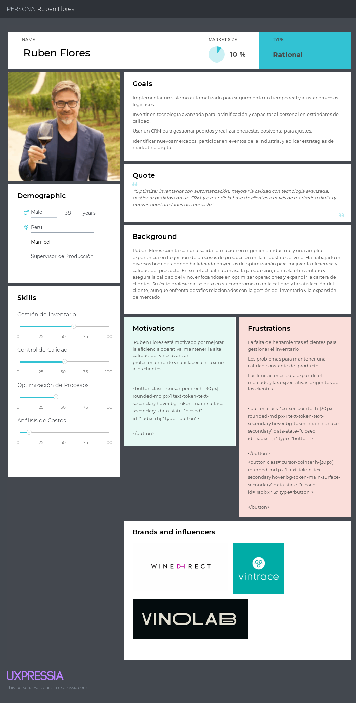
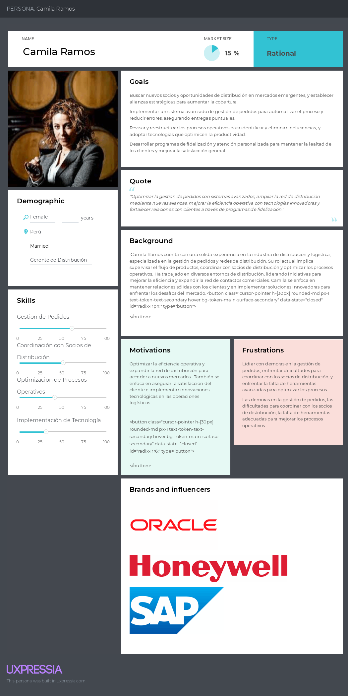
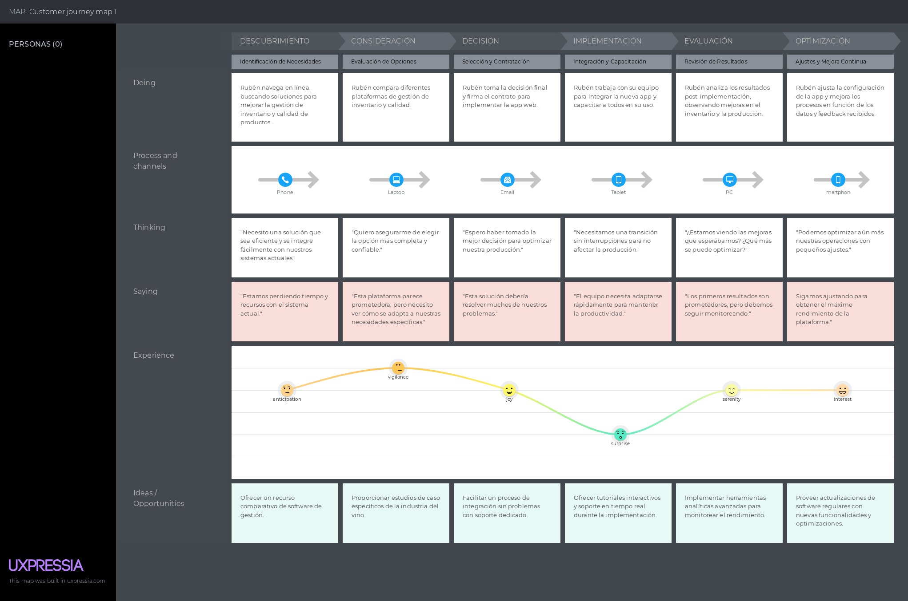

# Capítulo II: Requirements Elicitation & Analysis

## 2.1. Competidores.

### 2.1.1. Análisis competitivo.

### 2.1.2. Estrategias y tácticas frente a competidores.

## 2.2. Entrevistas.

### 2.2.1. Diseño de entrevistas.

### 2.2.2. Registro de entrevistas.

### 2.2.3. Análisis de entrevistas.

## 2.3. Needfinding.

La identificación y comprensión profunda de las necesidades de los usuarios es crucial para el éxito de ElixirControl, una plataforma diseñada para la gestión del proceso productivo en la industria del vino y pisco. Mediante un enfoque meticuloso de *needfinding*, se recolecta y analiza información clave sobre las operaciones y desafíos específicos que enfrentan tanto los productores de vino como los distribuidores de pisco. Este enfoque permite descubrir puntos críticos y oportunidades significativas que informan el desarrollo y diseño de la solución. Al explorar a fondo los comportamientos, preferencias y dificultades de estos usuarios, ElixirControl se orienta a crear una herramienta que no solo optimiza la eficiencia, sino que también proporciona una experiencia de usuario adaptada y sencilla. Los perfiles de usuario (*user personas*) que guían este desarrollo están basados en los perfiles detallados de productores y distribuidores, asegurando que la plataforma satisfaga de manera precisa sus necesidades específicas y maximice su efectividad en el sector.

### 2.3.1. User Personas.

### 2.3.2. User Task Matrix.

<body>
    <h2>User Task Matrix</h2>
    <table>
        <tr>
            <th rowspan="2">User Task</th>
            <th colspan="2">Ruben Flores   (Productor de Vinos)</th>
            <th colspan="2">Camila Ramos (Distribuidora de Vinos y Piscos)</th>
        </tr>
        <tr>
            <th>Frecuencia</th>
            <th>Importancia</th>
            <th>Frecuencia</th>
            <th>Importancia</th>
        </tr>
        <tr>
            <td>Actualiza inventario para mantener niveles adecuados de materiales y productos.	</td>
            <td>Alta</td>
            <td>Alta</td>
            <td>Media</td>
            <td>Alta</td>
        </tr>
        <tr>
            <td>Supervisa la vinificación para garantizar la calidad del vino.</td>
            <td>Alta</td>
            <td>Alta</td>
            <td>Baja</td>
            <td>Media</td>
        </tr>
        <tr>
            <td>Sigue los pedidos para asegurar entregas puntuales.</td>
            <td>Media</td>
            <td>Alta</td>
            <td>Alta</td>
            <td>Alta</td>
        </tr>
        <tr>
            <td>Mantiene y expande la cartera de clientes.</td>
            <td>Media</td>
            <td>Alta</td>
            <td>Alta</td>
            <td>Alta</td>  
        </tr>
        <tr>
            <td>Planifica la producción según la demanda y recursos.</td>
            <td>Alta</td>
            <td>Alta</td>
            <td>Media</td>
            <td>Media</td>  
        </tr>
        <tr>
            <td>Analiza costos para optimizar y rentabilizar.</td>
            <td>Alta</td>
            <td>Alta</td>
            <td>Media</td>
            <td>Alta</td>  
        </tr>
        <tr>
            <td>Explora nuevas oportunidades de mercado.</td>
            <td>Media</td>
            <td>Media</td>
            <td>Alta</td>
            <td>Alta</td>  
        </tr>
        <tr>
            <td>Evalúa nuevas tecnologías para mejorar la eficiencia.</td>
            <td>Baja</td>
            <td>Media</td>
            <td>Baja</td>
            <td>Media</td>  
        </tr>
        <tr>
            <td>Asegura la satisfacción del cliente con productos y servicios.</td>
            <td>Media</td>
            <td>Alta</td>
            <td>Alta</td>
            <td>Alta</td>  
        </tr>
        <tr>
            <td>Verifica que los productos cumplan con los estándares de calidad.</td>
            <td>Alta</td>
            <td>Alta</td>
            <td>Baja</td>
            <td>Media</td>  
        </tr>
    </table>
</body>

### 2.3.3. User Journey Mapping.
**Ruben Flores**

**Camila Ramos**

### 2.3.4. Empathy Mapping.

### 2.3.5. As-is Scenario Mapping.

## 2.4. Ubiquitous Language.