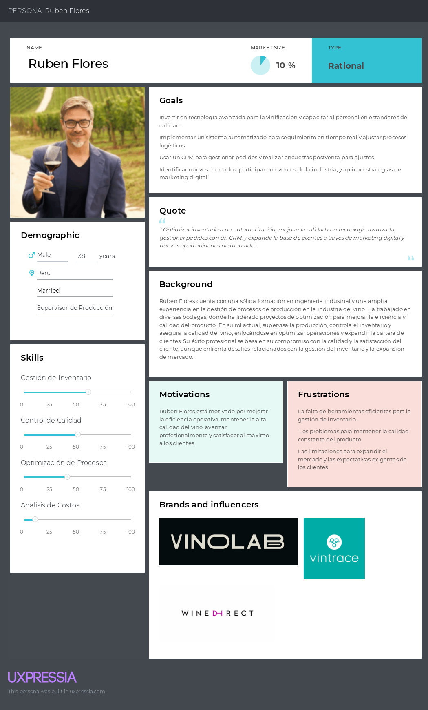
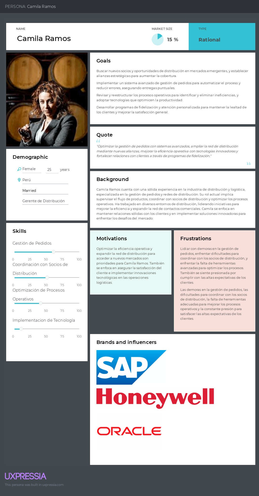
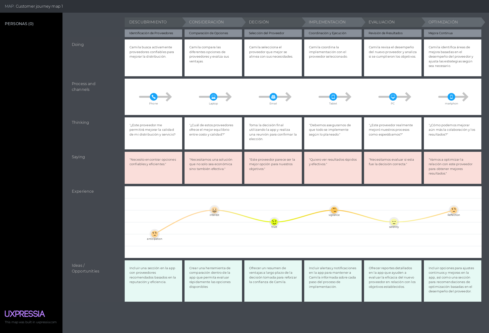

# Capítulo II: Requirements Elicitation & Analysis

## 2.1. Competidores.

En este punto el equipo realizará investigaciones sobre nuestros potenciales competidores en el mercado.

### 2.1.1. Análisis competitivo.

En este apartado el equipo realizará un analisis competitivo de nuestras 3 principales competidores identificados para posteriormente identificar y plantear estrategias que habrá que poner en marcha con respecto a nuestros competidrores.

<table>  
    <thead>
        <tr>
            <th colspan="6">Competitive Analysis Landscape</th>
        </tr>
        <tr>
            <th colspan="2">Competitive Analysis Landscape</th>
            <td colspan="5" style="text-align: justify"> Se realiza con el objetivo de reconocer y comprender mejor las fortalezas, debilidades y estrategias de nuestros principales competidores y a partir de ello identificar oportunidades y amenazas en el mercado, para desarrollar estrategias para obtener una ventaja competitiva.</td>
        </tr>
    </thead>
    <tbody style="text-align: center">
        <tr>
            <th colspan="2"></th>
            <th></th>
            <th></th>
            <th></th>
            <th></th>
        </tr>
        <!-- Este apartado pertenece al PERFIL se fucionó dos filas -->
        <tr>
            <th rowspan="2"> <strong> Perfil </strong> </th>
            <td> Overview</td>
            <td> </td>
            <td> </td>
            <td> </td>
            <td> </td>
        </tr>
        <tr>
            <td>Ventaja competitiva ¿Que valor ofrece a los clientes?</td>
            <td>Contenido</td>
            <td>Contenido</td>  
            <td>Contenido</td>  
            <td>Contenido</td>  
        </tr>
        <!-- ------------------------------------------------------- -->
        <!-- ----Este apartado pertenece al PERFIL DE MARKETING---- -->
        <tr>
            <th rowspan="2"> <strong> Perfil de Marketing </strong> </th>
            <td> Mercado objetivo</td>
            <td>Contenido</td>  
            <td>Contenido</td>  
            <td>Contenido</td>  
            <td>Contenido</td>  
        </tr>
        <tr>
            <td>Estrategias de Marketing</td>
            <td>Contenido</td>  
            <td>Contenido</td>  
            <td>Contenido</td>  
            <td>Contenido</td>  
        </tr>
        <!-- ------------------------------------------------------- -->
        <!-- ----Este apartado pertenece al PERFIL DEL PRODUCTO----- -->
        <tr>
            <th rowspan="3"> <strong> Perfil del producto </strong> </th>
            <td> Producto & servicios</td>
            <td>Contenido</td>  
            <td>Contenido</td>  
            <td>Contenido</td>  
            <td>Contenido</td>  
        </tr>
        <tr>
            <td>precio y costos</td>
            <td>Contenido</td>  
            <td>Contenido</td>  
            <td>Contenido</td>  
            <td>Contenido</td>  
        </tr>
        <tr>
            <td>Canales de distribución (Web y/o movil)</td>
            <td>Contenido</td>  
            <td>Contenido</td>  
            <td>Contenido</td>  
            <td>Contenido</td> 
        </tr>
        <!-- ------------------------------------------------------ -->
        <!-- ----Este apartado pertenece al ANÁLISIS SWOT --------- -->
        <tr>
            <th rowspan="4"> <strong> Análisis SWOT </strong> </th>
            <td>Fortalezas</td>
            <td>Contenido</td>  
            <td>Contenido</td>  
            <td>Contenido</td>  
            <td>Contenido</td> 
        </tr>
        <tr>
            <td>Debilidades</td>
            <td>Contenido</td>  
            <td>Contenido</td>  
            <td>Contenido</td>  
            <td>Contenido</td> 
        </tr>
        <tr>
            <td>Oportunidades</td>
            <td>Contenido</td>  
            <td>Contenido</td>  
            <td>Contenido</td>  
            <td>Contenido</td> 
        </tr>
        <tr>
            <td>Amenazas</td>
            <td>Contenido</td>  
            <td>Contenido</td>  
            <td>Contenido</td>  
            <td>Contenido</td> 
        </tr>
         <tr>
            <td colspan="6"></td>
        </tr>
        <!-- ---------------------------------------------------- -->   
    </tbody>
</table>

### 2.1.2. Estrategias y tácticas frente a competidores.

Luego de haber realizado el análisis de nuestra solución con respecto a soluciones ya existentes, nuestero equipo procederá a planteaer estrategias y tácnicas que debemos poner en marcha para sobresalir de las otras soluciones.

<table>
    <thead>
        <tr>
            <th colspan="3"> Matriz CAME para el desarrollo de estrategias en base al análisis FODA </th>
        </tr>
    </thead>
    <body>
        <tr>
            <th rowspan="2"> Análisis FODA cruzado</th>
            <th> Oportunidades </th>
            <th> Amenazas </th>
        </tr>
        <tr>
            <td> Contenido </td>
            <td> Contenido </td>
        </tr>
        <!-------------------------------------------->
        <!--------------Separación Fila--------------->
        <tr>
            <th>Fortalezas</th>
            <th>Estrategia (FO) E. Ofensivas</th>
            <th>Estrategia (FA) E. Defensivas</th>
        </tr>
        <!-------------------------------------------->
        <!--------------Separación Fila--------------->
        <tr>
            <td>
                Contenido 1 
            </td>
            <td>
                Contenido 2
            </td>
            <td>
                Contenido 3
            </td>
        </tr>
        <!-------------------------------------------->
        <!--------------Separación Fila--------------->
        <tr>
            <th>Debilidad (D)</th>
            <th>Estrategia(DO) de Reorientación</th>
            <th>Estrategia(DA) de Superviciencia</th>
        </tr>
        <!-------------------------------------------->
        <!--------------Separación Fila--------------->
        <tr>
            <td>
                Contenido 1 
            </td>
            <td>
                Contenido 2
            </td>
            <td>
                Contenido 3
            </td>
        </tr>
    </body>
</table>

### 2.1.2. Estrategias y tácticas frente a competidores.

## 2.2. Entrevistas.

### 2.2.1. Diseño de entrevistas.

### 2.2.2. Registro de entrevistas.

### 2.2.3. Análisis de entrevistas.

## 2.3. Needfinding.

La identificación y comprensión profunda de las necesidades de los usuarios es crucial para el éxito de ElixirControl, una plataforma diseñada para la gestión del proceso productivo en la industria del vino y pisco. Mediante un enfoque meticuloso de *needfinding*, se recolecta y analiza información clave sobre las operaciones y desafíos específicos que enfrentan tanto los productores de vino como los distribuidores de pisco. Este enfoque permite descubrir puntos críticos y oportunidades significativas que informan el desarrollo y diseño de la solución. Al explorar a fondo los comportamientos, preferencias y dificultades de estos usuarios, ElixirControl se orienta a crear una herramienta que no solo optimiza la eficiencia, sino que también proporciona una experiencia de usuario adaptada y sencilla. Los perfiles de usuario (*user personas*) que guían este desarrollo están basados en los perfiles detallados de productores y distribuidores, asegurando que la plataforma satisfaga de manera precisa sus necesidades específicas y maximice su efectividad en el sector.

### 2.3.1. User Personas.

### 2.3.2. User Task Matrix.

<body>
    <h2>User Task Matrix</h2>
    <table>
        <tr>
            <th rowspan="2">User Task</th>
            <th colspan="2">Ruben Flores   (Productor de Vinos)</th>
            <th colspan="2">Camila Ramos (Distribuidora de Vinos y Piscos)</th>
        </tr>
        <tr>
            <th>Frecuencia</th>
            <th>Importancia</th>
            <th>Frecuencia</th>
            <th>Importancia</th>
        </tr>
        <tr>
            <td>Actualiza inventario para mantener niveles adecuados de materiales y productos.	</td>
            <td>Alta</td>
            <td>Alta</td>
            <td>Media</td>
            <td>Alta</td>
        </tr>
        <tr>
            <td>Supervisa la vinificación para garantizar la calidad del vino.</td>
            <td>Alta</td>
            <td>Alta</td>
            <td>Baja</td>
            <td>Media</td>
        </tr>
        <tr>
            <td>Sigue los pedidos para asegurar entregas puntuales.</td>
            <td>Media</td>
            <td>Alta</td>
            <td>Alta</td>
            <td>Alta</td>
        </tr>
        <tr>
            <td>Mantiene y expande la cartera de clientes.</td>
            <td>Media</td>
            <td>Alta</td>
            <td>Alta</td>
            <td>Alta</td>  
        </tr>
        <tr>
            <td>Planifica la producción según la demanda y recursos.</td>
            <td>Alta</td>
            <td>Alta</td>
            <td>Media</td>
            <td>Media</td>  
        </tr>
        <tr>
            <td>Analiza costos para optimizar y rentabilizar.</td>
            <td>Alta</td>
            <td>Alta</td>
            <td>Media</td>
            <td>Alta</td>  
        </tr>
        <tr>
            <td>Explora nuevas oportunidades de mercado.</td>
            <td>Media</td>
            <td>Media</td>
            <td>Alta</td>
            <td>Alta</td>  
        </tr>
        <tr>
            <td>Evalúa nuevas tecnologías para mejorar la eficiencia.</td>
            <td>Baja</td>
            <td>Media</td>
            <td>Baja</td>
            <td>Media</td>  
        </tr>
        <tr>
            <td>Asegura la satisfacción del cliente con productos y servicios.</td>
            <td>Media</td>
            <td>Alta</td>
            <td>Alta</td>
            <td>Alta</td>  
        </tr>
        <tr>
            <td>Verifica que los productos cumplan con los estándares de calidad.</td>
            <td>Alta</td>
            <td>Alta</td>
            <td>Baja</td>
            <td>Media</td>  
        </tr>
    </table>
</body>

### 2.3.3. User Journey Mapping.
**Ruben Flores**

**Camila Ramos**

### 2.3.4. Empathy Mapping.
**Ruben Flores**

**Camila Ramos**

### 2.3.5. As-is Scenario Mapping.
**Ruben Flores**

**Camila Ramos**

## 2.4. Ubiquitous Language.

El **Ubiquitous Language** es esencial en el desarrollo de software para garantizar una comunicación clara entre todos los miembros del equipo y los stakeholders. Este glosario de términos específicos del dominio asegura que todos estén alineados y evita malentendidos, facilitando una colaboración efectiva y el cumplimiento de las necesidades del negocio.

Glosario:

- **Inventory Management (Gestión de Inventario):** Supervisión y control de niveles de inventario para asegurar disponibilidad oportuna de productos y materiales, incluyendo recepción, almacenamiento y despacho.

- **Wine Quality Control (Control de Calidad del Vino):** Procedimientos y estándares para asegurar que el vino cumpla con los requisitos de calidad, garantizando consistencia y excelencia en cada lote.

- **Customer Satisfaction (Satisfacción del Cliente):** Medida en la que se cumplen las expectativas del cliente con los productos y servicios ofrecidos, implicando evaluación y mejora continua de la experiencia del cliente.

- **Distribution Efficiency (Eficiencia de Distribución):** Optimización del proceso de distribución para reducir tiempos de entrega y costos, mejorando la satisfacción del cliente con entregas puntuales y efectivas.

- **Market Expansion (Expansión de Mercado):** Estrategia para aumentar la base de clientes mediante la entrada en nuevos mercados o la diversificación de productos.

- **Cost Analysis (Análisis de Costos):** Evaluación detallada de costos asociados con la producción y distribución para identificar oportunidades de reducción y mejorar la rentabilidad.

- **Customer Portfolio Management (Gestión de la Cartera de Clientes):** Optimización de las relaciones con clientes actuales para maximizar su valor y fortalecer las relaciones comerciales.

- **Order Tracking (Seguimiento de Pedidos):** Sistema para monitorear y gestionar el estado de los pedidos desde la creación hasta la entrega final, garantizando transparencia y comunicación continua.

- **Technology Implementation (Implementación de Nuevas Tecnologías):** Integración de nuevas herramientas tecnológicas en las operaciones diarias para mejorar eficiencia, calidad y competitividad.

- **Production Planning (Planificación de Producción):** Organización y programación de actividades de producción para asegurar fabricación en las cantidades correctas, a tiempo y con los recursos disponibles.
