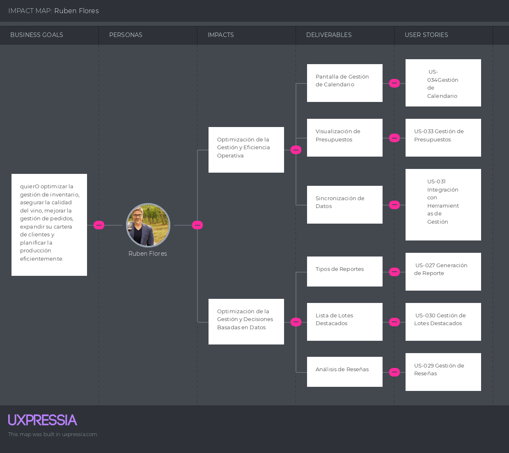

# Capítulo III: Requirements Specification

## 3.1. To-Be Scenario Mapping.
**Rubén Flores**

**Camila Ramos**

## 3.2. User Stories.

En este punto, se encuentran una serie de historias de usuario que han sido creadas para capturar las necesidades y expectativas clave del producto. Estas historias servirán como base para la planificación, el desarrollo y la validación del software.

<table>
    <thead>
        <tr>
            <th>Epic / Story ID</th>
            <th>Título</th>
            <th>Descripción</th>
            <th>Criterios de Aceptación</th>
            <th>Relacionado con (Epic ID)</th>
        </tr>
    </thead>
    <tbody>
        <!-- Epic Story 1 -->
<tr>
    <td>EPIC-001</td>
    <td>Gestión de Inventario</td>
    <td>
        Como productor, quiero gestionar el inventario de insumos y productos terminados para asegurar que siempre tenga lo necesario para la producción.
    </td>
    <td>N/A</td>
    <td>N/A</td>
</tr>

<!-- Epic Story 2 -->
<tr>
    <td>EPIC-002</td>
    <td>Control de Cartera de Clientes</td>
    <td>
        Como vendedor, quiero gestionar la cartera de clientes para mantener un seguimiento de las transacciones y mejorar la relación con ellos.
    </td>
    <td>N/A</td>
    <td>N/A</td>
</tr>

<!-- Epic Story 3 -->
<tr>
    <td>EPIC-003</td>
    <td>Gestión de Pedidos de Distribuidores</td>
    <td>
        Como distribuidor, quiero gestionar mis pedidos para asegurar la entrega oportuna de los productos.
    </td>
    <td>N/A</td>
    <td>N/A</td>
</tr>

<!-- Epic Story 4 -->
<tr>
    <td>EPIC-004</td>
    <td>Reportes y Análisis</td>
    <td>
        Como productor, quiero generar reportes sobre la producción y ventas para tomar decisiones informadas.
    </td>
    <td>N/A</td>
    <td>N/A</td>
</tr>

<!-- Epic Story 5 -->
<tr>
    <td>EPIC-005</td>
    <td>Suscripciones y Notificaciones</td>
    <td>
        Como productor, quiero gestionar mis suscripciones y recibir notificaciones para estar al tanto de las actualizaciones.
    </td>
    <td>N/A</td>
    <td>N/A</td>
</tr>

<!-- Epic Story 6 -->
<tr>
    <td>EPIC-006</td>
    <td>Experiencia de Usuario</td>
    <td>
        Como usuario, quiero que la aplicación sea intuitiva y fácil de usar para mejorar mi experiencia general.
    </td>
    <td>N/A</td>
    <td>N/A</td>
</tr>
    </tbody>
</table>

<table>
    <thead>
        <tr>
            <th>Story ID</th>
            <th>Título</th>
            <th>Descripción</th>
            <th>Criterios de Aceptación</th>
            <th>Epic ID</th>
        </tr>
    </thead>
    <tbody>
        <!-- User Story 1 -->
<tr>
    <td>US-001</td>
    <td>Hipervínculos en el encabezado</td>
    <td>
        Como usuario, quiero que los hipervínculos en el encabezado sean claramente visibles y funcionales para poder navegar fácilmente por la aplicación.
    </td>
    <td>
        <strong>Escenario 01: Visibilidad de Hipervínculos.</strong>  
        Dado que el usuario accede a la aplicación, cuando visualiza el encabezado, entonces todos los hipervínculos deben ser visibles y accesibles. 
        <strong>Escenario 02: Redirección de Hipervínculos.</strong>  
        Dado que el usuario hace clic en un hipervínculo del encabezado, entonces el sistema lo redirige a la sección correspondiente sin errores.
    </td>
    <td>EPIC-006</td>
</tr>

<!-- User Story 2 -->
<tr>
    <td>US-002</td>
    <td>Información sobre beneficios de la aplicación</td>
    <td>
        Como usuario, quiero tener acceso a información clara sobre los beneficios de la aplicación para entender cómo puede ayudarme en mis actividades.
    </td>
    <td>
        <strong>Escenario 01: Visualización de Beneficios.</strong>  
        Dado que el usuario accede a la sección de beneficios, cuando visualiza la información, entonces debe ser clara y fácil de entender. 
        <strong>Escenario 02: Detalle de Beneficios.</strong>  
        Dado que el usuario desea saber más sobre un beneficio específico, cuando hace clic en el enlace correspondiente, entonces el sistema muestra información detallada sobre ese beneficio.
    </td>
    <td>EPIC-006</td>
</tr>

<!-- User Story 3 -->
<tr>
    <td>US-003</td>
    <td>Mostrar los planes disponibles</td>
    <td>
        Como usuario, quiero saber sobre los planes que tiene, para poder analizar si el plan que me ofrecen se adecúa a las necesidades de mi negocio.
    </td>
    <td>
        <strong>Escenario 01: Visualización de Planes.</strong>  
        Dado que el usuario accede a la sección de planes, cuando visualiza la lista, entonces el sistema muestra todos los planes disponibles con sus respectivas descripciones y precios. 
        <strong>Escenario 02: Detalles del Plan.</strong>  
        Dado que el usuario selecciona un plan, cuando hace clic en "Ver Detalles", entonces el sistema muestra información adicional sobre ese plan.
    </td>
    <td>EPIC-005</td>
</tr>

<!-- User Story 4 -->
<tr>
    <td>US-004</td>
    <td>Información útil en el footer</td>
    <td>
        Como usuario, quiero que el footer contenga información útil, como datos de contacto y enlaces a políticas, para facilitar mi navegación.
    </td>
    <td>
        <strong>Escenario 01: Contenido del Footer.</strong>  
        Dado que el usuario accede a la página, cuando visualiza el footer, entonces debe contener información útil y enlaces relevantes. 
        <strong>Escenario 02: Navegación desde el Footer.</strong>  
        Dado que el usuario hace clic en un enlace en el footer, entonces el sistema lo redirige a la sección correspondiente sin errores.
    </td>
    <td>EPIC-006</td>
</tr>

<!-- User Story 5 -->
<tr>
    <td>US-005</td>
    <td>Información sobre el producto</td>
    <td>
        Como usuario, quiero tener acceso a información detallada sobre los productos para tomar decisiones informadas.
    </td>
    <td>
        <strong>Escenario 01: Visualización de Producto.</strong>  
        Dado que el usuario accede a la sección de productos, cuando selecciona un producto, entonces el sistema muestra información detallada sobre ese producto. 
        <strong>Escenario 02: Comparación de Productos.</strong>  
        Dado que el usuario desea comparar productos, cuando selecciona múltiples productos, entonces el sistema permite la comparación de sus características.
    </td>
    <td>EPIC-006</td>
</tr>
        <!-- User Story 6 -->
<tr>
    <td>US-006</td>
    <td>Registro de Entrada de Insumos</td>
    <td>
        Como encargado de bodega, quiero registrar la entrada de insumos para mantener actualizado el inventario.
    </td>
    <td>
        <strong>Escenario 01: Ingreso de Datos.</strong>  
        Dado que el encargado de bodega se encuentra en la sección de insumos, cuando ingresa los datos del nuevo insumo, entonces el sistema guarda la información y actualiza el inventario. 
        <strong>Escenario 02: Notificación al Enólogo.</strong>  
        Dado que se ha registrado un nuevo insumo, cuando el sistema envía la notificación al enólogo, entonces el enólogo recibe la información sobre la llegada del nuevo insumo.
    </td>
    <td>EPIC-001</td>
</tr>

<!-- User Story 7 -->
<tr>
    <td>US-007</td>
    <td>Registro de Salida de Productos Terminados</td>
    <td>
        Como encargado de despacho, quiero registrar la salida de productos terminados para mantener actualizado el inventario.
    </td>
    <td>
        <strong>Escenario 01: Registro Manual.</strong>  
        Dado que el encargado de despacho se encuentra en la sección de despacho, cuando ingresa manualmente el código del producto, entonces el sistema actualiza el inventario con la información del producto despachado. 
        <strong>Escenario 02: Registro de Fecha y Hora.</strong>  
        Dado que se ha registrado la salida del producto, cuando el sistema captura la fecha y hora, entonces se actualiza el inventario con esta información. 
        <strong>Escenario 03: Reporte de Despachos.</strong>  
        Dado que se han registrado varios despachos, cuando el encargado de despacho genera el reporte, entonces el sistema muestra un listado de todos los productos despachados por día.
    </td>
    <td>EPIC-001</td>
</tr>

<!-- User Story 8 -->
<tr>
    <td>US-008</td>
    <td>Visualizar Datos de Solicitud</td>
    <td>
        Como encargado de bodega, quiero visualizar los datos de solicitud, como negocio, fecha de solicitud y teléfono, para tener un registro claro de las entradas y salidas.
    </td>
    <td>
        <strong>Escenario 01: Visualización de Datos.</strong>  
        Dado que el encargado de bodega accede a la sección de inventario, cuando selecciona la opción de visualizar datos, entonces el sistema muestra una lista con los datos de negocio, fecha de solicitud y teléfono. 
        <strong>Escenario 02: Filtrado de Datos.</strong>  
        Dado que el encargado de bodega desea ver información específica, cuando aplica un filtro por fecha o negocio, entonces el sistema muestra solo los registros que cumplen con los criterios seleccionados.
    </td>
    <td>EPIC-001</td>
</tr>

<!-- User Story 9 -->

<tr>
    <td>US-009</td>
    <td>Registro de Datos de Clientes</td>
    <td>
        Como vendedor, quiero registrar los datos de mis clientes para tener un historial de sus compras y facilitar futuras transacciones.
    </td>
    <td>
        <strong>Escenario 01: Registro de Cliente.</strong>  
        Dado que el vendedor accede a la sección de registro de clientes, cuando completa el formulario con los datos del cliente y lo envía, entonces el sistema guarda la información y muestra un mensaje de confirmación. 
        <strong>Escenario 02: Visualización de Clientes.</strong>  
        Dado que el vendedor desea ver la lista de clientes registrados, cuando accede a la sección de clientes, entonces el sistema muestra una lista con todos los clientes registrados.
    </td>
    <td>EPIC-002</td>
</tr>

<!-- User Story 10 -->
<tr>
    <td>US-010</td>
    <td>Registro de Pedidos de Clientes</td>
    <td>
        Como vendedor, quiero registrar los pedidos de mis clientes para tener un control de las ventas y facilitar el despacho.
    </td>
    <td>
        <strong>Escenario 01: Registro de Pedido.</strong>  
        Dado que el vendedor se encuentra en la sección de pedidos, cuando completa el formulario de pedido y lo envía, entonces el sistema guarda la información y genera un número de pedido. 
        <strong>Escenario 02: Visualización de Pedidos.</strong>  
        Dado que el pedido ha sido registrado, cuando el vendedor revisa la lista de pedidos, entonces puede ver el nuevo pedido en la lista.
    </td>
    <td>EPIC-002</td>
</tr>
<!-- User Story 11 -->
<tr>
    <td>US-011</td>
    <td>Edición de Pedidos de Clientes</td>
    <td>
        Como vendedor, quiero poder editar los pedidos de mis clientes para mantener actualizada la información y facilitar el despacho.
    </td>
    <td>
        <strong>Escenario 01: Selección de Pedido.</strong>  
        Dado que el vendedor se encuentra en la sección de pedidos, cuando selecciona un pedido existente, entonces el sistema muestra los detalles del pedido para su edición. 
        <strong>Escenario 02: Modificación de Información.</strong>  
        Dado que el vendedor ha seleccionado un pedido, cuando realiza cambios en la información del pedido, entonces el sistema actualiza los datos sin modificar el número de pedido original. 
        <strong>Escenario 03: Confirmación de Cambios.</strong>  
        Dado que se han realizado modificaciones en el pedido, cuando el vendedor confirma los cambios, entonces el sistema guarda la información actualizada.
    </td>
    <td>EPIC-002</td>
</tr>

<!-- User Story 12 -->
<tr>
    <td>US-012</td>
    <td>Visualización de Productos Disponibles</td>
    <td>
        Como distribuidor, quiero visualizar los productos disponibles para poder realizar mis pedidos.
    </td>
    <td>
        <strong>Escenario 01: Visualización de Productos.</strong>  
        Dado que el distribuidor accede a la sección de productos, cuando visualiza la lista, entonces el sistema muestra todos los productos disponibles con sus respectivas descripciones y precios. 
        <strong>Escenario 02: Búsqueda de Productos.</strong>  
        Dado que el distribuidor desea buscar un producto, cuando ingresa el nombre en el buscador, entonces el sistema filtra la lista de productos.
    </td>
    <td>EPIC-003</td>
</tr>

<!-- User Story 13 -->
<tr>
    <td>US-013</td>
    <td>Registro de Pedidos</td>
    <td>
        Como distribuidor, quiero registrar mis pedidos para asegurar la entrega de los productos que necesito.
    </td>
    <td>
        <strong>Escenario 01: Registro de Pedido.</strong>  
        Dado que el distribuidor se encuentra en la sección de pedidos, cuando completa el formulario de pedido, entonces el sistema guarda la información y actualiza el inventario. 
        <strong>Escenario 02: Confirmación de Pedido.</strong>  
        Dado que el distribuidor ha registrado un pedido, cuando finaliza el proceso, entonces el sistema muestra un mensaje de confirmación.
    </td>
    <td>EPIC-003</td>
</tr>

<!-- User Story 14 -->
<tr>
    <td>US-014</td>
    <td>Visualizar Historial de Pedidos</td>
    <td>
        Como distribuidor, quiero visualizar el historial de mis pedidos para poder hacer seguimiento a mis transacciones anteriores.
    </td>
    <td>
        <strong>Escenario 01: Acceso al Historial.</strong>  
        Dado que el distribuidor se encuentra en la sección de pedidos, cuando selecciona la opción de "Historial de Pedidos", entonces el sistema muestra una lista de todos los pedidos realizados con detalles como fecha, estado y productos. 
        <strong>Escenario 02: Filtrado por Fecha.</strong>  
        Dado que el distribuidor desea ver pedidos de un periodo específico, cuando selecciona un rango de fechas, entonces el sistema muestra solo los pedidos realizados en ese rango. 
        <strong>Escenario 03: Detalles del Pedido.</strong>  
        Dado que el distribuidor está revisando el historial, cuando selecciona un pedido específico, entonces el sistema muestra los detalles completos del pedido, incluyendo productos, cantidades y precios.
    </td>
    <td>EPIC-003</td>
</tr>

<!-- User Story 15 -->
<tr>
    <td>US-015</td>
    <td>Confirmación de Pedido</td>
    <td>
        Como distribuidor, quiero recibir una confirmación de mi pedido para asegurarme de que ha sido procesado correctamente.
    </td>
    <td>
        <strong>Escenario 01: Envío de Confirmación.</strong>  
        Dado que se ha realizado un pedido, entonces el sistema envía un correo electrónico de confirmación al distribuidor con los detalles del pedido.
    </td>
    <td>EPIC-003</td>
</tr>

<!-- User Story 16 -->
<tr>
    <td>US-016</td>
    <td>Visualizar Home de la Plataforma</td>
    <td>
        Como usuario, quiero visualizar la página de inicio de la plataforma para acceder fácilmente a las principales funcionalidades.
    </td>
    <td>
        <strong>Escenario 01: Acceso a la Home.</strong>  
        Dado que el usuario accede a la plataforma, entonces el sistema muestra la página de inicio con enlaces a las principales secciones. 
        <strong>Escenario 02: Navegación desde la Home.</strong>  
        Dado que el usuario está en la página de inicio, cuando hace clic en cualquier enlace, entonces el sistema lo redirige a la sección correspondiente.
    </td>
    <td>EPIC-006</td>
</tr>

<!-- User Story 17 -->
<tr>
    <td>US-017</td>
    <td>Visualizar una Página No Encontrada</td>
    <td>
        Como usuario, quiero ver un mensaje claro cuando accedo a una página que no existe para entender que la URL es incorrecta.
    </td>
    <td>
        <strong>Escenario 01: Página de Error 404.</strong>  
        Dado que el usuario accede a una URL no válida, entonces el sistema muestra una página de error 404 con un mensaje claro. 
        <strong>Escenario 02: Navegación desde la Página de Error.</strong>  
        Dado que el usuario está en la página de error, cuando hace clic en el enlace de inicio, entonces el sistema lo redirige a la página de inicio.
    </td>
    <td>EPIC-006</td>
</tr>

<!-- User Story 18 -->
<tr>
    <td>US-018</td>
    <td>Cambiar Idioma</td>
    <td>
        Como usuario, quiero poder cambiar el idioma de la interfaz de inglés a español y viceversa para que sea más fácil de usar.
    </td>
    <td>
        <strong>Escenario 01: Cambio de Idioma.</strong>  
        Dado que el usuario accede a la configuración de idioma, cuando selecciona un idioma diferente, entonces el sistema cambia el idioma de la interfaz. 
        <strong>Escenario 02: Persistencia del Idioma.</strong>  
        Dado que el usuario ha cambiado el idioma, cuando recarga la página, entonces el sistema mantiene el idioma seleccionado.
    </td>
    <td>EPIC-006</td>
</tr>

<!-- User Story 19 -->
<tr>
    <td>US-019</td>
    <td>Integración de Validadores en Formularios de la App Web</td>
    <td>
        Como usuario, quiero que los formularios de la aplicación web tengan validadores para asegurar que los datos ingresados sean correctos.
    </td>
    <td>
        <strong>Escenario 01: Validación de Datos Incorrectos.</strong>  
        Dado que el usuario completa un formulario, cuando envía el formulario con datos incorrectos, entonces el sistema muestra mensajes de error específicos. 
        <strong>Escenario 02: Validación de Datos Correctos.</strong>  
        Dado que el usuario completa un formulario correctamente, cuando envía el formulario, entonces el sistema procesa la información y muestra un mensaje de éxito.
    </td>
    <td>EPIC-006</td>
</tr>

<!-- User Story 20 -->
<tr>
    <td>US-020</td>
    <td>Gestión de Lotes de Producción</td>
    <td>
        Como enólogo, quiero tener una herramienta que me ayude a gestionar mis lotes de producción de manera eficiente para poder compartir información relevante con los interesados en el proceso.
    </td>
    <td>
        <strong>Escenario 01: Visualización de Lotes.</strong>  
        Dado que el enólogo se encuentra en su perfil, cuando accede a la sección de lotes, entonces el sistema muestra todos los lotes que ha gestionado. 
        <strong>Escenario 02: Edición de Lotes.</strong>  
        Dado que el enólogo se encuentra en su lista de lotes, cuando selecciona un lote y elige la opción de editar, entonces puede modificar la información del lote y guardar los cambios. 
        <strong>Escenario 03: Eliminación de Lotes.</strong>  
        Dado que el enólogo se encuentra en su lista de lotes, cuando selecciona un lote y elige la opción de eliminar, entonces se le solicita confirmación y, al confirmarla, el lote se elimina de la lista.
    </td>
    <td>EPIC-004</td>
</tr>
      <!-- User Story 21 -->
<tr>
    <td>US-021</td>
    <td>Mejora de la Experiencia del Usuario</td>
    <td>
        Como usuario, quiero que la aplicación sea intuitiva y fácil de navegar para mejorar mi experiencia general.
    </td>
    <td>
        <strong>Escenario 01: Accesibilidad de Información.</strong>  
        Dado que el usuario navega por la aplicación, cuando encuentra información, entonces debe ser fácil de entender y accesible. 
        <strong>Escenario 02: Recursos de Ayuda.</strong>  
        Dado que el usuario tiene dificultades, cuando busca ayuda, entonces el sistema proporciona recursos útiles y accesibles.
    </td>
    <td>EPIC-006</td>
</tr>

<!-- User Story 22 -->
<tr>
    <td>US-022</td>
    <td>Implementación de Funcionalidad de Búsqueda</td>
    <td>
        Como usuario, quiero poder realizar búsquedas en la aplicación para encontrar rápidamente la información que necesito.
    </td>
    <td>
        <strong>Escenario 01: Búsqueda por Palabra Clave.</strong>  
        Dado que el usuario está en la página de búsqueda, cuando ingresa una palabra clave en el campo de búsqueda y hace clic en "Buscar", entonces el sistema debe mostrar una lista de resultados que contengan la palabra clave en el título o descripción. 
        <strong>Escenario 02: Búsqueda Sin Resultados.</strong>  
        Dado que el usuario ha ingresado una palabra clave en el campo de búsqueda, cuando no hay resultados que coincidan con la búsqueda, entonces el sistema debe mostrar un mensaje que indique "No se encontraron resultados para tu búsqueda. Por favor, intenta con otra palabra clave."
    </td>
    <td>EPIC-006</td>
</tr>
<!-- User Story 23 -->
<tr>
    <td>US-023</td>
    <td>Gestión de Lotes de Producción</td>
    <td>
        Como enólogo, quiero tener una herramienta que me ayude a gestionar mis lotes de producción de manera eficiente para poder compartir información relevante con los interesados en el proceso.
    </td>
    <td>
        <strong>Escenario 01: Visualización de Lotes.</strong>  
        Dado que el enólogo se encuentra en su perfil, cuando accede a la sección de lotes, entonces el sistema muestra todos los lotes que ha gestionado. 
        <strong>Escenario 02: Edición de Lotes.</strong>  
        Dado que el enólogo se encuentra en su lista de lotes, cuando selecciona un lote y elige la opción de editar, entonces puede modificar la información del lote y guardar los cambios. 
        <strong>Escenario 03: Eliminación de Lotes.</strong>  
        Dado que el enólogo se encuentra en su lista de lotes, cuando selecciona un lote y elige la opción de eliminar, entonces se le solicita confirmación y, al confirmarla, el lote se elimina de la lista.
    </td>
    <td>EPIC-004</td>
</tr>

<!-- User Story 24 -->
<tr>
    <td>US-024</td>
    <td>Gestión de Suscripción</td>
    <td>
        Como productor, quiero contar con la posibilidad de suscribirme a un plan de pago para acceder a beneficios exclusivos y mejorar mi experiencia en la aplicación.
    </td>
    <td>
        <strong>Escenario 01: Selección de Plan.</strong>  
        Dado que el productor se encuentra en la sección de suscripción, cuando elige un plan de pago, entonces el sistema muestra los detalles y beneficios de ese plan. 
        <strong>Escenario 02: Proceso de Suscripción.</strong>  
        Dado que el productor ha seleccionado un plan, cuando completa el formulario de suscripción y realiza el pago, entonces el sistema confirma la suscripción y activa los beneficios correspondientes. 
        <strong>Escenario 03: Cancelación de Suscripción.</strong>  
        Dado que el productor desea cancelar su suscripción, cuando selecciona la opción de cancelar, entonces el sistema le solicita confirmación y, al confirmarla, cancela la suscripción y notifica al usuario.
    </td>
    <td>EPIC-005</td>
</tr>
<!-- User Story 25 -->
<tr>
    <td>US-025</td>
    <td>Búsqueda de Pedidos con Filtros</td>
    <td>
        Como usuario, quiero poder buscar pedidos utilizando filtros para encontrar rápidamente la información que necesito.
    </td>
    <td>
        <strong>Escenario 01: Filtros de Búsqueda.</strong>  
        Dado que el usuario se encuentra en la sección de pedidos, cuando aplica filtros como fecha, estado o cliente, entonces el sistema muestra solo los pedidos que coinciden con los criterios seleccionados. 
        <strong>Escenario 02: Visualización de Resultados.</strong>  
        Dado que se han aplicado los filtros, cuando el usuario revisa los resultados, entonces debe ser fácil identificar y acceder a los detalles de cada pedido filtrado.
    </td>
    <td>EPIC-002</td>
</tr>
<!-- User Story 26 -->
<tr>
    <td>US-026</td>
    <td>Gestión de Notificaciones</td>
    <td>
        Como productor, quiero recibir notificaciones sobre actualizaciones en mis lotes y solicitudes de los distribuidores para estar al tanto de la actividad en mi perfil.
    </td>
    <td>
        <strong>Escenario 01: Notificaciones de Lote.</strong>  
        Dado que el productor tiene lotes en curso, cuando ocurre un cambio o actualización en alguno de ellos, entonces recibe una notificación con los detalles. 
        <strong>Escenario 02: Notificaciones de Solicitud.</strong>  
        Dado que un distribuidor envía una solicitud al productor, cuando se recibe la solicitud, entonces el productor recibe una notificación con la información del distribuidor y el lote solicitado. 
        <strong>Escenario 03: Configuración de Notificaciones.</strong>  
        Dado que el productor desea personalizar sus notificaciones, cuando accede a la sección de configuración, entonces puede seleccionar el tipo de notificaciones que desea recibir y la frecuencia.
    </td>
    <td>EPIC-005</td>
</tr>

<!-- User Story 27 -->
<tr>
    <td>US-027</td>
    <td>Generación de Reportes</td>
    <td>
        Como productor, quiero poder generar reportes sobre mi desempeño y actividad en la plataforma para tener una visión general de mi rendimiento.
    </td>
    <td>
        <strong>Escenario 01: Selección de Reportes.</strong>  
        Dado que el productor se encuentra en la sección de reportes, cuando selecciona el tipo de reporte que desea generar, entonces el sistema muestra las opciones disponibles. 
        <strong>Escenario 02: Generación de Reporte.</strong>  
        Dado que el productor ha seleccionado las opciones para el reporte, cuando genera el reporte, entonces el sistema muestra los resultados en formato PDF o Excel. 
        <strong>Escenario 03: Programación de Reportes.</strong>  
        Dado que el productor desea recibir reportes periódicamente, cuando programa la generación de reportes, entonces el sistema envía automáticamente los reportes según la frecuencia establecida.
    </td>
    <td>EPIC-004</td>
</tr>

<!-- User Story 28 -->
<tr>
    <td>US-028</td>
    <td>Reportes Personalizados</td>
    <td>
        Como usuario de producción, quiero poder crear reportes personalizados para analizar datos específicos de producción.
    </td>
    <td>
        <strong>Escenario 01: Creación de Reportes Personalizados.</strong>  
        Dado que el gerente accede a la sección de reportes, cuando selecciona las métricas y filtros deseados, entonces el sistema genera un reporte personalizado. 
        <strong>Escenario 02: Exportación de Reportes.</strong>  
        Los reportes deben poder exportarse en diferentes formatos (PDF, Excel).
    </td>
    <td>EPIC-004</td>
</tr>

<!-- User Story 29 -->
<tr>
    <td>US-029</td>
    <td>Actualización de Planes de Pago</td>
    <td>
        Como productor, quiero poder actualizar mi plan de pago en cualquier momento para adaptarlo a mis necesidades.
    </td>
    <td>
        <strong>Escenario 01: Selección de Nuevo Plan.</strong>  
        Dado que el usuario accede a la sección de suscripción, cuando selecciona un nuevo plan y confirma, entonces el sistema actualiza su plan de pago. 
        <strong>Escenario 02: Confirmación de Actualización.</strong>  
        El sistema debe mostrar un mensaje de confirmación de la actualización.
    </td>
    <td>EPIC-005</td>
</tr>

<!-- User Story 30 -->
<tr>
    <td>US-030</td>
    <td>Diseño Responsive de la Interfaz</td>
    <td>
        Como usuario, quiero que la interfaz de la aplicación sea responsive para poder visualizar la landing page sin problemas en cualquier dispositivo.
    </td>
    <td>
        <strong>Escenario 01: Adaptabilidad a Diferentes Dispositivos.</strong>  
        Dado que el usuario accede a la landing page desde un dispositivo, entonces la interfaz debe ajustarse automáticamente al tamaño de la pantalla (PC, tablet, móvil). 
        <strong>Escenario 02: Navegación Intuitiva.</strong>  
        Dado que el usuario está utilizando un dispositivo móvil, cuando navega por la página, entonces todos los elementos deben ser fácilmente accesibles y legibles sin necesidad de hacer zoom. 
        <strong>Escenario 03: Pruebas de Usabilidad.</strong>  
        El sistema debe ser probado en diferentes dispositivos y navegadores para asegurar que la experiencia del usuario sea consistente y sin errores.
    </td>
    <td>EPIC-006</td>
</tr>
<tr>
    <td>US-031</td>
    <td>Registro de Datos de Productores</td>
    <td>
        Como encargado, quiero registrar los datos de los productores para tener un historial de sus productos y facilitar futuras transacciones.
    </td>
    <td>
        <strong>Escenario 01: Registro de Productor.</strong>  
        Dado que el encargado accede a la sección de registro de productores, cuando completa el formulario con los datos del productor y lo envía, entonces el sistema guarda la información y muestra un mensaje de confirmación. 
        <strong>Escenario 02: Visualización de Productores.</strong>  
        Dado que el encargado desea ver la lista de productores registrados, cuando accede a la sección de productores, entonces el sistema muestra una lista con todos los productores registrados.
    </td>
    <td>EPIC-006</td>
</tr>

<tr>
    <td>US-032</td>
    <td>Edición de Lotes</td>
    <td>
        Añadir funcionalidad para que el usuario pueda modificar la información de un lote.
    </td>
    <td>
        <strong>Escenario 01: Editar Lote.</strong>  
        Dado que el usuario accede a la sección de edición de lotes, cuando selecciona un lote y modifica la información, entonces el sistema actualiza los datos y muestra un mensaje de confirmación. 
        <strong>Escenario 02: Visualización de Lotes Editados.</strong>  
        Dado que el usuario desea ver los lotes editados, cuando accede a la sección de lotes, entonces el sistema muestra la información actualizada de los lotes modificados.
    </td>
    <td>EPIC-006</td>
</tr>

<tr>
    <td>US-033</td>
    <td>Eliminar Lotes</td>
    <td>
        Añadir funcionalidad para que el usuario pueda eliminar un lote seleccionado.
    </td>
    <td>
        <strong>Escenario 01: Eliminar Lote.</strong>  
        Dado que el usuario accede a la sección de eliminación de lotes, cuando selecciona un lote y confirma la eliminación, entonces el sistema elimina el lote y muestra un mensaje de confirmación. 
        <strong>Escenario 02: Visualización de Lotes Eliminados.</strong>  
        Dado que el usuario desea ver los lotes eliminados, cuando accede a la sección de lotes, entonces el sistema no muestra los lotes que han sido eliminados.
    </td>
    <td>EPIC-006</td>
</tr>
<tr>
    <td>US-034</td>
    <td>Visualización de Detalles de Cliente</td>
    <td>
        Como vendedor, quiero visualizar los detalles de un cliente para poder acceder a su información y facilitar futuras interacciones.
    </td>
    <td>
        <strong>Escenario 01: Ver Detalles Breves del Cliente.</strong>  
        Dado que el vendedor accede a la sección de clientes, cuando selecciona un cliente específico, entonces el sistema muestra un resumen breve con el nombre y el contacto del cliente. 
        <strong>Escenario 02: Ver Detalles del Cliente.</strong>  
        Dado que el vendedor desea obtener más información, cuando selecciona "Ver Detalles", entonces el sistema muestra todos los detalles relevantes del cliente, incluyendo dirección, correo electrónico, número de teléfono y cualquier otra información adicional disponible.
    </td>
    <td>EPIC-007</td>
</tr>
<tr>
    <td>US-035</td>
    <td>Edición de Información del Cliente</td>
    <td>
        Como vendedor, quiero editar la información de un cliente para mantener sus datos actualizados y precisos.
    </td>
    <td>
        <strong>Escenario 01: Editar Información del Cliente.</strong>  
        Dado que el vendedor accede a la sección de edición de clientes, cuando selecciona un cliente y modifica su información, entonces el sistema actualiza los datos y muestra un mensaje de confirmación. 
        <strong>Escenario 02: Validación de Datos Editados.</strong>  
        Dado que el vendedor ha editado la información del cliente, cuando intenta guardar los cambios, entonces el sistema valida los datos ingresados y muestra un mensaje si hay errores.
    </td>
    <td>EPIC-007</td>
</tr>
<tr>
    <td>US-036</td>
    <td>Eliminación de Cliente</td>
    <td>
        Como vendedor, quiero eliminar un cliente para mantener la base de datos limpia y libre de registros obsoletos.
    </td>
    <td>
        <strong>Escenario 01: Eliminar Cliente.</strong>  
        Dado que el vendedor accede a la sección de eliminación de clientes, cuando selecciona un cliente y confirma la eliminación, entonces el sistema elimina al cliente y muestra un mensaje de confirmación. 
        <strong>Escenario 02: Verificación de Eliminación.</strong>  
        Dado que el vendedor desea verificar que el cliente ha sido eliminado, cuando accede a la lista de clientes, entonces el sistema no muestra al cliente eliminado.
    </td>
    <td>EPIC-007</td>
</tr>
<tr>
    <td>US-037</td>
    <td>Visualización de Pedidos</td>
    <td>
        Como vendedor, quiero visualizar los detalles de los pedidos para poder acceder a la información relevante y facilitar el seguimiento de las transacciones.
    </td>
    <td>
        <strong>Escenario 01: Ver Resumen de Pedidos.</strong>  
        Dado que el vendedor accede a la sección de pedidos, cuando selecciona un pedido específico, entonces el sistema muestra un resumen breve con el número de pedido, fecha y estado. 
        <strong>Escenario 02: Ver Detalles del Pedido.</strong>  
        Dado que el vendedor desea obtener más información, cuando selecciona "Ver Detalles", entonces el sistema muestra todos los detalles relevantes del pedido, incluyendo artículos, cantidades, precios y cualquier otra información adicional disponible.
    </td>
    <td>EPIC-008</td>
</tr>
<tr>
    <td>US-038</td>
    <td>Búsqueda de Productos</td>
    <td>
        Como usuario, quiero buscar productos en el sistema para encontrar rápidamente lo que necesito.
    </td>
    <td>
        <strong>Escenario 01: Búsqueda Simple de Productos.</strong>  
        Dado que el usuario accede a la sección de búsqueda, cuando ingresa un término en el campo de búsqueda, entonces el sistema muestra una lista de productos que coinciden con el término ingresado. 
        <strong>Escenario 02: Filtrado de Resultados.</strong>  
        Dado que el usuario ha realizado una búsqueda, cuando aplica filtros (como categoría, precio o unidades), entonces el sistema actualiza la lista de resultados para mostrar solo los productos que cumplen con los criterios seleccionados.
    </td>
    <td>EPIC-004</td>
</tr>
<tr>
    <td>US-039</td>
    <td>Filtrado por Fecha</td>
    <td>
        Como usuario, quiero filtrar los productos por fecha para encontrar fácilmente los más recientes o los más antiguos.
    </td>
    <td>
        <strong>Escenario 01: Filtrar por Fecha de Creación.</strong>  
        Dado que el usuario ha realizado una búsqueda, cuando selecciona la opción de filtrar por fecha de creación y especifica un rango, entonces el sistema muestra solo los productos creados dentro del rango de fechas seleccionado. 
        <strong>Escenario 02: Filtrar por Fecha de Modificación.</strong>  
        Dado que el usuario ha realizado una búsqueda, cuando selecciona la opción de filtrar por fecha de modificación y especifica un rango, entonces el sistema muestra solo los productos modificados dentro del rango de fechas seleccionado.
    </td>
    <td>EPIC-004</td>
</tr>
<tr>
    <td>US-040</td>
    <td>Detalles del Pedido</td>
    <td>
        Como vendedor, quiero ver los detalles completos de un pedido para tener una visión clara de la transacción.
    </td>
    <td>
        <strong>Escenario 01: Ver Resumen del Pedido.</strong>  
        Dado que el vendedor accede a la sección de pedidos, cuando selecciona un pedido específico, entonces el sistema muestra un resumen con información básica como número de pedido, fecha, cliente y estado. 
        <strong>Escenario 02: Ver Detalles del Pedido.</strong>  
        Dado que el vendedor ha seleccionado un pedido, cuando hace clic en "Ver Detalles", entonces el sistema muestra información detallada del pedido, incluyendo productos, cantidades, precios unitarios, descuentos, impuestos y total.
    </td>
    <td>EPIC-008</td>
</tr>
 <tr>
        <td>TS001</td>
        <td>Obtener Datos de Usuarios</td>
        <td>
            Como desarrollador backend en ElixirControl, quiero obtener la información de los usuarios productores y distribuidores a través de una API para permitir al equipo de frontend utilizar los datos del usuario en la interfaz.
        </td>
        <td>
            <strong>Escenario 01: Obtener Datos de Usuarios Exitosamente</strong> 
            Dado que tengo autorización en el uso de la API y al endpoint de Usuarios, cuando envío una solicitud GET para la obtención de datos del usuario, entonces el servidor responde con un código de estado 200 OK y recibo la información de los usuarios en un response de formato JSON que contiene al menos un usuario con los siguientes campos: 
            - Id: {ID del usuario} 
            - Email: {Email del usuario} 
            - Password: {Contraseña del usuario} 
            - Type: {Segmento objetivo del usuario} 
            - First name: {Nombre del usuario} 
            - Paternal Surname: {Apellido paterno del usuario} 
            - Maternal Surname: {Apellido materno del usuario}  
            <strong>Escenario 02: Obtener Datos del Usuario con Parámetro Erróneo</strong> 
            Dado que tengo autorización en el uso de la API y al endpoint de Usuarios, cuando envío una solicitud GET para la obtención de datos del usuario con un parámetro erróneo o inexistente, entonces el servidor responde con un código de estado 400 Bad Request y recibo un mensaje de error en el response indicando que el parámetro es incorrecto o no existe.
        </td>
     <td></td>
    </tr>
    <tr>
        <td>TS002</td>
    <td>Obtener Datos de Vinificación</td>
    <td>
        Como desarrollador backend en ElixirControl, quiero obtener los datos del proceso de vinificación a través de una API para permitir al equipo de frontend utilizar los datos del proceso en la interfaz.
    </td>
    <td>
        <strong>Escenario 01: Obtener Datos de Vinificación Exitosamente</strong> 
        Dado que tengo autorización en el uso de la API y al endpoint de Vinificación, cuando envío una solicitud GET para la obtención de datos del proceso de vinificación, entonces el servidor responde con un código de estado 200 OK y recibo la información del proceso de vinificación en un response de formato JSON que contiene los siguientes campos: 
        - ID: {ID del proceso de vinificación} 
        - Product ID: {ID del producto} 
        - Producer ID: {ID del productor} 
        - Start Date: {Fecha de inicio} 
        - End Date: {Fecha de fin} 
        - Status: {Estado del proceso (en curso, completado, cancelado)}  
        <strong>Escenario 02: Obtener Datos de Vinificación Exitosamente por ID</strong> 
        Dado que tengo autorización en el uso de la API y al endpoint de Vinificación por ID, cuando envío una solicitud GET para la obtención de datos del proceso de vinificación por su ID, entonces el servidor responde con un código de estado 200 OK y recibo la información del proceso de vinificación actual en un response de formato JSON.  
        <strong>Escenario 03: Obtener Datos de Vinificación por ID con Parámetro Erróneo</strong> 
        Dado que tengo autorización en el uso de la API y al endpoint de Vinificación por ID, cuando envío una solicitud GET para la obtención de datos del proceso de vinificación con un ID de parámetro erróneo o inexistente, entonces el servidor responde con un código de estado 400 Bad Request y recibo un mensaje de error en la solicitud indicando que el ID de parámetro es incorrecto o no existe.
        </td>
        <td></td>
    </tr>
    <tr>
        <td>TS003</td>
        <td>Obtener Datos de Inventario</td>
        <td>
            Como desarrollador backend en ElixirControl, quiero obtener la información del Inventario de los productores a través de una API para permitir al equipo de frontend utilizar los datos del mismo.
        </td>
        <td>
            <strong>Escenario 01: Obtener Datos de Inventario Exitosamente</strong> 
            Dado que tengo autorización en el uso de la API y al endpoint de Inventario, cuando envío una solicitud GET para la obtención de datos de Inventario, entonces el servidor responde con un código de estado 200 OK y recibo la información del Inventario en un response de formato JSON que contiene al menos un registro con los siguientes campos: 
            - ID: {ID del Registro de Inventario} 
            - Product Id: {Id del producto} 
            - Producer Id: {Id del productor} 
            - Quantity: {Cantidad en inventario} 
            - Unit: {Unidad de medida} 
            - Expiration Date: {Fecha de caducidad} 
            - Batch: {Lote del producto} 
            - Last Updated: {Última actualización}  
            <strong>Escenario 02: Obtener Datos de Inventario Exitosamente por ID</strong> 
            Dado que tengo autorización en el uso de la API y al endpoint de Inventario por ID, cuando envío una solicitud GET para la obtención de datos del Inventario por su ID, entonces el servidor responde con un código de estado 200 OK y recibo la información del Registro de Inventario actual en un response de formato JSON.  
            <strong>Escenario 03: Obtener Datos de Inventario por ID con Parámetro Erróneo</strong> 
            Dado que tengo autorización en el uso de la API y al endpoint de Inventario por ID, cuando envío una solicitud GET para la obtención de datos del Inventario con un ID de parámetro erróneo o inexistente, entonces el servidor responde con un código de estado 400 Bad Request y recibo un mensaje de error en la solicitud indicando que el ID de parámetro es incorrecto o no existe.
        </td>
        <td></td>
    </tr>
    <tr>
        <td>TS004</td>
        <td>Obtener Datos de Suscripciones de Usuarios</td>
        <td>
            Como desarrollador backend en ElixirControl, quiero obtener la información de las suscripciones de los usuarios (gratis, básico y premium) a través de una API para permitir al equipo de frontend utilizar los datos de suscripción en la interfaz.
        </td>
        <td>
            <strong>Escenario 01: Obtener Datos de Suscripciones Exitosamente</strong> 
            Dado que tengo autorización en el uso de la API y al endpoint de Suscripciones, cuando envío una solicitud GET para la obtención de datos de las suscripciones, entonces el servidor responde con un código de estado 200 OK y recibo la información de las suscripciones en un response de formato JSON que contiene al menos una suscripción con los siguientes campos: 
            - ID: {ID de la suscripción} 
            - UserID: {ID del usuario} 
            - Type: {Tipo de suscripción (gratis, básico, premium)} 
            - Start Date: {Fecha de inicio} 
            - End Date: {Fecha de fin} 
            - Cost: {Costo de la suscripción} 
            - Features: {Características de la suscripción}  
            <strong>Escenario 02: Obtener Datos de Suscripciones con Parámetro Erróneo</strong> 
            Dado que tengo autorización en el uso de la API y al endpoint de Suscripciones, cuando envío una solicitud GET para la obtención de datos de las suscripciones con un parámetro erróneo o inexistente, entonces el servidor responde con un código de estado 400 Bad Request y recibo un mensaje de error en el response indicando que el parámetro es incorrecto o no existe.
        </td>
        <td></td>
    </tr>
    <tr>
        <td>TS005</td>
        <td>Obtener Historial de Pedidos</td>
        <td>
            Como desarrollador backend en ElixirControl, quiero obtener el historial de pedidos realizados por los productores a través de una API para permitir al equipo de frontend utilizar los datos de los pedidos en la interfaz.
        </td>
        <td>
            <strong>Escenario 01: Obtener Historial de Pedidos Exitosamente</strong> 
            Dado que tengo autorización en el uso de la API y al endpoint de Historial de Pedidos, cuando envío una solicitud GET para la obtención de datos del historial de pedidos, entonces el servidor responde con un código de estado 200 OK y recibo la información del historial de pedidos en un response de formato JSON que contiene al menos un pedido con los siguientes campos: 
            - ID: {ID del historial} 
            - Order ID: {ID del pedido} 
            - Registration Date: {Fecha de registro} 
            - Status: {Estado del pedido (pendiente, completado, cancelado)}  
            <strong>Escenario 02: Obtener Historial de Pedidos con Parámetro Erróneo</strong> 
            Dado que tengo autorización en el uso de la API y al endpoint de Historial de Pedidos, cuando envío una solicitud GET para la obtención de datos del historial de pedidos con un parámetro erróneo o inexistente, entonces el servidor responde con un código de estado 400 Bad Request y recibo un mensaje de error en el response indicando que el parámetro es incorrecto o no existe.
        </td>
        <td></td>
    </tr>
    </tbody>
</table>

## 3.3. Impact Mapping.
**Ruben flores**

**Camila Ramos**

## 3.4. Product Backlog.

<table>
    <thead>
        <tr>
            <th>Orden</th>
            <th>User Story Id</th>
            <th>Título</th>
            <th>Descripción</th>
            <th>Story Points (1/2/3/5/8)</th>
        </tr>
    </thead>
    <tbody>
<tr>
    <td>1</td>
    <td>US-001</td>
    <td>Hipervínculos en el encabezado</td>
    <td>Como visitante de la landing page, quiero que las opciones del encabezado me dirijan a las diferentes secciones de la Landing Page para poder navegar de forma rápida y fluida.</td>
    <td>1</td>
</tr>
<tr>
    <td>2</td>
    <td>US-002</td>
    <td>Información sobre beneficios de la aplicación</td>
    <td>Como usuario, quiero saber más sobre los beneficios de la aplicación web para considerar ser miembro de la aplicación.</td>
    <td>1</td>
</tr>
<tr>
    <td>3</td>
    <td>US-004</td>
    <td>Información útil en el footer</td>
    <td>Como usuario, quiero que el footer contenga información útil, como datos de contacto y enlaces a políticas, para facilitar mi navegación.</td>
    <td>1</td>
</tr>
<tr>
    <td>4</td>
    <td>US-010</td>
    <td>Registro de Datos de Clientes</td>
    <td>Como vendedor, quiero registrar los datos de mis clientes para tener un historial de sus compras y facilitar futuras transacciones.</td>
    <td>2</td>
</tr>
<tr>
    <td>5</td>
    <td>US-005</td>
    <td>Información sobre el producto</td>
    <td>Como usuario, quiero tener acceso a información detallada sobre los productos para tomar decisiones informadas.</td>
    <td>2</td>
</tr>
<tr>
    <td>6</td>
    <td>US-011</td>
    <td>Registro de Pedidos de Clientes</td>
    <td>Como vendedor, quiero registrar los pedidos de mis clientes para tener un control de las ventas y facilitar el despacho.</td>
    <td>3</td>
</tr>
<tr>
    <td>7</td>
    <td>US-006</td>
    <td>Registro de Entrada de Insumos</td>
    <td>Como encargado de bodega, quiero registrar la entrada de insumos para mantener actualizado el inventario.</td>
    <td>3</td>
</tr>
<tr>
    <td>8</td>
    <td>US-007</td>
    <td>Registro de Salida de Productos Terminados</td>
    <td>Como encargado de despacho, quiero registrar la salida de productos terminados para mantener actualizado el inventario.</td>
    <td>3</td>
</tr>
<tr>
    <td>9</td>
    <td>US-016</td>
    <td>Visualizar Home de la Plataforma</td>
    <td>Como usuario, quiero visualizar la página de inicio de la plataforma para acceder fácilmente a las principales funcionalidades.</td>
    <td>3</td>
</tr>
<tr>
    <td>10</td>
    <td>US-017</td>
    <td>Visualizar una Página No Encontrada</td>
    <td>Como usuario, quiero ver un mensaje claro cuando accedo a una página que no existe para entender que la URL es incorrecta.</td>
    <td>3</td>
</tr>
 <tr>
    <td>11</td>
    <td>US-031</td>
    <td>Registro de Datos de Productores</td>
    <td>Como encargado, quiero registrar los datos de los productores para tener un historial de sus productos y facilitar futuras transacciones.</td>
    <td>3</td>
</tr>
<tr>
    <td>12</td>
    <td>US-032</td>
    <td>Edición de Lotes</td>
    <td>Añadir funcionalidad para que el usuario pueda modificar la información de un lote.</td>
    <td>3</td>
</tr>
<tr>
    <td>13</td>
    <td>US-033</td>
    <td>Eliminar Lotes</td>
    <td>Añadir funcionalidad para que el usuario pueda eliminar un lote seleccionado.</td>
    <td>3</td>
</tr>
<tr>
    <td>14</td>
    <td>US-034</td>
    <td>Visualización de Detalles de Cliente</td>
    <td>Como vendedor, quiero visualizar los detalles de un cliente para poder acceder a su información y facilitar futuras interacciones.</td>
    <td>3</td>
</tr>
<tr>
    <td>15</td>
    <td>US-036</td>
    <td>Eliminación de Cliente</td>
    <td>Como vendedor, quiero eliminar un cliente para mantener la base de datos limpia y libre de registros obsoletos.</td>
    <td>3</td>
</tr>       
<tr>
    <td>16</td>
    <td>US-008</td>
    <td>Visualizar Datos de Solicitud</td>
    <td>Como encargado de bodega, quiero visualizar los datos de solicitud, como negocio, fecha de solicitud y teléfono, para tener un registro claro de las entradas y salidas.</td>
    <td>5</td>
</tr>
<tr>
    <td>17</td>
    <td>US-012</td>
    <td>Visualización de Productos Disponibles</td>
    <td>Como distribuidor, quiero visualizar los productos disponibles para poder realizar mis pedidos.</td>
    <td>5</td>
</tr>
<tr>
    <td>18</td>
    <td>US-013</td>
    <td>Registro de Pedidos</td>
    <td>Como distribuidor, quiero registrar mis pedidos para asegurar la entrega de los productos que necesito.</td>
    <td>5</td>
</tr>
<tr>
    <td>19</td>
    <td>US-018</td>
    <td>Cambiar Idioma</td>
    <td>Como usuario, quiero poder cambiar el idioma de la interfaz de inglés a español y viceversa para que sea más fácil de usar.</td>
    <td>5</td>
</tr>
<tr>
    <td>20</td>
    <td>US-019</td>
    <td>Integración de Validadores en Formularios de la App Web</td>
    <td>Como usuario, quiero que los formularios de la aplicación web tengan validadores para asegurar que los datos ingresados sean correctos.</td>
    <td>5</td>
</tr>
<tr>
    <td>21</td>
    <td>US-021</td>
    <td>Búsqueda de Pedidos con Filtros</td>
    <td>Como usuario, quiero poder buscar pedidos utilizando filtros para encontrar rápidamente la información que necesito.</td>
    <td>5</td>
</tr>
<tr>
    <td>22</td>
    <td>US-022</td>
    <td>Implementación de Funcionalidad de Búsqueda</td>
    <td>Como usuario, quiero poder realizar búsquedas en la aplicación para encontrar rápidamente la información que necesito.</td>
    <td>5</td>
</tr>
<tr>
    <td>23</td>
    <td>US-038</td>
    <td>Filtrado por Fecha</td>
    <td>Como usuario, quiero filtrar los productos por fecha para encontrar fácilmente los más recientes o los más antiguos.</td>
    <td>5</td>
</tr>

<tr>
    <td>24</td>
    <td>US-037</td>
    <td>Búsqueda de Productos</td>
    <td>Como usuario, quiero buscar productos en el sistema para encontrar rápidamente lo que necesito.</td>
    <td>5</td>
</tr>

<tr>
    <td>25</td>
    <td>US-039</td>
    <td>Detalles del Pedido</td>
    <td>Como vendedor, quiero ver los detalles completos de un pedido para tener una visión clara de la transacción.</td>
    <td>5</td>
</tr>

<tr>
    <td>26</td>
    <td>US-035</td>
    <td>Edición de Información del Cliente</td>
    <td>Como vendedor, quiero editar la información de un cliente para mantener sus datos actualizados y precisos.</td>
    <td>5</td>
</tr>
        <tr>
            <td>27</td>
            <td>US-038</td>
            <td>Filtrado por Fecha</td>
            <td>Como usuario, quiero filtrar los productos por fecha para encontrar fácilmente los más recientes o los más antiguos.</td>
            <td>5</td>
        </tr>
        <tr>
            <td>28</td>
            <td>US-039</td>
            <td>Detalles del Pedido</td>
            <td>Como vendedor, quiero ver los detalles completos de un pedido para tener una visión clara de la transacción.</td>
            <td>5</td>
        </tr>
        <tr>
            <td>29</td>
            <td>US-040</td>
            <td>Generación de Reportes</td>
            <td>Como usuario, quiero poder generar reportes con gráficos y análisis para tener una visión general del rendimiento del negocio.</td>
            <td>5</td>
        </tr>
<tr>
    <td>30</td>
    <td>US-003</td>
    <td>Mostrar los planes disponibles</td>
    <td>Como visitante del landing page, quiero saber sobre los planes que tiene, para poder analizar si el plan que me ofrecen se adecúa a las necesidades de mi negocio.</td>
    <td>8</td>
</tr>
<tr>
    <td>31</td>
    <td>US-014</td>
    <td>Visualizar Historial de Pedidos</td>
    <td>Como distribuidor, quiero visualizar el historial de mis pedidos para poder hacer seguimiento a mis transacciones anteriores.</td>
    <td>8</td>
</tr>
<tr>
    <td>32</td>
    <td>US-015</td>
    <td>Confirmación de Pedido</td>
    <td>Como distribuidor, quiero recibir una confirmación de mi pedido para asegurarme de que ha sido procesado correctamente.</td>
    <td>8</td>
</tr>
<tr>
    <td>33</td>
    <td>US-025</td>
    <td>Mejora de la Experiencia del Usuario</td>
    <td>Como usuario, quiero que la aplicación sea intuitiva y fácil de usar para mejorar mi experiencia general.</td>
    <td>8</td>
</tr>
<tr>
    <td>34</td>
    <td>US-030</td>
    <td>Diseño Responsive de la Interfaz</td>
    <td>Como usuario, quiero que la interfaz de la aplicación sea responsive para poder visualizar la landing page sin problemas en cualquier dispositivo.</td>
    <td>8</td>
</tr>
<tr>
    <td>35</td>
    <td>US-023</td>
    <td>Gestión de Lotes de Producción</td>
    <td>Como enólogo, quiero tener una herramienta que me ayude a gestionar mis lotes de producción de manera eficiente para poder compartir información relevante con los interesados en el proceso.</td>
    <td>8</td>
</tr>
<tr>
    <td>36</td>
    <td>US-024</td>
    <td>Gestión de Suscripción</td>
    <td>Como productor, quiero contar con la posibilidad de suscribirme a un plan de pago para acceder a beneficios exclusivos y mejorar mi experiencia en la aplicación.</td>
    <td>8</td>
</tr>
<tr>
    <td>37</td>
    <td>US-026</td>
    <td>Gestión de Notificaciones</td>
    <td>Como productor, quiero recibir notificaciones sobre actualizaciones en mis lotes y solicitudes de los distribuidores para estar al tanto de la actividad en mi perfil.</td>
    <td>8</td>
</tr>
<tr>
    <td>38</td>
    <td>US-027</td>
    <td>Generación de Reportes</td>
    <td>Como productor, quiero poder generar reportes sobre mi desempeño y actividad en la plataforma para tener una visión general de mi rendimiento.</td>
    <td>8</td>
</tr>
<tr>
    <td>39</td>
    <td>US-028</td>
    <td>Reportes Personalizados</td>
    <td>Como usuario de producción, quiero poder crear reportes personalizados para analizar datos específicos de producción.</td>
    <td>8</td>
</tr>
<tr>
    <td>40</td>
    <td>US-029</td>
    <td>Actualización de Planes de Pago</td>
    <td>Como usuario, quiero poder actualizar mi plan de pago en cualquier momento para adaptarlo a mis necesidades.</td>
    <td>8</td>
</tr>
    </tbody>
</table>
