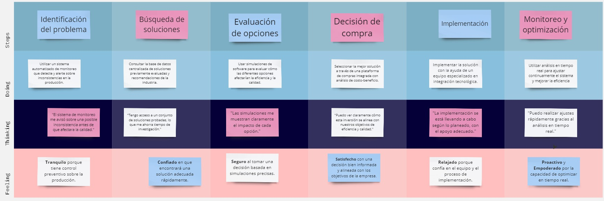
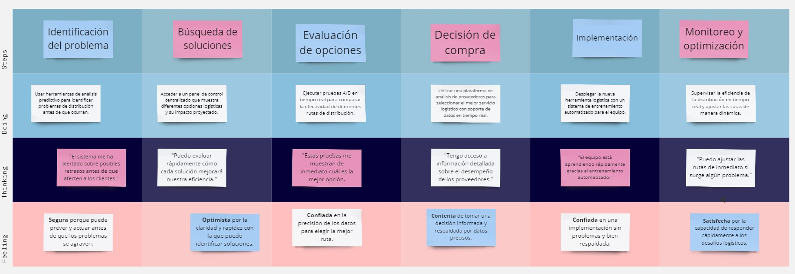

# Capítulo III: Requirements Specification

## 3.1. To-Be Scenario Mapping.
**Rubén Flores**

**Camila Ramos**

## 3.2. User Stories.

En este punto, se encuentran una serie de historias de usuario que han sido creadas para capturar las necesidades y expectativas clave del producto. Estas historias servirán como base para la planificación, el desarrollo y la validación del software.

<table>
    <thead>
        <tr>
            <th>Epic / Story ID</th>
            <th>Título</th>
            <th>Descripción</th>
            <th>Criterios de Aceptación</th>
            <th>Relacionado con (Epic ID)</th>
        </tr>
    </thead>
    <tbody>
        <!-- User Story 1 -->
        <tr>
            <td>EPIC-001</td>
            <td>Gestión de Inventario</td>
            <td>
                Como productor, quiero gestionar el inventario de insumos y productos terminados para asegurar que siempre tenga lo necesario para la producción.
            </td>
            <td>N/A</td>
            <td>N/A</td>
        </tr>
        <!-- User Story 2 -->
        <tr>
            <td>EPIC-002</td>
            <td>Seguimiento del Proceso de Vinificación</td>
            <td>Como enólogo, quiero tener un seguimiento detallado del proceso de vinificación para asegurar la calidad del producto final.</td>
            <td>N/A</td>
            <td>N/A</td>
        </tr>
        <!-- User Story 3 -->
        <tr>
            <td>EPIC-003</td>
            <td>Control de Cartera de Clientes</td>
            <td>Como vendedor, quiero gestionar la cartera de clientes para mantener un seguimiento de las transacciones y mejorar la relación con ellos.</td>
            <td>N/A</td>
            <td>N/A</td>
        </tr>
        <!-- User Story 4 --> 
        <tr>
            <td>EPIC-004</td>
            <td>Portal de Pedidos para Distribuidores</td>
            <td>Como distribuidor, quiero tener un portal de pedidos fácil de usar para realizar mis pedidos de manera rápida y eficiente.</td>
            <td>N/A</td>
            <td>N/A</td>
        </tr>
        <!-- User Story 5 -->
        <tr>
            <td>EPIC-005</td>
            <td>Gestión del Viñedo</td>
            <td>Como viticultor, quiero gestionar las labores del viñedo para optimizar la producción de uvas y asegurar la calidad de la materia prima.</td>
            <td>N/A</td>
            <td>N/A</td>
        </tr>
        <!-- User Story 6 -->
        <tr>
            <td>EPIC-006</td>
            <td>Planificación de la Cosecha</td>
            <td>Como viticultor, quiero planificar la cosecha para asegurar que se realice en el momento óptimo y con la logística adecuada.</td>
            <td>N/A</td>
            <td>N/A</td>
        </tr>
        <!-- User Story 7 -->
        <tr>
            <td>EPIC-007</td>
            <td>Generación de Reportes de Producción</td>
            <td>Como gerente de producción, quiero generar reportes detallados sobre el rendimiento de la producción para facilitar la toma de decisiones
                informadas.</td>
            <td>N/A</td>
            <td>N/A</td>
        </tr>
        <!-- User Story 8 -->
        <tr>
            <td>EPIC-008</td>
            <td>Gestión de Planes de Pago</td>
            <td>Como usuario, quiero tener la opción de elegir entre diferentes planes de pago para acceder a funcionalidades que se adapten a mis necesidades.</td>
            <td>N/A</td>
            <td>N/A</td>
        </tr>
        <!-- User Story 9 -->
        <tr>
            <td>EPIC-009</td>
            <td>Mejora de la Experiencia del Usuario</td>
            <td>Como usuario, quiero que la interfaz del software sea amigable e intuitiva para facilitar su uso y minimizar la curva de aprendizaje.</td>
            <td>N/A</td>
            <td>N/A</td>
        </tr>
    </tbody>
</table>

<table>
    <thead>
        <tr>
            <th>Story ID</th>
            <th>Título</th>
            <th>Descripción</th>
            <th>Criterios de Aceptación</th>
            <th>Epic ID</th>
        </tr>
    </thead>
    <tbody>
        <!-- User Story 1 -->
        <tr>
            <td>US-001</td>
            <td>Hipervínculos en el encabezado</td>
            <td>
                Como visitante de la landing page, quiero que las opciones del encabezado me dirijan a las diferentes secciones de la Landing Page para poder
                navegar de forma rápida y fluida.
            </td>
            <td>
                <strong>Escenario 1: Navegación fluida.</strong>  
                Dado que un usuario ha navegado a una sección de la Landing Page, cuando el usuario hace clic en otra opción del encabezado, entonces la página
                se desplaza suavemente a la nueva sección seleccionada
                y la URL de la página cambia para reflejar la nueva sección. 
                <strong>Escenario 2: Múltiples Dispositivos.</strong>  
                Dado que un usuario visita la landing page desde un dispositivo móvil, cuando el usuario hace clic en una opción del encabezado, entonces la
                página se desplaza suavemente a la sección
                correspondiente, adaptándose al tamaño de la pantalla del dispositivo.
            </td>
            <td>EPIC-009</td>
        </tr>
        <!-- User Story 2 -->
        <tr>
            <td>US-002</td>
            <td>Información sobre beneficios de la aplicación</td>
            <td>
                Como usuario, quiero saber más sobre los beneficios de la aplicación web para considerar ser miembro de la aplicación.
            </td>
            <td>
                <strong>Escenario 01: Navegación a la sección de beneficios.</strong>  
                Dado que un usuario visita la página de inicio de la aplicación web, cuando el usuario hace clic en la sección "Beneficios", entonces se muestra
                una página con información clara y concisa sobre los
                beneficios de la aplicación, incluyendo una lista de beneficios, imágenes ilustrativas y ejemplos concretos. 
                <strong>Escenario 02: Información Clara y Concisa.</strong>  
                Dado que un usuario está leyendo la página de beneficios, cuando el usuario lee la información sobre un beneficio específico, entonces la
                información es fácil de entender y no contiene lenguaje
                técnico.
            </td>
            <td>EPIC-009</td>
        </tr>
        <!-- User Story 3 -->
        <tr>
            <td>US-003</td>
            <td>Mostrar los planes disponibles</td>
            <td>
                Como visitante del landing page, quiero saber sobre los planes que tiene, para poder analizar si el plan que me ofrecen se adecúa a las
                necesidades de mi negocio.
            </td>
            <td>
                <strong>Escenario 01: Información Clara y Concisa.</strong>  
                Dado que un usuario está leyendo la página de un plan específico, cuando el usuario lee la información sobre una función específica del plan,
                entonces la información es fácil de entender y no
                contiene lenguaje técnico. 
                <strong>Escenario 02: Comparación de Planes.</strong>  
                Dado que un usuario está leyendo la página de un plan específico, cuando el usuario quiere comparar el plan con otro plan, entonces la página
                ofrece una herramienta para comparar los planes en
                paralelo, mostrando las diferencias en precio, funciones, beneficios y limitaciones.
            </td>
            <td>EPIC-008</td>
        </tr>
        <!-- User Story 4 -->
        <tr>
            <td>US-004</td>
            <td>Información útil en el footer</td>
            <td>
                Como usuario que visita la landing page, quiero encontrar información útil en el footer para poder contactarme con la empresa, conocer más sobre
                ella, leer sus políticas y seguirla en redes sociales.
            </td>
            <td>
                <strong>Escenario 01: Información de Contacto.</strong>  
                Dado que un usuario visita la landing page, cuando el usuario busca información de contacto en el footer, entonces el footer muestra la siguiente
                información: correo electrónico, teléfono y
                dirección, resaltada en un color diferente al resto del texto. 
                <strong>Escenario 02: Redes Sociales.</strong>  
                Dado que un usuario visita la landing page, cuando el usuario busca los iconos de redes sociales en el footer, entonces el footer muestra iconos
                de Facebook, Twitter e Instagram, y al hacer clic en
                un icono, el usuario es dirigido a la página de la empresa en esa red social.
            </td>
            <td>EPIC-009</td>
        </tr>
        <!-- User Story 5 -->
        <tr>
            <td>US-005</td>
            <td>Información sobre el producto</td>
            <td>
                Como usuario que visita la landing page, quiero entender claramente qué ofrece el producto para poder tomar una decisión informada sobre si
                adquirirlo o no.
            </td>
            <td>
                <strong>Escenario 01: Descripción Clara y Concisa.</strong>  
                Dado que un usuario visita la landing page, cuando el usuario lee y visualiza un video sobre la descripción del producto, entonces la descripción
                debe ser clara y concisa, resaltando los beneficios
                clave del producto y motivando al usuario a adquirirlo. 
                <strong>Escenario 02: Llamado a la Acción.</strong>  
                Dado que un usuario ha leído la información del producto, cuando decide que quiere adquirirlo, entonces la sección del producto debe ofrecer un
                botón claro y visible para descargar e iniciar a
                utilizar el producto.
            </td>
            <td>EPIC-009</td>
        </tr>
        <!-- User Story 6 -->
        <tr>
            <td>US-006</td>
            <td>Registro de Entrada de Insumos</td>
            <td>
                Como encargado de bodega, quiero registrar la entrada de insumos para mantener actualizado el inventario.
            </td>
            <td>
                <strong>Escenario 01: Ingreso de Datos.</strong>  
                Dado que el encargado de bodega se encuentra en la sección de insumos, cuando ingresa los datos del nuevo insumo, entonces el sistema guarda la
                información y actualiza el inventario. 
                <strong>Escenario 02: Generación de Código de Barras.</strong>  
                Dado que se ha registrado un nuevo insumo, cuando el sistema genera el código de barras, entonces el encargado de bodega puede imprimir la
                etiqueta y pegarla en el producto. 
                <strong>Escenario 03: Notificación al Enólogo.</strong>  
                Dado que se ha registrado un nuevo insumo, cuando el sistema envía la notificación al enólogo, entonces el enólogo recibe la información sobre la
                llegada del nuevo insumo.
            </td>
            <td>EPIC-001</td>
        </tr>
        <!-- User Story 7 -->
        <tr>
            <td>US-007</td>
            <td>Registro de Salida de Productos Terminados</td>
            <td>
                Como encargado de despacho, quiero registrar la salida de productos terminados para mantener actualizado el inventario.
            </td>
            <td>
                <strong>Escenario 01: Escaneo de Código de Barras.</strong>  
                Dado que el encargado de despacho se encuentra en la sección de despacho, cuando escanea el código de barras del producto, entonces el sistema
                registra automáticamente la salida del producto. 
                <strong>Escenario 02: Registro de Fecha y Hora.</strong>  
                Dado que se ha escaneado el código de barras, cuando el sistema registra la fecha y hora de salida, entonces se actualiza el inventario con la
                información del producto despachado. 
                <strong>Escenario 03: Reporte de Despachos.</strong>  
                Dado que se han registrado varios despachos, cuando el encargado de despacho genera el reporte, entonces el sistema muestra un listado de todos
                los productos despachados por día.
            </td>
            <td>EPIC-001</td>
        </tr>
        <!-- User Story 8 -->
        <tr>
            <td>US-008</td>
            <td>Registro de Parámetros de Fermentación</td>
            <td>
                Como enólogo, quiero registrar los parámetros de fermentación para asegurar la calidad del proceso.
            </td>
            <td>
                <strong>Escenario 01: Ingreso de Datos.</strong>  
                Dado que el enólogo se encuentra en la sección de fermentación, cuando ingresa los datos de temperatura, densidad y pH, entonces el sistema guarda
                la información. 
                <strong>Escenario 02: Visualización de Gráficos.</strong>  
                Dado que se han registrado varios datos de fermentación, cuando el enólogo accede a la sección de gráficos, entonces el sistema muestra la
                evolución de los parámetros a lo largo del tiempo. 
                <strong>Escenario 03: Alertas por Desviación.</strong>  
                Dado que algún parámetro se desvía del rango establecido, cuando el sistema detecta la anomalía, entonces envía una alerta al enólogo para que
                tome las medidas correctivas.
            </td>
            <td>EPIC-002</td>
        </tr>
        <!-- User Story 9 -->
        <tr>
            <td>US-009</td>
            <td>Registro de Actividades de Maduración</td>
            <td>
                Como enólogo, quiero registrar las actividades realizadas durante la maduración para tener un historial completo del proceso.
            </td>
            <td>
                <strong>Escenario 01: Ingreso de Actividades.</strong>  
                Dado que el enólogo se encuentra en la sección de maduración, cuando ingresa las actividades realizadas, entonces el sistema guarda la información
                 
                <strong>Escenario 02: Asociación con Lote.</strong>  
                Dado que se ha registrado una actividad, cuando el sistema asocia la actividad con el lote correspondiente, entonces se mantiene un historial
                detallado del proceso de maduración por lote. 
                <strong>Escenario 03: Informe de Maduración.</strong>  
                Dado que se han registrado varias actividades de maduración, cuando el enólogo genera el informe, entonces el sistema muestra un reporte detallado
                del proceso de maduración por cada lote.
            </td>
            <td>EPIC-002</td>
        </tr>
        <!-- User Story 10 -->
        <tr>
            <td>US-010</td>
            <td>Registro de Datos de Clientes</td>
            <td>
                Como vendedor, quiero registrar los datos de mis clientes para tener un historial de sus compras y facilitar futuras transacciones.
            </td>
            <td>
                <strong>Escenario 01: Ingreso de Datos.</strong>  
                Dado que el vendedor se encuentra en la sección de clientes, cuando ingresa los datos del cliente, entonces el sistema guarda la información y
                genera un código único para el cliente. 
                <strong>Escenario 02: Asociación con Distribuidor.</strong>  
                Dado que se ha registrado un nuevo cliente, cuando el vendedor asocia al cliente con su respectivo distribuidor, entonces se mantiene un vínculo
                entre ambos en el sistema. 
                <strong>Escenario 03: Historial de Compras.</strong>  
                Dado que se han registrado varias compras de un cliente, cuando el vendedor accede al perfil del cliente, entonces el sistema muestra un historial
                detallado de todas las transacciones realizadas.
            </td>
            <td>EPIC-003</td>
        </tr>
        <!-- User Story 11 -->
        <tr>
            <td>US-011</td>
            <td>Registro de Pedidos de Clientes</td>
            <td>
                Como vendedor, quiero registrar los pedidos de mis clientes para tener un control de las ventas y facilitar el despacho.
            </td>
            <td>
                <strong>Escenario 01: Ingreso de Pedido.</strong>  
                Dado que el vendedor se encuentra en la sección de pedidos, cuando ingresa los datos del pedido, entonces el sistema guarda la información y
                genera un código único para el pedido. 
                <strong>Escenario 02: Asociación con Cliente.</strong>  
                Dado que se ha registrado un nuevo pedido, cuando el sistema asocia el pedido con el cliente correspondiente, entonces se mantiene un vínculo
                entre ambos en el sistema. 
                <strong>Escenario 03: Notificación al Distribuidor.</strong>  
                Dado que se ha registrado un nuevo pedido, cuando el sistema envía la notificación al distribuidor, entonces el distribuidor recibe la información
                sobre el nuevo pedido.
            </td>
            <td>EPIC-003</td>
        </tr>
        <!-- User Story 12 -->
        <tr>
            <td>US-012</td>
            <td>Visualización de Productos Disponibles</td>
            <td>
                Como distribuidor, quiero visualizar los productos disponibles para poder realizar mis pedidos.
            </td>
            <td>
                <strong>Escenario 01: Listado de Productos.</strong>  
                Dado que el distribuidor se encuentra en la sección de productos, cuando accede a la lista, entonces el sistema muestra todos los productos
                disponibles con sus respectivas descripciones y precios
                 
                <strong>Escenario 02: Filtrado por Categoría.</strong>  
                Dado que el distribuidor quiere ver solo los productos de una categoría específica, cuando selecciona la categoría, entonces el sistema muestra
                solo los productos de esa categoría. 
                <strong>Escenario 03: Indicador de Disponibilidad.</strong>  
                Dado que el distribuidor está revisando un producto, cuando el sistema muestra el indicador de disponibilidad, entonces el distribuidor sabe si el
                producto está en stock o no.
            </td>
            <td>EPIC-004</td>
        </tr>
        <!-- User Story 13 -->
        <tr>
            <td>US-013</td>
            <td>Registro de Pedidos</td>
            <td>
                Como distribuidor, quiero registrar mis pedidos para asegurar la entrega de los productos que necesito.
            </td>
            <td>
                <strong>Escenario 01: Ingreso de Pedido.</strong>  
                Dado que el distribuidor se encuentra en la sección de pedidos, cuando ingresa los datos del pedido, entonces el sistema guarda la información y
                genera un código único para el pedido. 
                <strong>Escenario 02: Asociación con Productos.</strong>  
                Dado que se ha registrado un nuevo pedido, cuando el sistema asocia los productos seleccionados con el pedido, entonces se mantiene un vínculo
                entre ambos en el sistema. 
                <strong>Escenario 03: Notificación al Vendedor.</strong>  
                Dado que se ha registrado un nuevo pedido, cuando el sistema envía la notificación al vendedor, entonces el vendedor recibe la información sobre
                el nuevo pedido.
            </td>
            <td>EPIC-004</td>
        </tr>
        <!-- User Story 14 -->
        <tr>
            <td>US-014</td>
            <td>Autorización y seguridad de acceso al API</td>
            <td>
                Como desarrollador, quiero poder configurar una autenticación y autorización segura en el API para garantizar que solo los usuarios admin puedan
                acceder al sistema.
            </td>
            <td>
                <strong>Escenario 01: Acceso con Credenciales Válidas.</strong>  
                Dado que un usuario admin quiere ingresar, cuando proporciona credenciales válidas, entonces el sistema le permite ingresar. 
                <strong>Escenario 02: Acceso con Credenciales Inválidas.</strong>  
                Dado que un usuario admin proporciona credenciales no válidas, entonces el sistema no le permite ingresar y le notifica que tiene 2 intentos
                restantes. 
                <strong>Escenario 03: Intento de Acceso No Autorizado.</strong>  
                Dado que un usuario no admin quiere ingresar, entonces el sistema le niega el acceso y notifica a los administradores.
            </td>
            <td>EPIC-003</td>
        </tr>
        <!-- User Story 15 -->
        <tr>
            <td>US-015</td>
            <td>Registro de Nuevos Clientes</td>
            <td>
                Como vendedor, quiero poder crear una cuenta para nuevos clientes en el sistema para gestionar sus pedidos y datos de contacto.
            </td>
            <td>
                <strong>Escenario 01: Pantalla de Creación de Cuenta.</strong>  
                Dado que el vendedor está en la sección de gestión de clientes, cuando hace clic en "Agregar Cliente", entonces aparece la pantalla de creación de
                cuenta nueva. 
                <strong>Escenario 02: Ingreso de Datos.</strong>  
                Dado que el vendedor llena los datos del cliente y hace clic en "Aceptar", entonces el cliente se guarda en la base de datos y se muestra un
                mensaje de éxito. 
                <strong>Escenario 03: Error por Datos Faltantes.</strong>  
                Dado que el vendedor no llena todos los campos requeridos, entonces aparece un mensaje de error indicando qué datos faltan.
            </td>
            <td>EPIC-002</td>
        </tr>
        <!-- User Story 16 -->
        <tr>
            <td>US-016</td>
            <td>Programar Consulta con un Cliente</td>
            <td>
                Como vendedor, quiero poder programar una consulta con un cliente para discutir sus necesidades y ofrecer recomendaciones.
            </td>
            <td>
                <strong>Escenario 01: Opción de Contacto.</strong>  
                Dado que soy un vendedor registrado, cuando accedo al perfil de un cliente, entonces tengo la opción de programar una consulta. 
                <strong>Escenario 02: Confirmación de Consulta.</strong>  
                Dado que he programado una consulta, cuando se confirma la cita, entonces recibo una notificación por correo electrónico.
            </td>
            <td>EPIC-003</td>
        </tr>
        <!-- User Story 17 -->
        <tr>
            <td>US-017</td>
            <td>Visualizar Home de la Plataforma</td>
            <td>
                Como usuario de ElixirControl, deseo poder acceder a un home de la aplicación para visualizar las opciones disponibles para mi rol.
            </td>
            <td>
                <strong>Escenario 01: Redirección al Home.</strong>  
                Dado que soy un usuario registrado, cuando accedo a la sección de inicio, entonces el sistema me redirige al home de la aplicación. 
                <strong>Escenario 02: Redirección para Administradores.</strong>  
                Dado que soy un administrador registrado, cuando accedo a la sección de inicio, entonces el sistema me redirige al home de la aplicación con
                opciones administrativas.
            </td>
            <td>EPIC-009</td>
        </tr>
        <!-- User Story 18 -->
        <tr>
            <td>US-018</td>
            <td>Visualizar una Página No Encontrada</td>
            <td>
                Como usuario de ElixirControl, deseo saber qué páginas no están a mi alcance para poder visualizar las opciones disponibles para mi rol.
            </td>
            <td>
                <strong>Escenario 01: Redirección a Página No Encontrada.</strong>  
                Dado que soy un usuario registrado, cuando ingreso una ruta incorrecta, entonces la aplicación me redirige a una página no encontrada. 
                <strong>Escenario 02: Mensaje de Error.</strong>  
                La página no encontrada debe mostrar un mensaje claro indicando que la ruta no es válida.
            </td>
            <td>EPIC-009</td>
        </tr>
        <!-- User Story 19 -->
        <tr>
            <td>US-019</td>
            <td>Cambiar Idioma</td>
            <td>
                Como visitante de la landing page, quiero acceder a una versión en otro idioma para poder entender mejor la información y navegar con mayor
                facilidad.
            </td>
            <td>
                <strong>Escenario 01: Información en Español.</strong>  
                Dado que el usuario quiere acceder al contenido en español, cuando presiona el botón para cambiar idioma, entonces la información es traducida y
                presentada en español. 
                <strong>Escenario 02: Información en Inglés.</strong>  
                Dado que el usuario quiere acceder al contenido en inglés, cuando presiona el botón para cambiar idioma, entonces la información es traducida y
                presentada en inglés.
            </td>
            <td>EPIC-009</td>
        </tr>
        <!-- User Story 20 -->
        <tr>
            <td>US-020</td>
            <td>Visualizar Testimonios de los Usuarios</td>
            <td>
                Como usuario visitante de la landing page, quiero saber la opinión de los usuarios que han utilizado la aplicación para tener una referencia de la
                experiencia de estos usuarios con el producto.
            </td>
            <td>
                <strong>Escenario 01: Testimonios sobre la Aplicación.</strong>  
                Dado que el usuario quiere conocer la opinión de otros usuarios sobre la plataforma, cuando lee las reseñas de valoración, entonces podrá evaluar
                según los comentarios y decidirá la posibilidad de
                uso de la aplicación.
            </td>
            <td>EPIC-009</td>
        </tr>
        <!-- User Story 21 -->
        <tr>
            <td>US-021</td>
            <td>Visualizar Formulario de Contacto</td>
            <td>
                Como usuario visitante de la landing page, quiero contar con opciones de contacto con la empresa para preguntar más información sobre el producto
                o servicio.
            </td>
            <td>
                <strong>Escenario 01: Envío de Mensaje Exitoso.</strong>  
                Dado que el usuario se encuentra en la sección de contacto, cuando ingresa correctamente los datos solicitados en el formulario, entonces el
                mensaje es enviado con éxito y se registrará su consulta
                 
                <strong>Escenario 02: Error en Envío de Mensaje.</strong>  
                Dado que el usuario se encuentra en la sección de contacto, cuando el usuario ingresa los datos solicitados en el formulario de forma incorrecta o
                inconclusa, entonces su mensaje no será enviado.
            </td>
            <td>EPIC-009</td>
        </tr>
        <!-- User Story 22 -->
        <tr>
            <td>US-022</td>
            <td>Integración de Validadores en Formularios de la App Web</td>
            <td>
                Como usuario de ElixirControl, quiero que los formularios en la app web tengan validadores integrados para asegurar la integridad de los datos que
                ingreso.
            </td>
            <td>
                <strong>Escenario 01: Validar Campos Requeridos.</strong>  
                Dado que estoy en cualquier formulario de la web app, cuando intento enviar el formulario sin completar campos requeridos, entonces debo ver un
                mensaje de error que indique los campos que necesitan
                ser completados. 
                <strong>Escenario 02: Enviar Formulario Correctamente.</strong>  
                Dado que estoy en cualquier formulario de la web app, cuando ingreso datos válidos en todos los campos, entonces debo poder enviar el formulario
                correctamente y el sistema muestra un mensaje de
                éxito.
            </td>
            <td>EPIC-009</td>
        </tr>
        <!-- User Story 23 -->
        <tr>
            <td>US-023</td>
            <td>Gestión de Lotes de Producción</td>
            <td>
                Como enólogo, quiero tener una herramienta que me ayude a gestionar mis lotes de producción de manera eficiente para poder compartir información
                relevante con los interesados en el proceso.
            </td>
            <td>
                <strong>Escenario 01: Visualización de Lotes.</strong>  
                Dado que el enólogo se encuentra en su perfil, cuando accede a la sección de lotes, entonces el sistema muestra todos los lotes que ha gestionado
             
                <strong>Escenario 02: Edición de Lotes.</strong>  
                Dado que el enólogo se encuentra en su lista de lotes, cuando selecciona un lote y elige la opción de editar, entonces puede modificar la
                información del lote y guardar los cambios. 
                <strong>Escenario 03: Eliminación de Lotes.</strong>  
                Dado que el enólogo se encuentra en su lista de lotes, cuando selecciona un lote y elige la opción de eliminar, entonces se le solicita
                confirmación y, al confirmarla, el lote se elimina de la lista.
            </td>
            <td>EPIC-007</td>
        </tr>
        <!-- User Story 24 -->
        <tr>
            <td>US-024</td>
            <td>Gestión de Suscripción</td>
            <td>
                Como productor, quiero contar con la posibilidad de suscribirme a un plan de pago para acceder a beneficios exclusivos y mejorar mi experiencia en
                la aplicación.
            </td>
            <td>
                <strong>Escenario 01: Selección de Plan.</strong>  
                Dado que el productor se encuentra en la sección de suscripción, cuando elige un plan de pago, entonces el sistema muestra los detalles y
                beneficios de ese plan. 
                <strong>Escenario 02: Proceso de Suscripción.</strong>  
                Dado que el productor ha seleccionado un plan, cuando completa el formulario de suscripción y realiza el pago, entonces el sistema confirma la
                suscripción y activa los beneficios correspondientes
                 
                <strong>Escenario 03: Cancelación de Suscripción.</strong>  
                Dado que el productor desea cancelar su suscripción, cuando selecciona la opción de cancelar, entonces el sistema le solicita confirmación y, al
                confirmarla, cancela la suscripción y notifica al
                usuario.
            </td>
            <td>EPIC-008</td>
        </tr>
        <!-- User Story 25 -->
        <tr>
            <td>US-025</td>
            <td>Mejora de la Experiencia del Usuario</td>
            <td>
                Como usuario, quiero que la interfaz del software sea amigable e intuitiva para facilitar su uso y minimizar la curva de aprendizaje.
            </td>
            <td>
                <strong>Escenario 01: Interfaz Amigable.</strong>  
                Dado que el usuario accede a la aplicación, cuando navega por las diferentes secciones, entonces la interfaz debe ser clara y fácil de entender
                 
                <strong>Escenario 02: Tutoriales.</strong>  
                Dado que el usuario es nuevo en la aplicación, cuando accede a la sección de ayuda, entonces se le ofrecen tutoriales o guías de uso que le ayuden
                a familiarizarse con las funcionalidades. 
                <strong>Escenario 03: Feedback del Usuario.</strong>  
                Dado que el usuario ha utilizado la aplicación, cuando se le solicita feedback, entonces puede enviar sus comentarios sobre la experiencia y
                sugerencias de mejora.
            </td>
            <td>EPIC-009</td>
        </tr>
        <!-- User Story 26 -->
        <tr>
            <td>US-026</td>
            <td>Gestión de Notificaciones</td>
            <td>
                Como productor, quiero recibir notificaciones sobre actualizaciones en mis lotes y solicitudes de los distribuidores para estar al tanto de la
                actividad en mi perfil.
            </td>
            <td>
                <strong>Escenario 01: Notificaciones de Lote.</strong>  
                Dado que el productor tiene lotes en curso, cuando ocurre un cambio o actualización en alguno de ellos, entonces recibe una notificación con los
                detalles. 
                <strong>Escenario 02: Notificaciones de Solicitud.</strong>  
                Dado que un distribuidor envía una solicitud al productor, cuando se recibe la solicitud, entonces el productor recibe una notificación con la
                información del distribuidor y el lote solicitado. 
                <strong>Escenario 03: Configuración de Notificaciones.</strong>  
                Dado que el productor desea personalizar sus notificaciones, cuando accede a la sección de configuración, entonces puede seleccionar el tipo de
                notificaciones que desea recibir y la frecuencia.
            </td>
            <td>EPIC-008</td>
        </tr>
                <!-- User Story 26 -->
        <tr>
            <td>US-026</td>
            <td>Gestión de Notificaciones</td>
            <td>
                Como productor, quiero recibir notificaciones sobre actualizaciones en mis lotes y solicitudes de los distribuidores para estar al tanto de la
                actividad en mi perfil.
            </td>
            <td>
                <strong>Escenario 01: Notificaciones de Lote.</strong>  
                Dado que el productor tiene lotes en curso, cuando ocurre un cambio o actualización en alguno de ellos, entonces recibe una notificación con los
                detalles. 
                <strong>Escenario 02: Notificaciones de Solicitud.</strong>  
                Dado que un distribuidor envía una solicitud al productor, cuando se recibe la solicitud, entonces el productor recibe una notificación con la
                información del distribuidor y el lote solicitado. 
                <strong>Escenario 03: Configuración de Notificaciones.</strong>  
                Dado que el productor desea personalizar sus notificaciones, cuando accede a la sección de configuración, entonces puede seleccionar el tipo de
                notificaciones que desea recibir y la frecuencia.
            </td>
            <td>EPIC-008</td>
        </tr>
        <!-- User Story 27 -->
        <tr>
            <td>US-027</td>
            <td>Generación de Reportes</td>
            <td>
                Como productor, quiero poder generar reportes sobre mi desempeño y actividad en la plataforma para tener una visión general de mi rendimiento.
            </td>
            <td>
                <strong>Escenario 01: Selección de Reportes.</strong>  
                Dado que el productor se encuentra en la sección de reportes, cuando selecciona el tipo de reporte que desea generar, entonces el sistema muestra
                las opciones disponibles. 
                <strong>Escenario 02: Generación de Reporte.</strong>  
                Dado que el productor ha seleccionado las opciones para el reporte, cuando genera el reporte, entonces el sistema muestra los resultados en
                formato PDF o Excel. 
                <strong>Escenario 03: Programación de Reportes.</strong>  
                Dado que el productor desea recibir reportes periódicamente, cuando programa la generación de reportes, entonces el sistema envía automáticamente
                los reportes según la frecuencia establecida.
            </td>
            <td>EPIC-007</td>
        </tr>
        <!-- User Story 28 -->
        <tr>
            <td>US-028</td>
            <td>Integración con Redes Sociales</td>
            <td>
                Como productor, quiero poder integrar mi perfil de ElixirControl con mis redes sociales para ampliar mi alcance y visibilidad.
            </td>
            <td>
                <strong>Escenario 01: Conexión con Redes Sociales.</strong>  
                Dado que el productor se encuentra en la sección de configuración de perfil, cuando selecciona la opción de integrar con redes sociales, entonces
                el sistema muestra las redes disponibles para
                conectar. 
                <strong>Escenario 02: Publicación Automática.</strong>  
                Dado que el productor ha conectado sus redes sociales, cuando realiza una actualización en su perfil de ElixirControl, entonces el sistema publica
                automáticamente en las redes sociales vinculadas
                 
                <strong>Escenario 03: Desconexión de Redes Sociales.</strong>  
                Dado que el productor desea desvincular una red social, cuando selecciona la opción de desconectar, entonces el sistema elimina la conexión y deja
                de publicar automáticamente en esa red.
            </td>
            <td>EPIC-008</td>
        </tr>
        <!-- User Story 29 -->
        <tr>
            <td>US-029</td>
            <td>Gestión de Reseñas</td>
            <td>
                Como productor, quiero poder responder a las reseñas de mis clientes para mejorar la comunicación y resolver cualquier inquietud.
            </td>
            <td>
                <strong>Escenario 01: Visualización de Reseñas.</strong>  
                Dado que el productor se encuentra en la sección de reseñas, cuando accede a la lista de reseñas, entonces el sistema muestra todas las reseñas
                recibidas. 
                <strong>Escenario 02: Respuesta a Reseñas.</strong>  
                Dado que el productor desea responder a una reseña, cuando selecciona la opción de responder, entonces el sistema muestra un campo de texto para
                ingresar la respuesta. 
                <strong>Escenario 03: Notificación de Respuesta.</strong>  
                Dado que el productor ha respondido a una reseña, cuando el cliente recibe la respuesta, entonces el sistema envía una notificación al cliente con
                la respuesta del productor.
            </td>
            <td>EPIC-007</td>
        </tr>
        <!-- User Story 30 -->
        <tr>
            <td>US-030</td>
            <td>Gestión de Lotes Destacados</td>
            <td>
                Como productor, quiero poder destacar ciertos lotes en mi perfil para resaltar mis mejores trabajos y atraer más clientes.
            </td>
            <td>
                <strong>Escenario 01: Selección de Lotes Destacados.</strong>  
                Dado que el productor se encuentra en la sección de lotes, cuando selecciona la opción de destacar un lote, entonces el sistema muestra una marca
                o etiqueta que indica que el lote está destacado. 
                <strong>Escenario 02: Orden de Lotes.</strong>  
                Dado que el productor ha seleccionado varios lotes destacados, cuando accede a su perfil, entonces el sistema muestra primero los lotes destacados
                y luego los demás lotes. 
                <strong>Escenario 03: Límite de Lotes Destacados.</strong>  
                Dado que el productor desea destacar más lotes, cuando alcanza el límite establecido, entonces el sistema muestra un mensaje indicando que no
                puede destacar más lotes.
            </td>
            <td>EPIC-008</td>
        </tr>
        <!-- User Story 31 -->
        <tr>
            <td>US-031</td>
            <td>Integración con Herramientas de Gestión</td>
            <td>
                Como productor, quiero poder integrar mi perfil de ElixirControl con herramientas de gestión para facilitar la administración de mis proyectos de
                vinificación.
            </td>
            <td>
                <strong>Escenario 01: Selección de Herramientas.</strong>  
                Dado que el productor se encuentra en la sección de configuración de perfil, cuando selecciona la opción de integrar con herramientas de gestión,
                entonces el sistema muestra las herramientas
                disponibles para conectar. 
                <strong>Escenario 02: Sincronización de Datos.</strong>  
                Dado que el productor ha conectado una herramienta de gestión, cuando actualiza información en esa herramienta, entonces el sistema sincroniza
                automáticamente los datos en su perfil de ElixirControl
                 
                <strong>Escenario 03: Desconexión de Herramientas.</strong>  
                Dado que el productor desea desvincular una herramienta de gestión, cuando selecciona la opción de desconectar, entonces el sistema elimina la
                conexión y deja de sincronizar automáticamente los
                datos de esa herramienta.
            </td>
            <td>EPIC-009</td>
        </tr>
        <!-- User Story 32 -->
        <tr>
            <td>US-032</td>
            <td>Gestión de Proyectos Colaborativos</td>
            <td>
                Como enólogo, quiero poder trabajar en proyectos colaborativos con otros enólogos para ofrecer un servicio más completo a los productores.
            </td>
            <td>
                <strong>Escenario 01: Creación de Proyecto Colaborativo.</strong>  
                Dado que el enólogo se encuentra en la sección de proyectos, cuando selecciona la opción de crear un proyecto colaborativo, entonces el sistema
                muestra un formulario para ingresar los detalles del 
                proyecto y los enólogos participantes. 
                <strong>Escenario 02: Seguimiento de Proyecto Colaborativo.</strong>  
                Dado que el proyecto colaborativo está en curso, cuando el enólogo accede a la sección del proyecto, entonces el sistema muestra los avances y
                tareas asignadas a cada enólogo participante. 
                <strong>Escenario 03: Finalización de Proyecto Colaborativo.</strong>  
                Dado que el proyecto colaborativo ha sido completado, cuando el enólogo selecciona la opción de finalizar, entonces el sistema solicita la
                confirmación de todos los enólogos participantes y, al 
                recibir la confirmación, marca el proyecto como finalizado.
            </td>
            <td>EPIC-007</td>
        </tr>
        <!-- User Story 33 -->
        <tr>
            <td>US-033</td>
            <td>Gestión de Presupuestos</td>
            <td>
                Como productor, quiero poder crear y gestionar presupuestos para mis proyectos de vinificación para tener un control financiero de cada lote.
            </td>
            <td>
                <strong>Escenario 01: Creación de Presupuesto.</strong>  
                Dado que el productor se encuentra en la sección de un proyecto, cuando selecciona la opción de crear presupuesto, entonces el sistema muestra un
                formulario para ingresar los detalles del 
                presupuesto, incluyendo materias primas, mano de obra y otros gastos. 
                <strong>Escenario 02: Seguimiento de Presupuesto.</strong>  
                Dado que el proyecto está en curso, cuando el productor accede a la sección del presupuesto, entonces el sistema muestra el presupuesto original y
                los gastos reales incurridos hasta el momento. 
                <strong>Escenario 03: Actualización de Presupuesto.</strong>  
                Dado que el productor necesita actualizar el presupuesto, cuando selecciona la opción de editar, entonces el sistema permite modificar el
                presupuesto y guarda los cambios.
            </td>
            <td>EPIC-008</td>
        </tr>
        <!-- User Story 34 -->
        <tr>
            <td>US-034</td>
            <td>Gestión de Calendario</td>
            <td>
                Como productor, quiero poder gestionar mi calendario de proyectos de vinificación para tener una visión general de mis compromisos y planificar
                mejor mi tiempo.
            </td>
            <td>
                <strong>Escenario 01: Visualización de Calendario.</strong>  
                Dado que el productor se encuentra en la sección de calendario, cuando accede a la vista del calendario, entonces el sistema muestra los proyectos
                programados por día, semana o mes. 
                <strong>Escenario 02: Programación de Proyectos.</strong>  
                Dado que el productor tiene un nuevo proyecto, cuando selecciona la opción de programar, entonces el sistema muestra un formulario para ingresar
                los detalles del proyecto y la fecha de inicio y fin. 
                 
                <strong>Escenario 03: Notificaciones de Calendario.</strong>  
                Dado que el productor tiene proyectos programados, cuando se acerca la fecha de inicio de un proyecto, entonces el sistema envía una notificación
                al productor recordando el proyecto próximo a 
                comenzar.
            </td>
            <td>EPIC-009</td>
        </tr>
    </tbody>
</table>

## 3.3. Impact Mapping.

## 3.4. Product Backlog.

<table>
    <thead>
        <tr>
            <th>Orden</th>
            <th>User Story Id</th>
            <th>Título</th>
            <th>Descripción</th>
            <th>Story Points (1/2/3/5/8)</th>
        </tr>
    </thead>
    <tbody>
        <tr>
            <td>1</td>
            <td>US-001</td>
            <td>Hipervínculos en el encabezado</td>
            <td>Como visitante de la landing page, quiero que las opciones del encabezado me dirijan a las diferentes secciones de la Landing Page para poder
                navegar de forma rápida y fluida.</td>
            <td>1</td>
        </tr>
        <tr>
            <td>2</td>
            <td>US-002</td>
            <td>Información sobre beneficios de la aplicación</td>
            <td>Como usuario, quiero saber más sobre los beneficios de la aplicación web para considerar ser miembro de la aplicación.</td>
            <td>2</td>
        </tr>
        <tr>
            <td>3</td>
            <td>US-003</td>
            <td>Mostrar los planes disponibles</td>
            <td>Como visitante del landing page, quiero saber sobre los planes que tiene, para poder analizar si el plan que me ofrecen se adecúa a las
                necesidades de mi negocio.</td>
            <td>1</td>
        </tr>
        <tr>
            <td>4</td>
            <td>US-004</td>
            <td>Información útil en el footer</td>
            <td>Como usuario que visita la landing page, quiero encontrar información útil en el footer para poder contactarme con la empresa, conocer más sobre
                ella, leer sus políticas y seguirla en redes sociales.</td>
            <td>1</td>
        </tr>
        <tr>
            <td>5</td>
            <td>US-005</td>
            <td>Información sobre el producto</td>
            <td>Como usuario que visita la landing page, quiero entender claramente qué ofrece el producto para poder tomar una decisión informada sobre si
                adquirirlo o no.</td>
            <td>2</td>
        </tr>
        <tr>
            <td>6</td>
            <td>US-006</td>
            <td>Registro de Entrada de Insumos</td>
            <td>Registrar la entrada de insumos para mantener actualizado el inventario.</td>
            <td>5</td>
        </tr>
        <tr>
            <td>7</td>
            <td>US-007</td>
            <td>Registro de Salida de Productos Terminados</td>
            <td>Registrar la salida de productos terminados para mantener actualizado el inventario.</td>
            <td>5</td>
        </tr>
        <tr>
            <td>8</td>
            <td>US-008</td>
            <td>Registro de Parámetros de Fermentación</td>
            <td>Registrar los parámetros de fermentación para asegurar la calidad del proceso.</td>
            <td>5</td>
        </tr>
        <tr>
            <td>9</td>
            <td>US-009</td>
            <td>Registro de Actividades de Maduración</td>
            <td>Registrar las actividades realizadas durante la maduración para tener un historial completo.</td>
            <td>5</td>
        </tr>
        <tr>
            <td>10</td>
            <td>US-010</td>
            <td>Registro de Datos de Clientes</td>
            <td>Registrar los datos de mis clientes para tener un historial de sus compras.</td>
            <td>3</td>
        </tr>
        <tr>
            <td>11</td>
            <td>US-011</td>
            <td>Registro de Pedidos de Clientes</td>
            <td>Registrar los pedidos de mis clientes para tener un control de las ventas.</td>
            <td>3</td>
        </tr>
        <tr>
            <td>12</td>
            <td>US-012</td>
            <td>Visualización de Productos Disponibles</td>
            <td>Visualizar los productos disponibles para realizar pedidos.</td>
            <td>3</td>
        </tr>
        <tr>
            <td>13</td>
            <td>US-013</td>
            <td>Registro de Pedidos</td>
            <td>Registrar mis pedidos para asegurar la entrega de los productos que necesito.</td>
            <td>3</td>
        </tr>
        <tr>
            <td>14</td>
            <td>US-014</td>
            <td>Autorización y seguridad de acceso al API</td>
            <td>Configurar autenticación y autorización segura en el API.</td>
            <td>8</td>
        </tr>
        <tr>
            <td>15</td>
            <td>US-015</td>
            <td>Registro de Nuevos Clientes</td>
            <td>Crear una cuenta para nuevos clientes en el sistema.</td>
            <td>3</td>
        </tr>
        <tr>
            <td>16</td>
            <td>US-016</td>
            <td>Programar Consulta con un Cliente</td>
            <td>Programar una consulta con un cliente para discutir sus necesidades.</td>
            <td>2</td>
        </tr>
        <tr>
            <td>17</td>
            <td>US-017</td>
            <td>Visualizar Home de la Plataforma</td>
            <td>Como usuario de ElixirControl, deseo poder acceder a un home de la aplicación para visualizar las opciones disponibles para mi rol.</td>
            <td>3</td>
        </tr>
        <tr>
            <td>18</td>
            <td>US-018</td>
            <td>Visualizar una Página No Encontrada</td>
            <td>Como usuario de ElixirControl, deseo saber qué páginas no están a mi alcance para poder visualizar las opciones disponibles para mi rol.</td>
            <td>2</td>
        </tr>
        <tr>
            <td>19</td>
            <td>US-019</td>
            <td>Cambiar Idioma</td>
            <td>Como visitante de la landing page, quiero acceder a una versión en otro idioma para poder entender mejor la información y navegar con mayor
                facilidad.</td>
            <td>1</td>
        </tr>
        <tr>
            <td>20</td>
            <td>US-020</td>
            <td>Visualizar Testimonios de los Usuarios</td>
            <td>Como usuario visitante de la landing page, quiero saber la opinión de los usuarios que han utilizado la aplicación para tener una referencia de
                la experiencia de estos usuarios con el producto.</td>
            <td>1</td>
        </tr>
        <tr>
            <td>21</td>
            <td>US-021</td>
            <td>Visualizar Formulario de Contacto</td>
            <td>Como usuario visitante de la landing page, quiero contar con opciones de contacto con la empresa para preguntar más información sobre el producto
                o servicio.</td>
            <td>1</td>
        </tr>
        <tr>
            <td>22</td>
            <td>US-022</td>
            <td>Integración de Validadores en Formularios</td>
            <td>Como usuario de ElixirControl, quiero que los formularios en la app web tengan validadores integrados para asegurar la integridad de los datos
                que ingreso.</td>
            <td>5</td>
        </tr>
        <tr>
            <td>23</td>
            <td>US-023</td>
            <td>Gestión de Lotes de Producción</td>
            <td>Como enólogo, quiero tener una herramienta que me ayude a gestionar mis lotes de producción de manera eficiente para poder compartir información
                relevante con los interesados en el proceso.</td>
            <td>5</td>
        </tr>
        <tr>
            <td>24</td>
            <td>US-024</td>
            <td>Gestión de Suscripción</td>
            <td>Como productor, quiero contar con la posibilidad de suscribirme a un plan de pago para acceder a beneficios exclusivos y mejorar mi experiencia
                en la aplicación.</td>
            <td>5</td>
        </tr>
        <tr>
            <td>25</td>
            <td>US-025</td>
            <td>Mejora de la Experiencia del Usuario</td>
            <td>Como usuario, quiero que la interfaz del software sea amigable e intuitiva para facilitar su uso y minimizar la curva de aprendizaje.</td>
            <td>5</td>
        </tr>
        <tr>
            <td>26</td>
            <td>US-026</td>
            <td>Gestión de Notificaciones</td>
            <td>Como productor, quiero recibir notificaciones sobre actualizaciones en mis lotes y solicitudes de los distribuidores para estar al tanto de la
                actividad en mi perfil.</td>
            <td>5</td>
        </tr>
        <tr>
            <td>27</td>
            <td>US-027</td>
            <td>Generación de Reportes</td>
            <td>Como productor, quiero poder generar reportes sobre mi desempeño y actividad en la plataforma para tener una visión general de mi rendimiento
            </td>
            <td>8</td>
        </tr>
        <tr>
            <td>28</td>
            <td>US-028</td>
            <td>Integración con Redes Sociales</td>
            <td>Como productor, quiero poder integrar mi perfil de ElixirControl con mis redes sociales para ampliar mi alcance y visibilidad.</td>
            <td>5</td>
        </tr>
        <tr>
            <td>29</td>
            <td>US-029</td>
            <td>Gestión de Reseñas</td>
            <td>Como productor, quiero poder responder a las reseñas de mis clientes para mejorar la comunicación y resolver cualquier inquietud.</td>
            <td>3</td>
        </tr>
        <tr>
            <td>30</td>
            <td>US-030</td>
            <td>Gestión de Lotes Destacados</td>
            <td>Como productor, quiero poder destacar ciertos lotes en mi perfil para resaltar mis mejores trabajos y atraer más clientes.</td>
            <td>3</td>
        </tr>
        <tr>
            <td>31</td>
            <td>US-031</td>
            <td>Integración con Herramientas de Gestión</td>
            <td>Como productor, quiero poder integrar mi perfil de ElixirControl con herramientas de gestión para facilitar la administración de mis proyectos de
                vinificación.</td>
            <td>5</td>
        </tr>
        <tr>
            <td>32</td>
            <td>US-032</td>
            <td>Gestión de Proyectos Colaborativos</td>
            <td>Como enólogo, quiero poder trabajar en proyectos colaborativos con otros enólogos para ofrecer un servicio más completo a los productores.</td>
            <td>5</td>
        </tr>
        <tr>
            <td>33</td>
            <td>US-033</td>
            <td>Gestión de Presupuestos</td>
            <td>Como productor, quiero poder crear y gestionar presupuestos para mis proyectos de vinificación para tener un control financiero de cada lote.</td>
            <td>5</td>
        </tr>
        <tr>
            <td>34</td>
            <td>US-034</td>
            <td>Gestión de Calendario</td>
            <td>Como productor, quiero poder gestionar mi calendario de proyectos de vinificación para tener una visión general de mis compromisos y planificar
                mejor mi tiempo.</td>
            <td>5</td>
        </tr>
    </tbody>
</table>
