# Capítulo V: Product Implementation, Validation & Deployment

### 5.1. Software Configuration Management.

En este punto del informe se describe las decisiones y los principios que ayudarán al 
equipo a garantizar la coherencia durante el desarrollo de la solución.

### 5.1.1. Software Development Environment Configuration.

En este apartado se proporcionan los enlaces a las aplicaciones y productos de 
software creados durante el ciclo del proyecto utilizando los programas correspondientes.

Con ese fin, se organizará en las siguientes secciones:
1. [ ] Project Management
2. [ ] Requirements Management
3. [ ] Product UX/UI Design
4. [ ] Software Development
5. [ ] Software Testing
6. [ ] Software Documentation

Asimismo, se clasificarán los elementos de estas secciones como rutas de referencia 
(para software basado en modelos Saas) o rutas de descarga (para productos que se 
ejecuten en las computadoras de los miembros del equipo) para cada uno de los productos 
de software.

**Project Management**

Esta disciplina se fundamenta en la administración de proyectos y busca principalmente la 
mejora de procesos y su entorno con el propósito de lograr los resultados esperados.

* Durante el ciclo digital del proyecto, se llevará a cabo la implementación de un producto 
de software basado en el modelo SaaS, el cual funcionará a través de un navegador web; no 
obstante, no se desarrollará una versión de la aplicación móvil correspondiente.

**Requirements Management:**

Este proceso se enfoca en asegurar que una organización documente, verifique y satisfaga las 
necesidades y expectativas de sus clientes, así como las de las partes interesadas internas 
o externas.


* **Jira Software:** Esta es una plataforma que facilita la gestión de historias de usuario, 
organizándolas en epopeyas y evaluando su importancia en el programa según su prioridad y puntos 
de historia. Se utiliza debido a su capacidad para permitir que cada miembro del equipo tenga una 
vista en tiempo real de los avances en cada proyecto, contribuyendo con diferentes secciones o 
ajustando el flujo del proyecto según sea necesario.

**Product UX/UI Design**

Esta herramienta facilita la creación digital de modelos que se integran en la vida del consumidor. 
En este caso, estamos desarrollando un modelo de sitio web compatible tanto con computadoras como 
con dispositivos móviles.

Para lograrlo, utilizamos varias herramientas de diseño y colaboración, que incluyen:

1. **Uxpressia:** Uxpressia es una plataforma en línea especializada en el mapeo de la trayectoria del
cliente. Nos ayuda a crear mapas de impacto y perfiles de usuario, como User Personas, Empathy Maps 
y Journey Maps. Puedes encontrar más información sobre Uxpressia en este [enlace](https://uxpressia.com/).

2. **MIRO:** MIRO es una pizarra digital colaborativa en línea que se adapta a diversas actividades 
colaborativas, como investigación, ideación, creación de lluvias de ideas y mapas mentales. Es una 
herramienta versátil que facilita el trabajo en equipo. Descubre más sobre MIRO en su 
[sitio web](https://miro.com/es/).

3. **Figma:** Figma es una herramienta de prototipado web y un editor de gráficos vectoriales. A 
diferencia de otras herramientas, Figma se ejecuta en línea, lo que permite crear modelos que 
funcionan tanto en navegadores web como en navegadores móviles. Puedes explorar 
Figma en [este enlace](https://www.figma.com/es-es/).

4. **Lucid Chart:** Esta es una aplicación de diagramación en línea que permite a los usuarios colaborar y
trabajar juntos en tiempo real para crear una variedad de diseños, incluidos diagramas UML, mapas 
mentales, prototipos de software y otros tipos de diagramas. Puedes conocer más acerca de Lucid Chart 
en [este enlace](https://www.lucidchart.com/pages/es).

5. **Overflow:** Overflow es una herramienta de diagramación que ofrece la posibilidad de colaborar en 
tiempo real. Utilizamos esta herramienta para crear diagramas de Userflows. Si deseas obtener más 
información sobre Overflow, visita su [sitio web](https://overflow.io/).

Estas herramientas nos ayudan a dar vida a nuestros diseños digitales y a garantizar que nuestros 
productos sean accesibles y atractivos en diferentes plataformas.


**Software Development:**

El desarrollo de software es una metodología aplicada en la creación de productos de software. Esta 
metodología se utiliza para establecer un proceso que guía el desarrollo del software, y cada uno de
sus pasos describe un enfoque específico para las distintas actividades que ocurren durante el proceso.

Aquí te presentamos algunas herramientas y tecnologías clave que utilizaremos en el proyecto:

1. **GitHub:** GitHub es una plataforma de repositorio comunitario que se utiliza para almacenar y 
gestionar los avances de proyectos realizados por grupos de personas. Puedes acceder al repositorio 
del proyecto en este [enlace](https://github.com/SV51-MetaSoft-App-Web).

2. **Webstorm:** Webstorm es un entorno de desarrollo de JetBrains, una empresa especializada en software, 
orientado al desarrollo web en JavaScript. Esta herramienta proporciona facilidades para probar 
sitios web en navegadores como Google Chrome. En nuestro proyecto, utilizaremos webstorm para 
trabajar con lenguajes como HTML, CSS y JavaScript. Obtén más información sobre WebStorm [aquí](https://www.jetbrains.com/webstorm/).

3. **HTML:** HTML es un lenguaje de marcado que se utiliza en el desarrollo de sitios web para crear
hipertextos y enlazar a otros documentos. Este lenguaje proporciona herramientas para diseñar 
sitios web y se puede combinar eficazmente con CSS y JavaScript. En nuestro proyecto, utilizaremos 
HTML para implementar la documentación de la página web. Obtén más información sobre la edición de
archivos HTML en WebStorm [aquí](https://www.jetbrains.com/help/idea/editing-html-files.html).

4. **CSS:** CSS es un lenguaje de diseño destinado al entorno web, que posibilita la mejora de la interfaz
de usuario previamente diseñada al añadir elementos como colores y tamaños, entre otros. Además, 
es posible crear un estilo en CSS y compartirlo en el sitio web creado en HTML. Este lenguaje será 
empleado en la implementación del diseño de nuestra plataforma web. Puedes obtener más información 
sobre CSS en [enlace](https://www.jetbrains.com/help/idea/style-sheets.html).

5. **JavaScript:** Es un lenguaje de programación que es interpretado por otros programas. Funciona bajo 
el paradigma de programación orientada a objetos (POO), utilizando prototipos en lugar de clases 
para la implementación. Este lenguaje permite crear dinámicas para los usuarios a través de la 
lógica de programación y será utilizado en la creación de las interacciones dinámicas en la plataforma 
web. Puedes encontrar más detalles sobre JavaScript en [enlace](https://www.jetbrains.com/help/idea/style-sheets.html).

Estas herramientas y tecnologías desempeñarán un papel fundamental en la creación exitosa de nuestro 
producto de software.

**Software Testing:**

Se trata de la acción de evaluar los elementos y el funcionamiento del software sometido a prueba 
mediante procesos de validación y verificación.

**Lenguaje Gherkin:** Este lenguaje, conocido como DSL (Lenguaje Específico de Dominio), está diseñado 
específicamente para abordar problemas particulares. Además de poder ser interpretado en código,
permite agregar historias de usuario del programa junto con sus componentes correspondientes, como 
Característica, Escenario, Ejemplo, Esquema de Escenario, Dado, Cuando, Entonces y Y.

**Software Documentation**

Se refiere a textos escritos o ilustraciones que acompañan al software de computadora o están 
integrados en su código fuente. Esta documentación tiene como objetivo explicar cómo funciona el 
software o cómo utilizarlo.

### 5.1.2. Source Code Management.

A continuación, se describe la gestión del código fuente, también conocida por las siglas SCM (Source Code Management). Su función principal es rastrear los cambios que realizará el equipo durante el desarrollo de su proyecto en el repositorio de código fuente. Se utilizará como un sistema de control de versiones que lepermitirá realizar un seguimiento de los cambios realizados por miembros o desarrolladores individuales del proyecto. Además, es importante tener en cuenta que usaremos GitHub como nuestro sistema de control de versiones.

1. [ ] URL de la organización: SV51-MetaSoft-App-Web - https://github.com/SV51-MetaSoft-App-Web

2. [ ] URL del repositorio de la Landing Page: ElixirControl-Landing-Page - https://github.com/SV51-MetaSoft-App-Web/ElixirControl-Landing-Page

3. [ ] URL del repositorio del Front-End: ElixirControl-FrontEnd - https://github.com/SV51-MetaSoft-App-Web/ElixirControl-FrontEnd

4. [ ] URL del repositorio del Back-End: ElixirControl-BackEnd - https://github.com/SV51-MetaSoft-App-Web/ElixirControl-BackEnd

**GitFlow**

GitFlow es un modelo alternativo para la creación de ramas en Git que se ha convertido en una herramienta esencial para muchos desarrolladores en los últimos años. Este flujo de trabajo de control de versiones, desarrollado y popularizado por Vicent Driessen, desempeña un papel crucial en la gestión de las versiones de un código, facilitando la creación ordenada de nuevas características (Features) y correcciones de problemas urgentes (Hotfixes).


Como se mencionó previamente, GitFlow opera con ramas o "branches". A continuación, se detallan las ramas que se utilizarán en el flujo de trabajo de nuestro proyecto.

* **Main Branches:**
    * **Main:** Esta es la rama principal desde la cual se ramifican todas las demás. Contendrá la versión más reciente junto con las versiones anteriores creadas por los desarrolladores. Aquí se mantendrá el historial oficial de las versiones publicadas.
    * **Develop:** Esta rama puede ser creada a partir de la rama principal (Main) y contendrá todas las características (Features) estables. A través de esta rama, el equipo podrá integrar las funcionalidades de manera efectiva.

* **Support Branches**
A diferencia de las ramas principales, estas ramas secundarias tienen una vida útil limitada, ya que se eliminan al fusionarse con sus ramas primarias.
    * **Feature:**
        * Se ramifica de: develop
        * Debe fusionarse de nuevo en: develop
        * Se utilizan para desarrollar las nuevas funciones que se integrarán en la próxima versión. Es importante destacar que esta rama existe únicamente mientras está en proceso de desarrollo. Sin embargo, una vez que el desarrollador haya completado esa función, se fusionará nuevamente con la rama "develop".

* **Convenciones para nombrar los Features:**
    * **Feture Branch:** feature/name
    **Example:**
        1. feature/welcome
        2. feature/about
        3. feture/myfeture
    * **Conventional Commits**
    El commit debe seguir la siguiente estructura:
    **\<type> [optional scope]: \<description>**
    **[optional body]**
    **[optional footer(s)]**
        * **Type:**
        **1\. feat:** Cuando se agrega un nuevo feature.
        **2\. fix:** cuando corriges un error.
        **3\. build:** cuando afectan los componentes de compilación como la herramienta de compilación, las dependencias o la version del proyecto.
        **4\. chore:** modificaciones privadas del código.
        **5\. docs:** commits que afectan solo a la documentación.
        **6\. refractor:** commits que reescriben o reestructura el código, pero no cambia el comportamiento.
        **7\. perf:** commits especiales que mejoran el rendimiento.
        **8\. style:** commits que no afectan el programa. (espacios en blanco, formato, puntos o comas faltantes).
        **9\. test:** commits que agregan pruebas.
        * **Scope**
        Ofrece información contextual adicional. Aunque es opcional, es beneficioso incluirlo para proporcionar a los desarrolladores una descripción más detallada del commit.
        **\<description>**
        Es una parte obligatoria del formato de los commits. Siempre debemos usar lenguaje en modo imperativo y evitar escribir en mayúsculas
        **[optional body]**
        El cuerpo es opcional y, cuando se utiliza, debe explicar la motivación detrás del cambio y contrastarlo con el comportamiento anterior. Es ideal para mencionar identificadores de problemas y sus relaciones.
        **[optional footer(s)]**
        Esta sección es opcional y puede incluir información sobre cambios significativos. Puede hacer referencia al problema por su identificación y, en esta sección, se incluyen los cambios importantes precedidos por "BREAKING CHANGES:" seguido de uno o dos saltos de línea.
        **Ejemplos:**
            1. feat(welcome): add welcome section
            2. build(release): bump version to 1.0.0
            3. style: remove empty line
            4. feat(sign up): add the button to sign up
            5. feat!: email the costumer when product is shipped
            6. feat: remove ticket list endpoint
            refers to JIRA-1337
            BREAKING CHANGES: ticket enpoints no longer supports list all entites.

Como se mencionó previamente, la gestión de nuestro código fuente se llevará a cabo mediante
GitHub. El IDE utilizado en este caso, WebStorm, debe estar vinculado directamente al 
repositorio creado por nuestra StartUp. De esta manera, cada commit realizado por 
un miembro del equipo se subirá automáticamente y se cargará en el GitHub de la organización. Las instrucciones para completar con éxito este proceso de emparejamiento se detallan a continuación:

* **Activar el controlador de versiones del IDE**
Dado que utilizaremos GitHub para gestionar nuestro código, la opción que debe estar 
habilitada o seleccionada es aquella que indique que el sistema de control se realizará
mediante Git. Para hacer esto, siga los siguientes pasos:

  1. Diríjase a la pestaña "VCS" en WebStorm.
  2. Luego, seleccione la opción "Enable Version Control Integration".


Ahora se debe seleccionar el sistema de control a través de Git y, por último aceptar los cambios.


* **Aregar una cuenta de GitHub, siga estos pasos:**
  1. Diríjase a la sección de configuración en su aplicación.
  2. Dentro de la pestaña 'File', busque y seleccione la opción 'Settings'.
  3. En la configuración, busque la sección de version control.
  4. Agregue su cuenta de GitHub para obtener acceso a los repositorios.


* **Configurar el nombre de usuario de Git:** Una vez que hayas establecido el sistema de control de versiones que se vinculará con tu IDE, deberás ingresar la cuenta que utilizarás. Para hacerlo, sigue estos pasos:
  1. Realiza un commit en tu proyecto. Durante este proceso, se te solicitará que ingreses tu nombre de usuario de Git.
  2. Después de haberlo añadido, todos los cambios se guardarán en el repositorio especificado en esa plataforma, siempre y cuando des la orden correspondiente.
  3. Para configurar tu nombre de usuario de Git, primero selecciona la opción 'commit' que se encuentra dentro de la pestaña 'Git'.


* **Guardar el progreso en GitHub:** Con todo configurado en WebStorm, ahora puedes subir tu código a GitHub sin problemas. Simplemente dirígete a la opción 'GitHub' que se encuentra en la pestaña 'Git' y comparte el proyecto.


* **Configurar la propiedad del repositorio en GitHub:** Ahora, solo necesitas configurar la ubicación del repositorio. El código ya debería estar guardado en GitHub, pero solo estará presente en tu propia cuenta. Para cambiar la propiedad y transferirla a la organización deseada, sigue estos pasos:
  1. Ingresa al repositorio creado en GitHub.
  2. Selecciona la pestaña 'settings'
  3. Dirigite al apartado de 'DangerZone'
  4. Luego da click en 'transfer'
  5. Finalmente elegimos el nuevo lugar para guardar el repositorio.


* **Configurar control remoto en Git:** Por último, dado que el repositorio ahora está bajo la propiedad de la empresa y depende de ella, es necesario acceder al control remoto del código. Para hacerlo, simplemente ingresa al repositorio creado y copia la URL del repositorio.


Ahora, en el IDE, dirígete a la pestaña 'Git' y elige la opción 'Manage Remotes'.


Finalmente, como último paso, debes pegar el enlace copiado en el campo de dirección que solicita el IDE para el control remoto en Git.


Si has seguido correctamente todos los pasos y directrices mencionados, entonces has completado la configuración con éxito. Ahora, solo necesitas realizar un commit y los cambios que hayas efectuado se guardarán en el repositorio de GitHub, ya sea que hayas realizado modificaciones en el código, creado nuevas ramas u otras acciones.

### 5.1.3. Source Code Style Guide & Conventions.

En esta sección, se presentarán las pautas, convenciones, estilos y principios que se aplicarán a cada uno de los lenguajes utilizados en la creación de nuestra aplicación. La observancia de este conjunto de directrices reviste una importancia fundamental, ya que tiene el propósito de mantener la calidad estructural del software, mejorar la legibilidad del código fuente y simplificar el mantenimiento del mismo.

Dado que en este proyecto se emplearán varios lenguajes, como HTML, CSS, JavaScript, C# y TypeScript para el desarrollo de la plataforma web, así como Gherkin para el proceso de pruebas del programa, a continuación, se detallarán y describirán las reglas y recomendaciones generales que se tendrán en cuenta al utilizarlos.


**Nomenclatura General**

Para los nombres de variables, objetos, elementos y funciones que se utilicen en el proyecto, se emplearán términos en inglés que estén relacionados con lo que representan. No se utilizarán mayúsculas en estos nombres, ya que, de acuerdo con W3Schools (sin fecha), la combinación de mayúsculas y minúsculas puede dificultar la legibilidad del código. En su lugar, se optará por utilizar exclusivamente letras minúsculas, lo que contribuirá a una mayor claridad en el código.

Ejemplos de nomenclatura estándar, siguiendo las recomendaciones de Google (s.f.):

```
.gallery {}
.video {}
.login {}
```

Estas pautas de nomenclatura ayudarán a mantener una coherencia en el código y facilitarán su comprensión.

**Sangría**

Cuando se trabaje con HTML, CSS y/o JavaScript, se aplicará un espaciado de dos espacios antes de cada línea que se encuentre dentro de un bloque. Según W3Schools (sin fecha), no se recomienda el uso de la tecla "Tabulación". A continuación, se muestra un ejemplo de la sangría estándar en HTML siguiendo las directrices de W3Schools (s.f.):

``` html
<!DOCTYPE html>
<html>
  <head>
    <title>Título del Documento</title>
  </head>
  <body>
    <h1>Encabezado Principal</h1>
    <p>Este es un párrafo dentro del cuerpo del documento.</p>
  </body>
</html>
```

Este estilo de sangría proporciona una estructura clara y organizada al código, lo que facilita su lectura y mantenimiento.

Ejemplo de formato estándar de sangría en CSS, conforme a las recomendaciones de W3Schools (s.f):

``` CSS
html {
  background: #fff; /* Fondo blanco */
  color: #404;     /* Color de texto gris */
}
```

Ejemplo de nomenclatura estándar de la sangría en JavaScript según W3School (s.f.):

``` JavaScript
function toCelsius(fahrenheit) {
  return (5 / 9) * (fahrenheit - 32);
}
```

**Especificaciones generales**

A continuación, detallaremos las reglas específicas necesarias para comprender el código de nuestra aplicación en cada lenguaje.

**HTML:**

HTML, acrónimo de HyperText Markup Language en inglés, es un lenguaje de marcado que se utiliza para definir la estructura de una página web. También incluye funcionalidades que permiten controlar el comportamiento de diferentes elementos del contenido de la página, como cambiar el tamaño del texto o aplicar formato cursiva, entre otros. En nuestro proyecto, emplearemos HTML5, y a continuación, se presentan las características y directrices que debemos seguir para utilizar este lenguaje de la siguiente manera:

* **Declare Document Type**
  La declaración del tipo de documento debe realizarse en la primera línea del código. Según las recomendaciones de Google (s.f.), se prefiere la sintaxis de HTML5 para todos los documentos HTML. Para declararla, simplemente copia lo siguiente:

``` html
<!DOCTYPE html>
```

* **Blank Lines**
  Cada vez que comiences un nuevo bloque, lista o tabla de gran longitud, es recomendable dejar una línea en blanco después del elemento anterior para mejorar la legibilidad y la presentación del código, de acuerdo con las pautas de W3Schools (s.f.):

``` html
<!DOCTYPE html>
<html>
<head>
<title>Animales Exóticos</title>
</head>
<body>
<h1>Lemur de Madagascar</h1>
<p>El lémur de Madagascar es un primate endémico de la isla de Madagascar en el Océano Índico.</p>

<h1>Pangolín</h1>
<p>El pangolín es un mamífero cubierto de escamas que se encuentra en regiones de África y Asia.</p>

<h1>Ocelote</h1>
<p>El ocelote es un felino salvaje que habita en América del Sur y Central, conocido por su pelaje moteado.</p>
</body>
</html>
```

Esta práctica de dejar una línea en blanco mejora la estructura y legibilidad del código HTML.

* **Quote attribute Values**
  Para los valores de los atributos, es común utilizar comillas dobles alrededor de ellos, aunque esta característica no sea obligatoria. Según W3Schools (sin fecha), esto mejora la legibilidad del código y es una práctica común entre los desarrolladores. Aquí tienes un ejemplo:

``` html
<table class="striped">
```

Este enfoque de usar comillas dobles alrededor de los valores de los atributos es ampliamente aceptado y recomendado en la comunidad de desarrollo web.

* **Never Skip the \<title> Element**
  El elemento `<title>` permite que las páginas aparezcan en la lista de resultados al realizar búsquedas en un navegador web. Además, este elemento es responsable de proporcionar el nombre de la página cuando se agrega a marcadores o favoritos. A continuación, se muestra un ejemplo de su uso:

``` html
<title>Guía de Estilo HTML y Convenciones de Codificación</title>
```

Este elemento es esencial para mejorar la identificación y accesibilidad de una página web.

* **HTML Line-Wrapping**
  A pesar de que en un documento HTML no exista un límite estricto en la cantidad de palabras por línea, no se recomienda generar líneas de código excesivamente largas. De hecho, hacerlo dificulta la legibilidad del código. Para continuar en la siguiente línea, se deben utilizar al menos cuatro espacios para distinguir elementos secundarios. Aquí tienes un ejemplo basado en las recomendaciones de Google (sin fecha):

``` html
<button mat-icon-button color='primary' class="menu-button"
(click)="openMenu()">
<mat-icon>menu</mat-icon>
</button>
```

Este estilo de formateo ayuda a mantener un código más legible y facilita la identificación de los elementos y su jerarquía en la estructura del documento HTML.

**CSS:**

CSS, conocido por sus siglas en inglés, Cascading Style Sheets (Hojas de Estilo en Cascada), es un lenguaje que se enfoca en definir y mejorar la presentación de un documento basado en HTML. A continuación, se presentan las directrices que debemos seguir al utilizar CSS:

* **Shorthand Properties**
  Se recomienda utilizar abreviaturas de propiedades y declarar los campos de los elementos en la menor cantidad de líneas posible, según las pautas de Google (sin fecha). Esto aumenta la eficiencia del código y lo hace más legible. Además, se debe evitar agregar unidades después del valor cero. Aquí tienes un ejemplo:

``` css
border-top: 0;
font: 100%/1.6 palatino, georgia, serif;
padding: 0 1em 0;
```

Siguiendo estas recomendaciones, se puede lograr un código CSS más conciso y fácil de entender.

* **Declaration Stops**
  Es importante incluir un punto y coma al final de cada declaración en CSS, al igual que en la mayoría de los lenguajes de programación. Siguiendo las pautas de Google (sin fecha), esta práctica contribuye a mantener la coherencia en el código. A continuación, se muestra un ejemplo:

``` css
html {
  background: #fff;
  color: #404;
}
```

El uso consistente de puntos y comas al final de las declaraciones CSS ayuda a prevenir errores y mejora la claridad del código.

* **Property Name Stops**
  Es necesario incluir un espacio entre los dos puntos que siguen al nombre de una propiedad y el valor correspondiente. Siempre se debe colocar un solo espacio después de los dos puntos, pero no antes. A continuación, se muestra un ejemplo siguiendo esta convención estándar de Google (s.f):

``` css
html {
  background: #fff;
  color: #404;
}
```

Mantener esta consistencia en la colocación de espacios ayuda a que el código CSS sea más legible y fácil de entender.

* **Declaration Block Separation**
  Es esencial utilizar un espacio separador después del nombre de un selector de elemento y antes de la llave que inicia un bloque de declaración CSS. Además, la llave de apertura del bloque debe estar en la misma línea que el selector. Aquí tienes un ejemplo siguiendo esta convención estándar de Google (sin fecha):

``` css
html {
  background: #fff;
  color: #404;
}
```

El cumplimiento de estas directrices ayuda a mantener la consistencia y la legibilidad en el código CSS.

* **CSS quotation Marks**
  No se deben utilizar comillas dobles (`"`) en el código CSS; en su lugar, se permiten y deben emplearse comillas simples (`'`) únicamente para selectores de atributos y valores de propiedades.
  Ejemplo conforme a las pautas estándar de Google (sin fecha):

``` css
html {
  font-family: 'open sans', arial, sans-serif;
}
```

Este ejemplo demuestra el uso de comillas simples para encerrar el valor del atributo `font-family` en CSS, lo cual es una práctica común y aceptada.

**JavaScript**

JavaScript es un lenguaje de programación que permite especificar de manera precisa las acciones que debe realizar el navegador web, incluyendo el orden de ejecución de tareas y la frecuencia con la que se deben llevar a cabo. A continuación, se presentan las pautas para el uso de JavaScript en nuestro proyecto:

* **Spaces around operators**
  Es importante añadir espacios alrededor de cada operador matemático y comas que se utilicen en el código JavaScript. A continuación, se muestra un ejemplo siguiendo la convención estándar de W3Schools (sin fecha):

``` javascript
let x = y + z;
const myArray = ['Volvo', 'Saab', 'Fiat'];
```

El uso consistente de espacios alrededor de operadores y comas mejora la legibilidad del código JavaScript.

* **Simple Statement's End**
  Es fundamental que una instrucción simple finalice con un punto y coma, tal como es el caso en muchos otros lenguajes de programación. A continuación, se muestra un ejemplo que cumple con la convención estándar de W3Schools (sin fecha):

``` javascript
let x = v + 7;
const myArray = ['Volvo', 'Saab', 'Fiat'];
```

El uso de punto y coma al final de cada instrucción ayuda a garantizar la estructura correcta del código JavaScript y a evitar posibles errores.

* **Beginning and End of Function**
  Un bloque de función debe incluir una llave al final de la primera línea, de modo que el cierre de la función esté en la última línea, sin necesidad de un punto y coma. Este mismo principio se aplica a las estructuras condicionales y los bucles. A continuación, se muestra un ejemplo que cumple con la convención estándar de W3Schools (sin fecha):

``` javascript
function toCelsius(fahrenheit) {
  return (5 / 9) * (fahrenheit - 32);
}
```

En este ejemplo, la función `toCelsius` está formateada de acuerdo con estas pautas, con la llave de apertura en la misma línea que la declaración de la función y la llave de cierre en la última línea. Esto ayuda a mantener la estructura y la legibilidad del código JavaScript.

* **Object Rules**
  Para la creación de un objeto, al igual que en una función, se comienza con una llave al final de la primera línea. Sin embargo, en este caso, la llave de cierre debe ir seguida de un punto y coma. Para definir las propiedades del objeto, se utilizan dos puntos y un espacio para separar el nombre de la propiedad de su valor. Si el valor es un string, se debe encerrar entre comillas dobles. A continuación, se muestra un ejemplo siguiendo la convención estándar de W3Schools (sin fecha):

``` javascript
const person = {
  firstName: "John",
  lastName: "Doe",
  age: 50,
  eyeColor: "blue"
};
```

En este ejemplo, el objeto `person` está formateado de acuerdo con estas pautas, lo que mejora la legibilidad y la estructura del código JavaScript.

**Gherking:**

Gherkin es un Lenguaje Específico de Dominio (DSL por sus siglas en inglés) que se utiliza para resolver problemas específicos mediante la generación de casos de prueba que validan una característica en diversos escenarios. Gherkin incluye varios elementos, entre los cuales los más conocidos y utilizados son Feature, Scenario, Example, Given, When y Then. A continuación, se presentan las pautas que debemos seguir al utilizar Gherkin en nuestro código:

* **Discernible Given-When-Then Blocks**
  Es importante aplicar sangría a los elementos que representan los pasos a seguir en un escenario. En el caso de "And", se debe aplicar una sangría adicional. Siguiendo la recomendación de Keiblinger (2021), este enfoque ayuda a identificar rápidamente las partes que componen un escenario. A continuación, se muestra un ejemplo:

``` gherkin
Scenario: Ingreso de requisitos con claridad
  Given que en el formulario de ingreso de oferta laboral
  When escribo claramente los requisitos
  Then se mostrará el mensaje
  And mi oferta solo aparecerá a quienes cumplan con estos
  And se habilita la opción
```

En este ejemplo, se ha aplicado la sangría de manera adecuada para resaltar los pasos del escenario, y se ha utilizado una sangría adicional para los pasos que comienzan con "And". Esto mejora la legibilidad y la comprensión de los escenarios escritos en Gherkin.

* **Step with Tables**
  Conforme a la recomendación de Keiblinger (2021), cuando sea necesario introducir valores en partes del escenario, se debe emplear una tabla o crear un formulario que refleje esa parte del escenario. Antes de esta representación, se deben colocar dos puntos. Aquí tienes un ejemplo:

``` gherkin
Then se mostrará el mensaje:
  | Mensaje |
  | Se completaron los requisitos adecuadamente |
```

Este enfoque permite una representación clara y estructurada de los valores relacionados con una parte específica del escenario.

* **Reducing Noise**
  Para evitar la acumulación de demasiadas líneas de código en un escenario, es recomendable incluir valores por defecto dentro de los pasos para campos que no sean muy relevantes para ese escenario en particular. Los valores "estándar" que se coloquen deben estar entre comillas simples. Siguiendo el consejo de Keiblinger (2021), esta práctica contribuye significativamente a la reducción del tamaño del código. A continuación, se muestra un ejemplo:

``` gherkin
When escribo claramente los requisitos 'dominio en C'
```

En este ejemplo, se ha incluido un valor por defecto ('dominio en C') entre comillas simples dentro del paso para representar un campo que no es esencial en ese escenario. Esto ayuda a mantener el escenario más conciso y legible.

* **Scenarios Separator**
  Para separar dos escenarios, se debe insertar un salto de línea y, según la sugerencia de Keiblinger (2021), si es posible, agregar una línea de comentario para facilitar la visualización de estos. De esta manera, se identifica rápidamente el inicio y el fin de un escenario. A continuación, se presenta un ejemplo:

``` gherkin
Scenario: Ingreso de requisitos con claridad
Given que en el formulario de ingreso de oferta laboral
When escribo claramente los requisitos
Then se mostrará el mensaje
And mi oferta solo aparecerá a quienes cumplan con estos
And se habilita la opción

# --------------------------

Scenario: Otro escenario
Given que en otro contexto
When ocurre algo diferente
Then se muestra otro resultado
```

En este ejemplo, se ha agregado un salto de línea entre los dos escenarios y se ha incluido una línea de comentario como separador para mejorar la visualización y la identificación de cada escenario.

**C#:**

C# es un lenguaje de programación desarrollado por Microsoft en el año 2000 como parte de su plataforma .NET. Desde su creación, C# ha evolucionado significativamente, convirtiéndose en una herramienta esencial para el desarrollo de una amplia gama de aplicaciones, desde software de escritorio hasta aplicaciones web y móviles, así como servicios en la nube. Su diseño moderno y su integración con el ecosistema de .NET lo han consolidado como una opción preferida para muchos desarrolladores a nivel global.

A continuación, se presentan las pautas para utilizar C# en nuestro proyecto:

* **Datos de cadena**


Use **interpolación de cadenas** para concatenar cadenas cortas, como se muestra en el código siguiente.

```C#  
  string displayName = $"{nameList[n].LastName}, {nameList[n].FirstName}";
```

Para anexar cadenas en bucles, especialmente cuando se trabaja con grandes cantidades de texto, utilice un objeto System.Text.StringBuilder.
En este ejemplo, se han seguido las pautas para nombrar clases e interfaces de manera clara y legible.


```C#  
  var phrase = "lalalalalalalalalalalalalalalalalalalalalalalalalalalalalala";
  var manyPhrases = new StringBuilder();
  for (var i = 0; i < 10000; i++)
  {
      manyPhrases.Append(phrase);
  }
  //Console.WriteLine("tra" + manyPhrases);
```

* **Delegados**

Use **Func<> y Action<>** en lugar de definir tipos de delegado. En una clase, defina el método delegado.

```C#  
  Action<string> actionExample1 = x => Console.WriteLine($"x is: {x}");
  
  Action<string, string> actionExample2 = (x, y) => Console.WriteLine($"x is: {x}, y is {y}");
  
  Func<string, int> funcExample1 = x => Convert.ToInt32(x);
  
  Func<int, int, int> funcExample2 = (x, y) => x + y;
```

Llame al método con la signatura definida por el delegado Func<> o Action<>.

```C#  
  actionExample1("string for x");
  actionExample2("string for x", "string for y");
  Console.WriteLine($"The value is {funcExample1("1")}");
  Console.WriteLine($"The sum is {funcExample2(1, 2)}");
```

* **try-catch y using en el control de excepciones**

Use **try-catch** para controlar las excepciones. Use **using** para liberar recursos no administrados.

``` C#  
  try
  {
      // Code that may throw an exception
  }
  catch (Exception ex)
  {
      // Code to handle the exception
  }
  
  using (var resource = new Resource())
  {
      // Code that uses the resource
  }
```

* **Operadores && y ||**

Use **&&** y **||** en lugar de **&** y **|** para operaciones lógicas. Los operadores **&&** y **||** realizan una evaluación de cortocircuito, lo que significa que si la primera parte de la expresión es suficiente para determinar el resultado, la segunda parte no se evalúa.

```C#  
  if (a == 10 && b == 20)
  {
      // Code to execute if both conditions are true
  }
  
  if (a == 10 || b == 20)
  {
      // Code to execute if either condition is true
  }
```

* **Comentarios**

Use comentarios para explicar el código y proporcionar información adicional. Los comentarios deben ser claros y concisos.

```C#  
  // This is a single-line comment
  
  /*
  This is a multi-line comment
  that spans multiple lines
  */
```
* **Operador new**

Use **new** para crear instancias de clases y estructuras.

```C#  
  var person = new Person();
  var point = new Point(10, 20);
```

* **Control de eventos**

Use **eventos** para notificar a los suscriptores cuando ocurre un evento.

```C#  
  public class Button
  {
      public event EventHandler Click;
  
      protected virtual void OnClick(EventArgs e)
      {
          Click?.Invoke(this, e);
      }
  }
```

* **Consultas LINQ**

Use consultas LINQ para realizar operaciones de consulta en colecciones de datos.

```C#  
  var query = from c in customers
              where c.City == "London"
              select c;
```

* **Variables locales con asignación implícita de tipos**

Use la asignación implícita de tipos para las variables locales cuando el tipo se puede inferir fácilmente.

```C#  
  var name = "John";
  var age = 30;
```

**Typescript**

JavaScript es uno de los lenguajes más populares y ha experimentado un rápido avance y mejora en los últimos años. A continuación, se presentan las pautas para utilizar JavaScript en nuestro proyecto:

En TypeScript, se recomienda que las variables se declaren en minúsculas y se especifique el tipo de dato utilizando dos puntos después del nombre de la variable. Aquí tienes ejemplos de cómo declarar y asignar valores a variables en TypeScript:

``` typescript
// Definición e inicialización separadas
let edad: number;
edad = 20;

// Definición e inicialización en la misma línea.
let edadAitor: number = 18;
```

Además, en TypeScript, se siguen las mismas convenciones que se utilizan en JavaScript.

### 5.1.4. Software Deployment Configuration.

Para desplegar la Landing Page desde GitHubPages hay que seguir los siguientes pasos:

**1. Ubicar el repositorio que tiene guardado el codigo fuente y dirigirse al apartado de configuración (settings):**


**1. Seleccionar la sección pages:**


**1. Configurar la rama que será usada para hacer deploy:**


## 5.2. Landing Page, Services & Applications Implementation.

### 5.2.1. Sprint 1

En la fase inicial de nuestro proyecto, nos propusimos llevar a cabo la implementación del diseño de nuestra Landing Page utilizando WebStorm como entorno de desarrollo. Esto implica que al concluir el Sprint, todas las secciones, ya sea Home, Services, Pricing, Testimonials o About Us, deben estar completadas. A continuación, adjuntamos imágenes que ilustran cómo gestionamos las tareas en Pivotal Tracker.

Repositorio: [https://github.com/SV51-MetaSoft-App-Web/ElixirControl-Landing-Page](https://github.com/SV51-MetaSoft-App-Web/ElixirControl-Landing-Page)

Landing Page Deployed: 


## 5.2. Landing Page, Services & Applications Implementation.


### 5.2.1. Sprint n

En la fase inicial de nuestro proyecto, nos propusimos llevar a cabo la implementación del 
diseño de nuestra Landing Page utilizando WebStorm como entorno de desarrollo. Esto implica
que al concluir el Sprint, todas las secciones, ya sea Home, Services, Pricing, Testimonials
o About Us, deben estar completadas. A continuación, adjuntamos imágenes que ilustran cómo 
gestionamos las tareas en Jira Software.

#### 5.2.1.1. Sprint Planning 1.

<table>
    <thead>
        <tr>
            <th>Sprint #</th>
            <th>Sprint 1</th>
        </tr>
    </thead>
    <tbody>
        <tr>
            <td colspan="2"> <p1 style="text-align: center;"> Sprint Planning Background </p1></td>
        </tr>
        <!--FILA 1-->
        <tr>
            <td>Date</td>
            <td>21-08-2024</td>
        </tr>
        <!--FILA 2-->
        <tr>
            <td>Time</td>
            <td> 10:00 p.m </td>
        </tr>
        <!--FILA 3-->
        <tr>
            <td>Location</td>
            <td>Discord</td>
        </tr>
         <!--FILA 4-->
        <tr>
            <td>Prepared By</td>
            <td>Janover Saldaña</td>
        </tr>
         <!--FILA 5-->
        <tr>
            <td>Attendees (to planning meeting)</td>
            <td>Jhordi Carranza - Oscar Armas - Luis Villegas - Juan Llamccaya </td>
        </tr>
        <!--FILA 6-->
        <tr>
            <td colspan="2"> <p1 style="text-align: center;"> Sprint Goal & User Stories </p1></td>
        </tr>
        <!--FILA 7-->
        <tr>
            <td>Sprint 1 Goal</td>
            <td> Implementar la landing page incluyendo las distintas secciones acordadas y el requisito de cambio de idioma para la aplicación de ElixirControl </td>
        </tr>
        <!--FILA 8-->
        <tr>
            <td>Sprint 1 Velocity</td>
            <td> 20 </td>
        </tr>
        <!--FILA 9-->
        <tr>
            <td>Sum of Story Points</td>
            <td> 20 </td>
        </tr>
    </tbody>
</table>


##### 5.2.1.2. Sprint Backlog 1.

<!--Status -> (To-do / In-Process / To-Review / Done) -->

<table>
    <thead>
        <tr>
            <th colspan="7">Srpint #</th>
            <th> Sprint 1</th>
        </tr>
    </thead>
    <tbody>
        <!--FILA 1-->
        <tr>
            <td colspan="1">User Story</td>
            <td colspan="15">Work-Item / Task</td>
        </tr>
        <!--FILA 2-->
        <tr>
            <td>Id</td>
            <td>Title</td>
            <td>Id</td>
            <td>Title</td>
            <td>Description</td>
            <td>Estimation (hours)</td>
            <td>Assigned To</td>
            <td>Status</td>
        </tr>
        <!--FILA 3-->
        <tr>
            <td rowspan="4" >US-001</td>
            <td rowspan="4" >Hipervínculos en el encabezado</td>
            <td>T001</td>
            <td>Definir enlaces del encabezado	</td>
            <td>Identificar y organizar los enlaces del encabezado.	</td>
            <td>1</td>
            <td></td>
            <td>Done</td>
        </tr>
        <!--FILA 4-->
        <tr>
            <td>T002</td>
            <td>Implementar hipervínculos</td>
            <td>Añadir hipervínculos en HTML</td>
            <td>1</td>
            <td></td>
            <td>Done</td>
        </tr>
        <!--FILA 5-->
        <tr>
            <td>T003</td>
            <td>Estilizar con CSS	</td>
            <td>Aplicar estilos básicos a los enlaces del encabezado</td>
            <td>2</td>
            <td></td>
            <td>Done</td>
        </tr>
        <!--FILA 6-->
        <tr>
            <td>T004</td>
            <td>Pruebas de funcionamiento	</td>
            <td>Asegurarse de que los hipervínculos funcionen correctamente.	</td>
            <td>1</td>
            <td></td>
            <td>Done</td>
        </tr>
        <!--FILA 7-->
        <tr>
            <td rowspan="3"> US-002	</td>
            <td rowspan="3">Información sobre beneficios o servicios de la app</td>
            <td> T005 </td>
            <td>Recopilar información de beneficios</td>
            <td>Obtener y redactar la información sobre los beneficios de la aplicación.</td>
            <td>2</td>
            <td></td>
            <td>Done</td>
        </tr>
        <!--FILA 8-->
        <tr>
            <td>T006</td>
            <td>Implementar en el sitio	</td>
            <td>Incluir la información de beneficios en la página correspondiente.	</td>
            <td>2</td>
            <td></td>
            <td>Done</td>
        </tr>
        <!--FILA 9-->
        <tr>
            <td>T007</td>
            <td>Pruebas de visualización	</td>
            <td>Asegurarse de que la información esté visible y bien organizada.	</td>
            <td>1</td>
            <td></td> 
            <td>Done</td>
        </tr>
        <!--FILA 10-->
        <tr>
            <td rowspan="3"> US-003	</td>
            <td rowspan="3">Mostrar los planes disponibles</td>
            <td> T008 </td>
            <td>Definir estructura de precios</td>
            <td>Establecer la estructura de precios a seguir en la sección.</td>
            <td>4</td>
            <td></td>
            <td>Done</td>
        </tr>
        <!--FILA 11-->  
        <tr>
            <td>T009</td>
            <td>Implementar la funcionalidad de los planes	</td>
            <td>Crear la estructura de precios en HTML.</td>
            <td>2</td>
            <td></td>
            <td>Done</td>
        </tr> 
        <!--FILA 12-->  
        <tr>
            <td>T010</td>
            <td>Estilizar con CSS	</td>
            <td>Aplicar estilos a la estructura de precios.</td>
            <td>2</td>
            <td></td>
            <td>Done</td>
        </tr>
        <!--FILA 13-->
        <tr>
            <td rowspan="5"> US-004	</td>
            <td rowspan="5">Información util en el footer </td>
            <td> T011 </td>
            <td>Recopilar opiniones</td>
            <td>Obtener y redactar opiniones de usuarios.</td>
            <td>2</td>
            <td></td>
            <td>Done</td>
        </tr> 
        <!--FILA 14-->
        <tr>
            <td>T012</td>
            <td>Recopilar información útil	</td>
            <td>Organizar y decidir qué información incluir en el footer.	</td>
            <td>1</td>
            <td></td>
            <td>Done</td>
        </tr>
        <!--FILA 15-->  
        <tr>
            <td>T013</td>
            <td>Implementar contenido en el footer</td>
            <td>Añadir la información útil al footer.	</td>
            <td>1</td>
            <td></td>
            <td>Done</td>
        </tr>
        <!--FILA 16-->
        <tr>
            <td>T014</td>
            <td>Estilizar footer</td>
            <td> Dar estilo y formato al footer utilizando CSS.</td>
            <td>1</td>
            <td></td>
            <td>Done</td>   
        </tr>
        <!--FILA 17-->  
        <tr>
            <td> T015 </td>
            <td>Pruebas de visualización</td>
            <td>Verificar que la información sea clara y legible.	</td>
            <td>1</td>
            <td></td>
            <td>Done</td> 
        </tr>
        <tr>
            <td rowspan="4"> US-005	</td>
            <td rowspan="4">Información sobre el producto	</td>
            <td> T016 </td>
            <td>Definir contenido sobre el producto	</td>
            <td>Recopilar y escribir la información relevante sobre el producto.	</td>
            <td>2</td>
            <td></td>
            <td>Done</td>
        </tr> 
        <!--FILA 14-->
        <tr>
            <td>T017</td>
            <td>Implementar el contenido en el sitio	</td>
            <td>Incluir la información en la página adecuada.</td>
            <td>2</td>
            <td></td>
            <td>Done</td>
        </tr>
        <!--FILA 15-->  
        <tr>
            <td>T018</td>
            <td>Estilizar y ajustar visualización	</td>
            <td>Ajustar el diseño y la visualización del contenido.	</td>
            <td>2</td>
            <td></td>
            <td>Done</td>
        </tr>
        <!--FILA 16-->
        <tr>
            <td>T019</td>
            <td>Pruebas de visualización</td>
            <td> Comprobar que la información sea visible y bien organizada.</td>
            <td>1</td>
            <td></td>
            <td>Done</td>   
        </tr>
        <!--FILA 17-->  
        <tr>
            <td rowspan="4"> US-018	</td>
            <td rowspan="4">Implementar opción de cambio de idioma	</td>
            <td> T020 </td>
            <td>Añadir la funcionalidad para cambiar el idioma de la aplicación en Angular.	</td>
            <td>5</td>
            <td></td>
            <td>Done</td> 
        </tr>
        <tr>
            <td> T021 </td>
            <td>Definir textos traducidos</td>
            <td>Proveer textos traducidos en los diferentes idiomas soportados.</td>
            <td>4</td>
            <td></td>
            <td>Done</td> 
        </tr>
        <tr>
            <td> T022 </td>
            <td>Pruebas de funcionalidad de idiomas</td>
            <td>Verificar que el cambio de idioma funcione correctamente en toda la aplicación.	</td>
            <td>3</td>
            <td></td>
            <td>Done</td>
        </tr> 
        <tr>
            <td rowspan="4"> US-018	</td>
            <td rowspan="4">Implementar opción de cambio de idioma	</td>
            <td> T026 </td>
            <td>Implementar diseño responsive utilizando CSS</td>
            <td>5</td>
            <td></td>
            <td>Done</td> 
        </tr>
        <tr>
            <td> T027 </td>
            <td>Pruebas de visualización en diferentes dispositivos</td>
            <td>Probar el diseño en varios dispositivos (móvil, tablet, desktop).	</td>
            <td>4</td>
            <td></td>
            <td>Done</td> 
        </tr>
        <tr>
            <td> T028 </td>
            <td>Ajustes finales de responsividad</td>
            <td>Realizar ajustes finales para asegurar una experiencia responsive óptima.		</td>
            <td>2</td>
            <td></td>
            <td>Done</td>
        </tr> 
    </tbody>
</table>

##### 5.2.1.3. Development Evidence for Sprint Review.


<table>
    <thead>
        <tr>
            <th rowspan="" >Repository</th>
            <th>Branch</th>
            <th>Commit Id</th>
            <th>Commit Message</th>
            <th>Commit Message Body</th>
            <th>Commited on (Date)</th>
        </tr>
    </thead>
    <tbody>
        <!--FILA 1 -->
        <tr>
            <td rowspan="14">https://github.com/SV51-MetaSoft-App-Web/ElixirControl-Landing-Page</td>
            <td>main</td>
            <td>ca7aff9e22b71a4a96e8d823c0e61c347240df9c</td>
            <td>Initial commit</td>
            <td></td>
            <td>13/08/2024</td>
        </tr>
        <!--FILA 2 -->
        <tr>
            <td>develop</td>
            <td>23d5ab43ce3f6f11fe2a2fd4f9b81111ca927cd3</td>
            <td>feat: Added the base structure of the project.</td>
            <td></td>
            <td>21/08/2024</td>
        </tr>
        <!--FILA 3 -->
        <tr>
            <td>feature/nav</td>
            <td>c6a3d0698ef363310ca9a3c96d9d1ae658118f5b</td>
            <td>feat: Added header and navigation section.</td>
            <td></td>
            <td>5/09/2024</td>
        </tr>
        <!--FILA 4 -->
        <tr>
            <td>feature/hero</td>
            <td>456e8089d0e5e7805a2819885be2972e3d221aef</td>
            <td>feat(hero): Added hero section.</td>
            <td></td>
            <td>5/09/2024</td>
        </tr>
        <!--FILA 5 -->
        <tr>
            <td>feature/services</td>
            <td>c3e661b693063ca547c171ba3db89fd194255fc1</td>
            <td>feat(services): Added services section</td>
            <td></td>
            <td>5/09/2024</td>
        </tr>
        <!--FILA 6 -->
        <tr>
            <td>feature/services</td>
            <td>1462bee8ba47ca2f878468b262302d7586e0633e</td>
            <td>feat(services): Updated the styles of the services section.</td>
            <td></td>
            <td>5/09/2024</td>
        </tr>
        <!--FILA 7 -->
        <tr>
            <td>feature/testimonials</td>
            <td>79ef0471340e7e312c05d0e1c854cd7f0e562b19</td>
            <td>feat(testimonials): Added Testimonials section.</td>
            <td></td>
            <td>06/09/2024</td>
        </tr>
        <!--FILA 8 -->
        <tr>
            <td>feature/plans</td>
            <td>d706c364023e2d4addf47df3aa8cf0e8dcf937ed</td>
            <td>feat(plans): Added structure of plans in Spanish</td>
            <td></td>
            <td>7/09/2024</td>
        </tr>
        <!--FILA 9 -->
        <tr>
            <td>feature/plans</td>
            <td>2d7b2b5497c5ad9d77740d17b66fcca4fd529842</td>
            <td>feat(plans): Added structure of plans in English</td>
            <td></td>
            <td>7/09/2024</td>
        </tr>
        <!--FILA 10 -->
        <tr>
            <td>feature/plans</td>
            <td>98620905ab1a4b86b797b55133f26e0ecc69dd28</td>
            <td>feat(plans): Added styles for the plans section.</td>
            <td></td>
            <td>7/09/2024</td>
        </tr>
        <!--FILA 11 -->
        <tr>
            <td>feature/about-the-team</td>
            <td>775e984a0b45a388f19cfcea2a4cbf42e82f29ba</td> 
            <td>feat(about-the-team): Added content and styles to the About Team section</td> 
            <td></td>
            <td>7/09/2024</td>   
        </tr> 
        <tr>
            <td>feature/about-the-team</td>
            <td>9b3fe2fe56a55c7ecd7e88eea28a0e5c83d7ee29</td> 
            <td>feat(about-the-team): Added content and styles to the About Team section</td> 
            <td></td>
            <td>7/09/2024</td>   
        </tr> 
        <tr>
            <td>feature/footer</td>
            <td>636f5902fdec78f18206aa842c9ed10eb591ac05</td> 
            <td>feat(footer): Added content and styles to the footer section.</td> 
            <td></td>
            <td>7/09/2024</td>   
        </tr> 
        <tr>
            <td>feature/about-the-app</td>
            <td>f5ddbc9174940b126b2dbfb87c58a8ded713beb7</td> 
            <td>feat(about-the-app): Added content and styles in about the app section.</td> 
            <td></td>
            <td>7/09/2024</td>   
        </tr> 
    </tbody>
</table>


##### 5.2.1.4. Testing Suite Evidence for Sprint Review.

Para este primer sprint no se realizaron testing.

##### 5.2.1.5. Execution Evidence for Sprint Review.

Después de completar el Sprint 1, logramos implementar todas las secciones de nuestra Landing Page para garantizar una visualización perfecta. Además, le dimos un formato atractivo que captura la atención del usuario hacia sus diferentes componentes. También agregamos métodos de navegación en la página, como botones ubicados al principio, que te permiten moverte fácilmente de una sección a otra. A continuación, te mostraremos los avances a través de imágenes del resultado obtenido.

Es importante destacar que el objetivo principal de la Landing Page es convertir a los visitantes en futuros clientes o usuarios habituales de nuestro servicio. Para lograrlo, utilizamos llamados a la acción (Call To Action) que los guían hacia la aplicación web.

A continuación, te presentamos capturas de pantalla del desarrollo de la Landing Page:


**Encabezado y botones de desplazamiento:**

En la parte superior, se encuentra el encabezado (Header) que incluye botones de inicio (Home), beneficios (benefits), Pricing (Pricing), sobre la aplicación (about), testimonios de usuarios (testimonials), un formulario para que nos contacten (Contact), un apartado para saber sobre el equipo (About us) y un botón para cambiar el idioma entre inglés y español. Estos elementos permiten a los visitantes desplazarse fácilmente a la sección que deseen visualizar.

Imagen 01: Encabezado y botones de desplazamiento


**Sección Hero:**

Se presenta la sección "Hero", que incluye una breve descripción y una frase representativa de ElixirControl. Además, permite iniciar el uso del servicio web y proporciona una imagen relacionada con el mismo.

Imagen 02: Sección Hero


**Sección Services:**

Se presenta la sección de servicio que ofrecemos para nuestros segmentos objetivos. En esta sección, se describen los beneficios y características de ElixirControl, lo que permite a los visitantes conocer más sobre el servicio.

Imagen 03: Sección Services
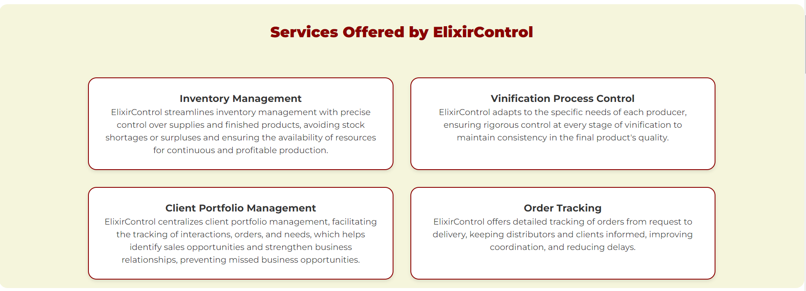


**Sección Pricing:**

En la sección de precios, se detallan los planes y precios de ElixirControl. Esta información es esencial para que los visitantes conozcan las opciones disponibles y puedan elegir la que mejor se adapte a sus necesidades.

Imagen 04: Sección Pricing
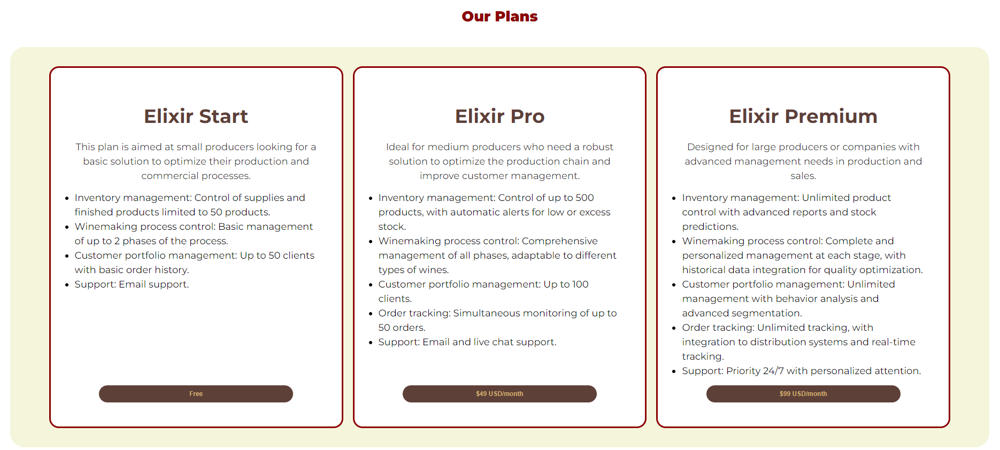


**Sección About the App:**

En esta sección, se presenta información detallada sobre la aplicación ElixirControl, sus características y funcionalidades. Esto permite a los visitantes conocer más sobre la aplicación y cómo puede ayudarles en su día a día.

Imagen 05: Sección About the App


**Sección Testimonials:**

En la sección de testimonios, se presentan opiniones y comentarios de usuarios reales que han utilizado ElixirControl. Esto ayuda a generar confianza en los visitantes y a mostrarles la experiencia positiva de otros usuarios.

Imagen 06: Sección Testimonials

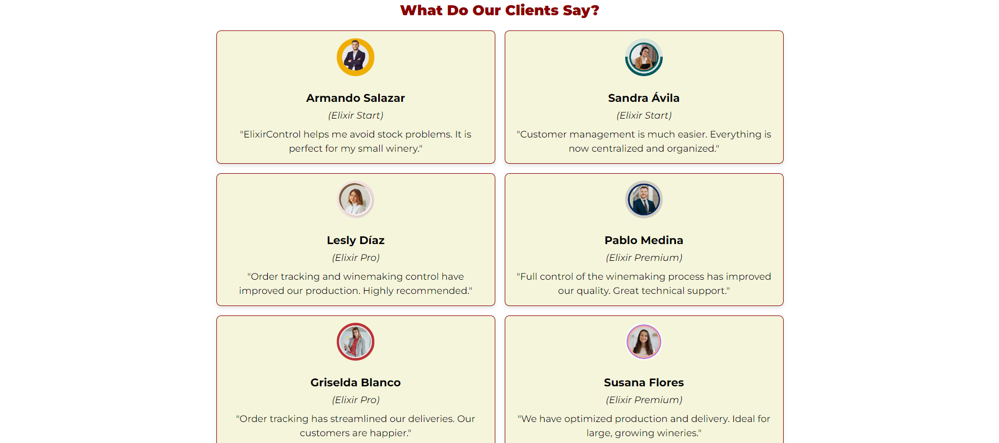

**Sección About the Team:**

En la sección "About the Team", se presenta información sobre el equipo de desarrollo de ElixirControl. Esto permite a los visitantes conocer a las personas detrás del servicio y generar confianza en la calidad y profesionalismo del equipo.


**Sección Contact:**

En la sección de contacto, se presenta un formulario que permite a los visitantes enviar consultas, comentarios o solicitudes de información sobre ElixirControl. Esto facilita la comunicación con los usuarios y permite responder a sus necesidades de manera eficiente.

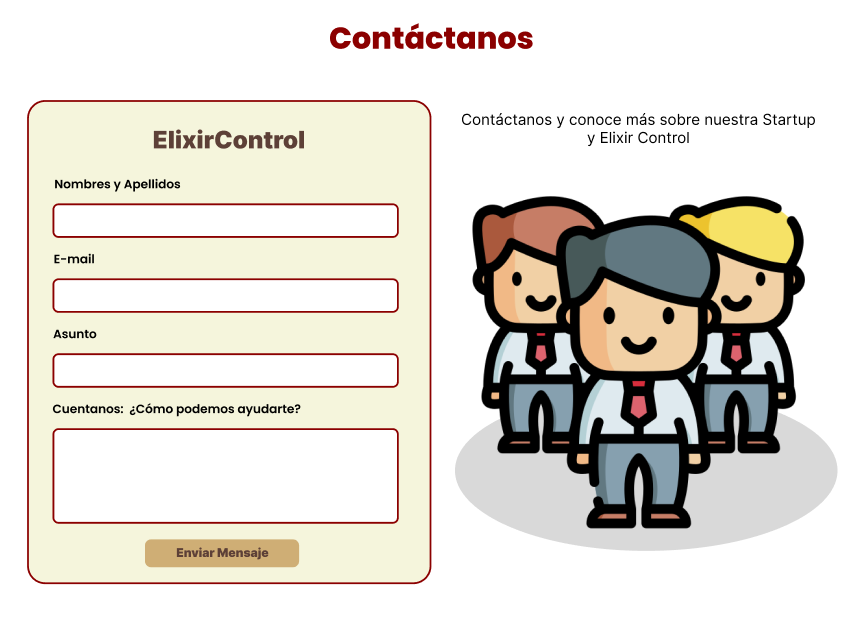

**Footer:**

En el pie de página (Footer), se incluyen enlaces a las redes sociales de ElixirControl, información de contacto y un botón para volver al inicio de la página. Esto permite a los visitantes acceder a más información y mantenerse conectados con el servicio.


##### 5.2.1.6. Services Documentation Evidence for Sprint Review.

En el primer Sprint el equipo de desarrollo de MetaSoft ha diseñado, programado y puesto en funcionamiento el sitio web (Landing Page) Para presentar la aplicación Web propuesta denominada "ElixirControl". En este sitio web (Landing Page), se lográ visualizar varias secciones que ilustran en que consiste "ElixirControl", cada integrante del equipo de desarrollo de Metasoft estuvo a cargo de una sección en especifico.

<table>
  <thead>
    <tr>
      <th>End Point</th>
      <th> Funciones</th>
    </tr>
  </thead>
  <tbody>
    <tr>
        <td>https://sv51-metasoft-app-web.github.io/ElixirControl-Landing-Page/</td>
        <td>Mostrar la Landing Page Desplegada</td>
    </tr>
  </tbody>
</table>


##### 5.2.1.7. Software Deployment Evidence for Sprint Review.

Para la implementación de nuestro sitio web, optamos por utilizar GitHub Pages. En este proceso, creamos un repositorio en GitHub donde gestionamos el control de versiones. En la sección de Configuración, publicamos el proyecto almacenado en la rama "realease-V1.0" que previamente se encontrba en la rama release-1.0.

[Landing Page ElexirControl](https://sv51-metasoft-app-web.github.io/ElixirControl-Landing-Page/) - https://sv51-metasoft-app-web.github.io/ElixirControl-Landing-Page/


##### 5.2.1.8. Team Collaboration Insights during Sprint.

En esta entrega, nuestra meta principal fue la implementación de la Landing Page. Para llevar a cabo este objetivo, hicimos uso de diversas herramientas como GitHub, Visual Studio Code, WebStorm, HTML, CSS y JavaScript. A continuación, vamos a presentar los diagramas de flujo que representan los commits realizados por cada miembro del equipo MetaSoft:

A continuación se muestra la cantidad de commits realizadas por cada integrante del equipo durante el desarrollo de la landing page.

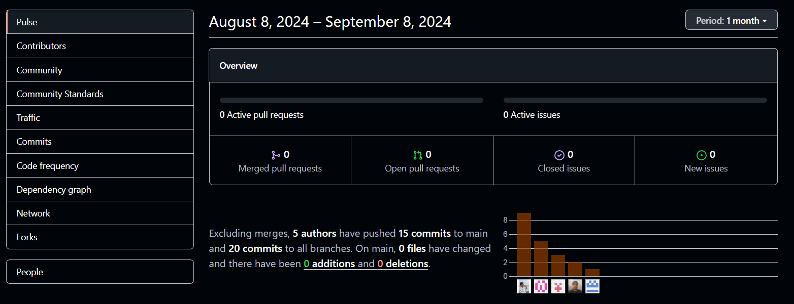

Los siguientes gráficos ofrecen una representación visual de las clonaciones registradas en nuestro repositorio, junto con la fecha en que cada una de estas acciones se llevó a cabo. Además, se presenta información sobre la cantidad de visitantes que ha tenido el repositorio de nuestro equipo a lo largo del tiempo.

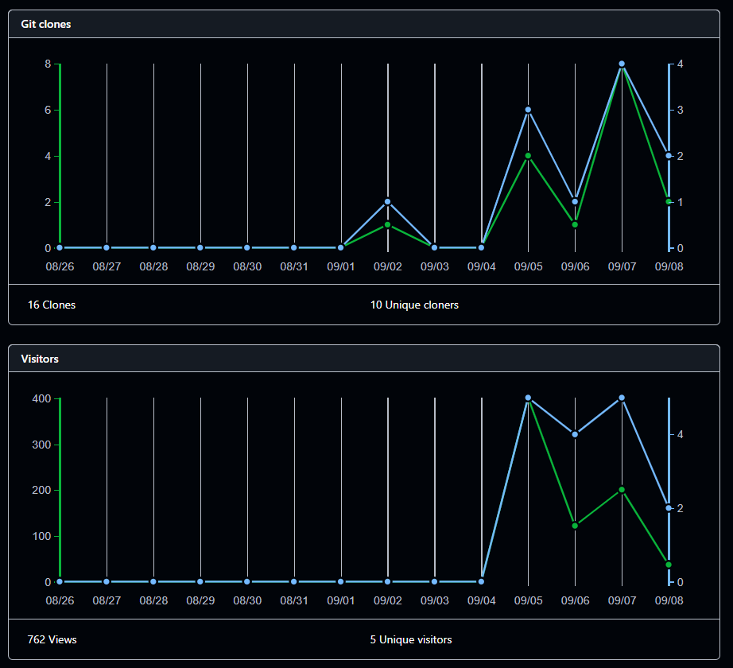


#### 5.2.2. Sprint 2
En esta etapa de nuestro proyecto, nos hemos enfocado en implementar la funcionalidad de gestión y trazabilidad del proceso de vinificación dentro de nuestra aplicación ElixirControl, utilizando Vite y Vue en WebStorm como herramientas de desarrollo. Al finalizar este Sprint, se espera que todas las funcionalidades relacionadas, incluyendo la creación, edición y visualización de pedidos, estén completamente operativas. A continuación, se incluyen imágenes que muestran cómo gestionamos las tareas en nuestro tablero de Jira Software, reflejando el progreso y la asignación de responsabilidades del equipo.

##### 5.2.2.1. Sprint Planning 2

##### 5.2.2.2. Sprint Backlog 2
<table>
  <thead>
    <tr>
      <th>User Story</th>
      <th>Title</th>
      <th>Id</th>
      <th>Title</th>
      <th>Description</th>
      <th>Estimation (Hours)</th>
      <th>Assigned To</th>
      <th>Status</th>
    </tr>
  </thead>
  <tbody>
    <tr>
      <td>US-009</td>
      <td>Integración de Validadores en Formularios de la App Web</td>
      <td>T001</td>
      <td>Login de distribuidor y productor.</td>
      <td>Implementar formulario para logeo de distribuidores y productores.</td>
      <td>2</td>
      <td></td>
      <td>To-do</td>
    </tr>
    <tr>
      <td>US-031</td>
      <td>Registro de Datos de Productores</td>
      <td>T002</td>
      <td>Registro de productor.</td>
      <td>Implementar formulario para registro de nuevos productores.</td>
      <td>2</td>
      <td></td>
      <td>To-do</td>
    </tr>
    <tr>
      <td>US-006</td>
      <td>Registro de Entrada de Insumos</td>
      <td>T003</td>
      <td>Registro de insumos.</td>
      <td>Agregar función para registrar insumos en el inventario.</td>
      <td>4</td>
      <td></td>
      <td>To-do</td>
    </tr>
    <tr>
      <td>US-007</td>
      <td>Registro de Salida de Productos Terminados</td>
      <td>T004</td>
      <td>Salida de productos.</td>
      <td>Agregar función para actualizar el inventario.</td>
      <td>4</td>
      <td></td>
      <td>To-do</td>
    </tr>
    <tr>
      <td>US-008</td>
      <td>Visualizar Datos de Solicitud</td>
      <td>T005</td>
      <td>Mostrar datos de solicitud.</td>
      <td>Añadir función para mostrar los datos de solicitud y filtrarlos.</td>
      <td>4</td>
      <td></td>
      <td>To-do</td>
    </tr>
    <tr>
      <td>US-020</td>
      <td>Gestión de Lotes de Producción</td>
      <td>T006</td>
      <td>Visualización de lotes.</td>
      <td>Añadir funcionalidad para que el usuario pueda visualizar todos los lotes que ha gestionado.</td>
      <td>3</td>
      <td></td>
      <td>To-do</td>
    </tr>
    <tr>
      <td>US-032</td>
      <td>Edición de Lotes</td>
      <td>T007</td>
      <td>Editar lotes.</td>
      <td>Añadir funcionalidad para que el usuario pueda modificar la información de un lote.</td>
      <td>2</td>
      <td></td>
      <td>To-do</td>
    </tr>
    <tr>
      <td>US-033</td>
      <td>Eliminación de lotes</td>
      <td>T008</td>
      <td>Eliminar lote seleccionado.</td>
      <td>Añadir funcionalidad para que el usuario pueda eliminar un lote seleccionado.</td>
      <td>2</td>
      <td></td>
      <td>To-do</td>
    </tr>
    <tr>
      <td>US-009</td>
      <td>Registro de Datos de Clientes</td>
      <td>T009</td>
      <td>Registro de nuevo cliente.</td>
      <td>Agregar opción para poder registrar un nuevo cliente con sus datos.</td>
      <td>3</td>
      <td></td>
      <td>To-do</td>
    </tr>
    <tr>
      <td>US-034</td>
      <td>Visualización de detalles de cliente</td>
      <td>T010</td>
      <td>Visualizar informacion del cliente.</td>
      <td>Implementar funcionalidad para ver los detalles del cliente seleccionado.</td>
      <td>3</td>
      <td></td>
      <td>To-do</td>
    </tr>
    <tr>
      <td>US-035</td>
      <td>Edición de información del cliente</td>
      <td>T011</td>
      <td>Modificar datos del cliente</td>
      <td>Implementar función para poder modificar los datos del cliente.</td>
      <td>3</td>
      <td></td>
      <td>To-do</td>
    </tr>
    <tr>
      <td>US-036</td>
      <td>Eliminación de cliente</td>
      <td>T012</td>
      <td>Eliminar el cliente de la lista</td>
      <td>Implementar función para eliminar un cliente de la lista.</td>
      <td>3</td>
      <td></td>
      <td>To-do</td>
    </tr>
    <tr>
      <td>US-011</td>
      <td>Registro de Pedidos de Clientes</td>
      <td>T013</td>
      <td>Registro de pedido.</td>
      <td>Agregar formulario para que el usuario registre su pedido.</td>
      <td>4</td>
      <td></td>
      <td>To-do</td>
    </tr>
    <tr>
      <td>US-037</td>
      <td>Visualización de pedidos</td>
      <td>T014</td>
      <td>Visualizar lista de pedidos.</td>
      <td>Agregar funcionalidad para que el usuario vea la lista de pedidos.</td>
      <td>4</td>
      <td></td>
      <td>To-do</td>
    </tr>
    <tr>
      <td>US-012</td>
      <td>Visualización de Productos Disponibles</td>
      <td>T015</td>
      <td>Visualización de productos.</td>
      <td>Añadir función para que el usuario pueda ver la lista de productos.</td>
      <td>4</td>
      <td></td>
      <td>To-do</td>
    </tr>
    <tr>
      <td>US-038</td>
      <td>Búsqueda de productos</td>
      <td>T016</td>
      <td>Sistema de búsqueda de productos.</td>
      <td>Añadir funcionalidad para que el usuario pueda realizar la búsqueda de un pedido.</td>
      <td>3</td>
      <td></td>
      <td>To-do</td>
    </tr>
    <tr>
      <td>US-013</td>
      <td>Visualizar Historial de Pedidos</td>
      <td>T017</td>
      <td>Acceso al historial.</td>
      <td>Agregar opción para que el usuario pueda ver la lista de pedidos realizados.</td>
      <td>3</td>
      <td></td>
      <td>To-do</td>
    </tr>
    <tr>
      <td>US-039</td>
      <td>Filtrado por fecha.</td>
      <td>T018</td>
      <td>Filtrado de pedido por fecha.</td>
      <td>Agregar opción de poder filtrar un pedido específico usando un rango de fechas.</td>
      <td>4</td>
      <td></td>
      <td>To-do</td>
    </tr>
    <tr>
      <td>US-40</td>
      <td>Detalles del Pedido</td>
      <td>T019</td>
      <td>Detalles del pedido.</td>
      <td>Agregar opción para mostrar los detalles completos de un pedido.</td>
      <td>4</td>
      <td></td>
      <td>To-do</td>
    </tr>
  </tbody>
</table>


##### 5.2.2.3. Development Evidence for Sprint Review
<table>
  <tr>
    <th>Repository</th>
    <th>Branch</th>
    <th>Commit Id</th>
    <th>Commit Message</th>
    <th>Commit Message Body</th>
    <th>Committed on (Date)</th>
  </tr>
  <tr>
    <td>https://github.com/SV51-MetaSoft-App-Web/ElixirControl-FrontEnd.git</td>
    <td>Master</td>
    <td>7f851107203c3991fc1fe0d251782570f03545a8</td>
    <td>Chore: initial commit</td>
    <td></td>
    <td>Sep 19, 2024</td>
  </tr>
  <tr>
    <td></td>
    <td></td>
    <td>7568ba72396e0ef2642a8a2b80ac0d550e955b0f</td>
    <td>Chore: clean up project</td>
    <td></td>
    <td></td>
  </tr>
  <tr>
    <td></td>
    <td></td>
    <td>410beb3309b6bfc3b2ee7fd19e2f25a9d244277f</td>
    <td>Chore: added initial project configuration</td>
    <td></td>
    <td></td>
  </tr>
  <tr>
    <td></td>
    <td>Develop</td>
    <td></td>
    <td></td>
    <td></td>
    <td></td>
  </tr>
  <tr>
    <td></td>
    <td>Feature/customer-management</td>
    <td>29c992c042ea81ee18785d764f06877138612f83</td>
    <td>Chore: create db.json</td>
    <td></td>
    <td>Sep 27, 2024</td>
  </tr>
  <tr>
    <td></td>
    <td>Feature/distributor-profile</td>
    <td>e8e82c48b77706b8ee8f20412a76f0c67e73bbbc</td>
    <td>Feat(distrubutor-profile): added db.json file to simulate the API</td>
    <td></td>
    <td>Sep 25, 2024</td>
  </tr>
  <tr>
    <td></td>
    <td></td>
    <td>56974485b42a727becd17f1e65558c9af334fb5c</td>
    <td>feat(distributor-profile): update App.vue component to improve the design</td>
    <td></td>
    <td></td>
  </tr>
  <tr>
    <td></td>
    <td></td>
    <td>33399c36ae71240f7ee69a2a28992da55e6f71da</td>
    <td>feat(distributor-profile): entities and services corresponding to the distributor profile order history section have been added</td>
    <td></td>
    <td></td>
  </tr>
  <tr>
    <td></td>
    <td></td>
    <td>c12ef7575564e2680bb1e6098c8891d7d04bf7b3</td>
    <td>feat(distributor-profile): delete other entities and services dont corresponding to the distributor profile order history section have been added</td>
    <td></td>
    <td></td>
  </tr>
  <tr>
    <td></td>
    <td>Feature/inventory-management</td>
    <td>c6cdbc0dfea0c84aaf59ea49f1b86708a014c675</td>
    <td>feat(inventory-management): added db.json file to simulate the API</td>
    <td></td>
    <td>Sep 25, 2024</td>
  </tr>
  <tr>
    <td></td>
    <td></td>
    <td>1d11d40e488cca8c5007bb53316a726c55a6c45c</td>
    <td>feat(inventory-management): update App.vue component to improve the design</td>
    <td></td>
    <td></td>
  </tr>
  <tr>
    <td></td>
    <td></td>
    <td>e4b658a0d4ab734cd8c1ee4f596bc6f6843b33bc</td>
    <td>feat(inventory-management): entities and services corresponding to the inventory management have been added.</td>
    <td></td>
    <td></td>
  </tr>
  <tr>
    <td></td>
    <td>Feature/producer-management</td>
    <td>f82742e28e0414009dfd0854e36faf0bd194bf94</td>
    <td>feat(winemaking-process): Entities and services corresponding to the winemaking process have been added.</td>
    <td></td>
    <td>Sep 23, 2024</td>
  </tr>
  <tr>
    <td></td>
    <td>Feature/winemaking-process</td>
    <td>d4bc3b86517a15e6032fe4827abdfca3e9adf1c2</td>
    <td>feat(winemaking-process): Added components for creating and editing objects.</td>
    <td></td>
    <td>Sep 24, 2024</td>
  </tr>
  <tr>
    <td></td>
    <td></td>
    <td>45437600b7b04a168285c4af5fb6582a0e216412</td>
    <td>feat(winemaking-process): Added CRUD to the table with batch information.</td>
    <td></td>
    <td>Sep 25, 2024</td>
  </tr>
  <tr>
    <td></td>
    <td></td>
    <td>113c3afe8a4bb5c43bb85421daa11adcca12a755</td>
    <td>feat(winemaking-process): Added CRUD to the table with fermentation information.</td>
    <td></td>
    <td></td>
  </tr>
  <tr>
    <td></td>
    <td></td>
    <td>0d5411dfec6057d3c2dbf1fa2e4b88387a915526</td>
    <td>feat(winemaking-process): Added CRUD to the table with aging information.</td>
    <td></td>
    <td>Sep 26, 2024</td>
  </tr>
  <tr>
    <td></td>
    <td></td>
    <td>208f92424d3a0901c97c3e5d1c81cd882fcb2d2d</td>
    <td>feat(winemaking-process): Added CRUD to the table with bottling information.</td>
    <td></td>
    <td></td>
  </tr>
  <tr>
    <td></td>
    <td></td>
    <td>51082f2a5ac747e5179a278b4488d1c8b5e3530b</td>
    <td>feat(winemaking-process): Added CRUD to the table with clarification and pressing information.</td>
    <td></td>
    <td>Sep 27, 2024</td>
  </tr>
  <tr>
    <td></td>
    <td></td>
    <td>49f65887335478860a0ac6c0d86a345ecc764f0d</td>
    <td>feat(winemaking-process): Added web app navigation bar.</td>
    <td></td>
    <td></td>
  </tr>
  <tr>
    <td></td>
    <td>Feature/security</td>
    <td>70e035609157b60943f11454652b905b90d8492d</td>
    <td>feat(security): added "en.json" and "es.json" files.</td>
    <td></td>
    <td>Sep 25, 2024</td>
  </tr>
  <tr>
    <td></td>
    <td></td>
    <td>aec471b4dae50e2e04b12112153338e826fc6f7c</td>
    <td>feat(security): added content of "index.js".</td>
    <td></td>
    <td></td>
  </tr>
  <tr>
    <td></td>
    <td></td>
    <td>0df6f357e4aee9314c137a477ea3e8bd8c8c1088</td>
    <td>feat(security): added pages in "views" section.</td>
    <td></td>
    <td></td>
  </tr>
  <tr>
    <td></td>
    <td></td>
    <td>c517242c4af0a179ef98eae9f9f8cc3679643bd9</td>
    <td>feat(security): added content of "App.vue" and "main.js".</td>
    <td></td>
    <td></td>
  </tr>
  <tr>
    <td></td>
    <td></td>
    <td>cb0a0b2c9e4095d8d52cabb7915c047a5744c78f</td>
    <td>feat(security): added content of "i18n.js" and "style.css".</td>
    <td></td>
    <td></td>
  </tr>
  <tr>
    <td></td>
    <td></td>
    <td>6810bd939a24f60aabba0049ea5e1642a265c5e9</td>
    <td>feat(security): added content of "vite.config.js".</td>
    <td></td>
    <td></td>
  </tr>
  <tr>
    <td></td>
    <td></td>
    <td>dec1b180326dec39db5801f8af263227a3ba8059</td>
    <td>feat(security): updated "style.css" and "vite.config.js".</td>
    <td></td>
    <td></td>
  </tr>
  <tr>
    <td></td>
    <td></td>
    <td>bd4043a36ffd972f4496196bb32bcb4b6b99fb46</td>
    <td>feat(security): added the component "Header.vue".</td>
    <td></td>
    <td></td>
  </tr>
</table>


##### 5.2.2.4. Testing Suite Evidence for Sprint Review

##### 5.2.2.5. Execution Evidence for Sprint Review
En este Sprint, nos hemos enfocado en el desarrollo y la implementación de la interfaz de gestión de pedidos, un componente esencial para mejorar la experiencia del usuario en nuestra aplicación. A través de un diseño intuitivo y funcional, buscamos facilitar la creación, edición y visualización de pedidos, permitiendo a los usuarios gestionar sus transacciones de manera eficiente y efectiva. Durante este período, hemos trabajado en varias vistas clave que contribuyen a esta funcionalidad. A continuación, se presentan las capturas de pantalla que ilustran las diferentes etapas del proceso de gestión de pedidos, destacando las características y mejoras implementadas. A continuación, te presentamos capturas de pantalla del desarrollo del front-end: 


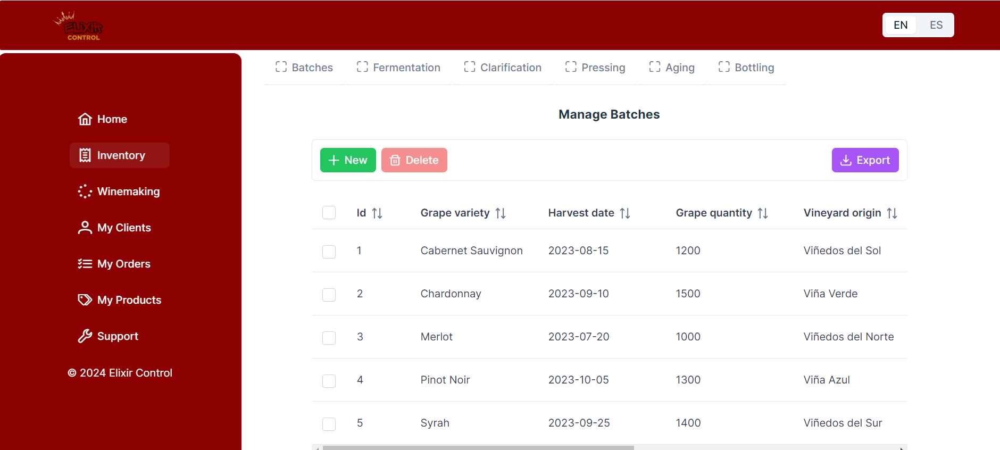

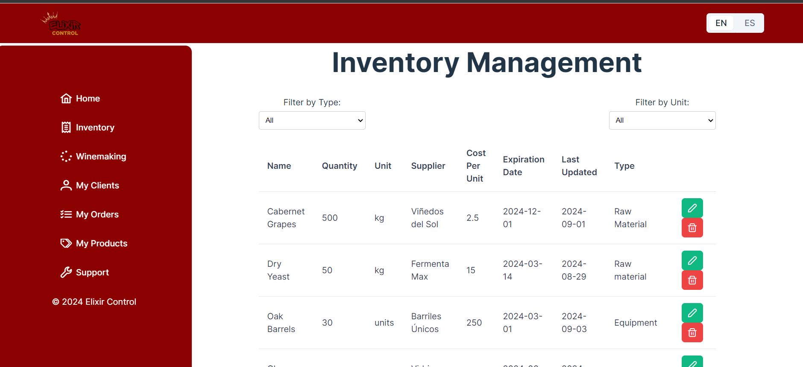

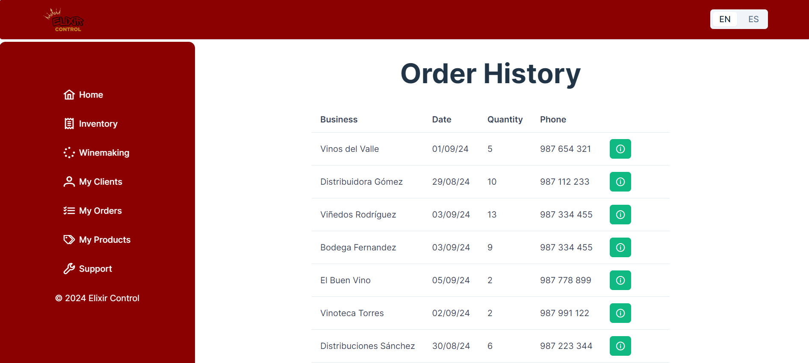

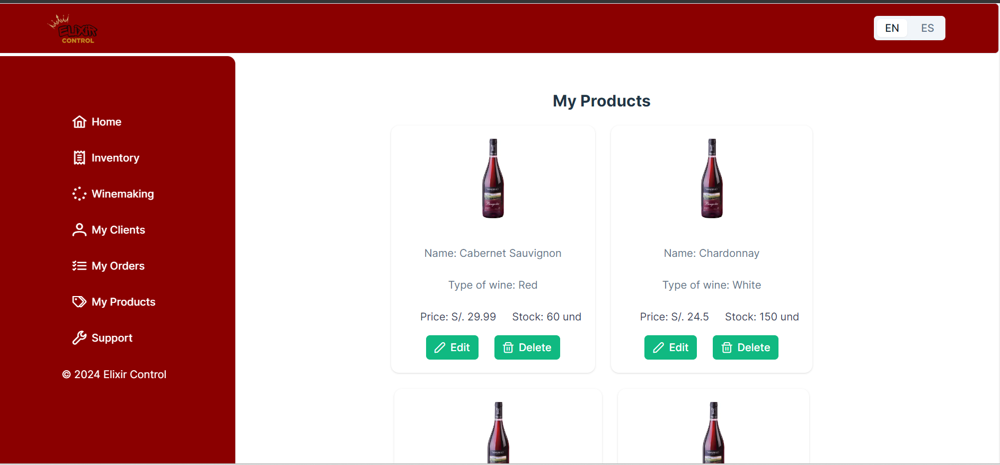


##### 5.2.2.6. Services Documentation Evidence for Sprint Review
Durante este Sprint, se ha llevado a cabo la documentación de los endpoints necesarios para la gestión de pedidos, utilizando OpenAPI como herramienta de referencia. Este proceso es fundamental para asegurar que todos los miembros del equipo, así como los desarrolladores futuros, tengan acceso a información clara y detallada sobre cómo interactuar con la API. La tabla a continuación detalla los endpoints documentados, proporcionando una visión clara de las acciones disponibles, los métodos HTTP asociados, y ejemplos de respuestas esperadas. Esta documentación no solo facilita el trabajo del equipo de desarrollo, sino que también mejora la comunicación entre los diferentes actores del proyecto.

| Endpoint | Acción | Verbo HTTP | Descripción | Ejemplo de Response |
|----------|--------|------------|-------------|---------------------|
| /api/pedidos | Crear Pedido | POST | Crea un nuevo pedido | { "id": 1, "status": "creado" } |
| /api/pedidos/{id} | Editar Pedido | PUT | Actualiza un pedido existente | { "id": 1, "status": "actualizado" } |
| /api/pedidos | Listar Pedidos | GET | Retorna la lista de pedidos | [{ "id": 1, "status": "creado" }, { "id": 2, "status": "enviado" }] |

La correcta implementación de estos endpoints en la aplicación, desarrollada con Vite y Vue en WebStorm, garantiza que los usuarios puedan gestionar sus pedidos de manera eficiente. Este enfoque no solo optimiza el flujo de trabajo, sino que también asegura que la experiencia del usuario sea fluida y satisfactoria. Además, la estandarización de la documentación mediante OpenAPI promueve una mejor colaboración entre equipos y una integración más sencilla con otros servicios en el futuro.

##### 5.2.2.7. Software Deployment Evidence for Sprint Review
Durante este Sprint, se llevó a cabo el proceso de despliegue de la aplicación utilizando Vite y Vue en WebStorm. La implementación se realizó en un entorno de producción, garantizando que todas las características desarrolladas fueran accesibles para los usuarios finales. El despliegue se realizó siguiendo una serie de pasos estructurados que incluyeron la preparación del entorno, la construcción del proyecto y la configuración del servidor. A continuación, se describen las etapas clave del proceso:
1. **Preparación del Entorno:** Se verificó que el entorno de producción estuviera configurado adecuadamente. Esto incluyó la instalación de las dependencias necesarias y la configuración de variables de entorno para asegurar que la aplicación funcionara correctamente en producción.
2. **Construcción del Proyecto:** Utilizando Vite, se ejecutó el comando de construcción, lo que permitió generar los archivos optimizados para producción. Este proceso optimiza el tamaño de los archivos y mejora el rendimiento de la aplicación.
3. **Configuración del Servidor:** Una vez construidos los archivos, se configuró el servidor para servir la aplicación. Esto incluyó la configuración de redirecciones adecuadas y la optimización de la entrega de contenido estático, asegurando que la aplicación se cargara rápidamente para los usuarios.
4. **Despliegue en Producción:** Finalmente, se subieron los archivos generados al repositorio de GitHub del grupo de trabajo. Como cada integrante trabajó en una rama diferente, se hizo “merge” para garantizar la recopilación general del proyecto.

##### 5.2.2.8. Team Collaboration Insights during Sprint

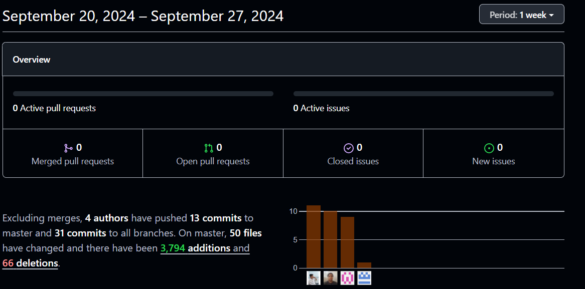

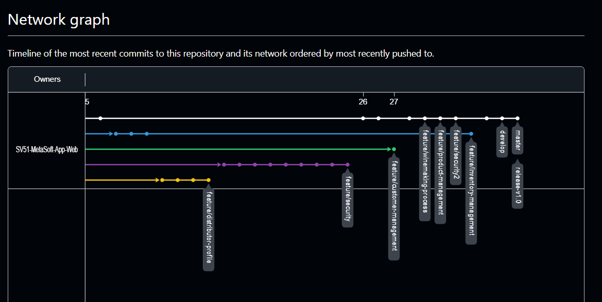

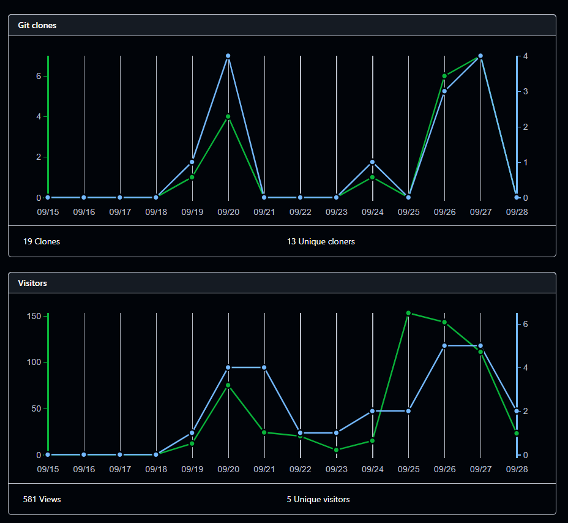


## 5.2.3. Sprint 3


#### 5.2.3.1.Spring Planning 3.

<table>
    <thead>
        <tr>
            <th>Sprint #</th>
            <th>Sprint 3</th>
        </tr>
    </thead>
    <tbody>
        <!--====================================================================-->
        <tr>
            <td colspan="2"> <p1 style="text-align: center;"> Sprint Planning Background </p1></td>
        </tr>
        <!--====================================================================-->
        <tr>
            <td>Date</td>
            <td>12-10-2024</td>
        </tr>
        <!--====================================================================-->
        <tr>
            <td>Time</td>
            <td> 10:00 p.m </td>
        </tr>
        <!--====================================================================-->
        <tr>
            <td>Location</td>
            <td>Discord</td>
        </tr>
        <!--====================================================================-->
        <tr>
            <td>Prepared By</td>
            <td>Janover Saldaña</td>
        </tr>
        <!--====================================================================-->
        <tr>
            <td>Attendees (to planning meeting)</td>
            <td>Oscar Armas - Luis Villegas</td>
        </tr>
        <!--====================================================================-->
        <tr>
            <td>Sprint 2 Review Summary</td>
            <td>Contenido Review</td>
        </tr>
        <!--====================================================================-->
        <tr>
            <td>Sprint 2 Retrospective Summary</td>
            <td>Contenido Retrospective</td>
        </tr>
        <!--====================================================================-->
        <tr>
            <td colspan="2"> <p1 style="text-align: center;"> Sprint Goal & User Stories </p1></td>
        </tr>
        <!--====================================================================-->
        <tr>
            <td>Sprint 3 Goal</td>
            <td> Por definir </td>
        </tr>
        <!--====================================================================-->
        <tr>
            <td>Sprint 3 Velocity</td>
            <td> Por definir </td>
        </tr>
        <!--====================================================================-->
        <tr>
            <td>Sum of Story Points</td>
            <td> Por Definir </td>
        </tr>
        <!--====================================================================-->
    </tbody>
</table>


#### 5.2.3.2.Sprint Backlog 3.


<!--Status -> (To-do / In-Process / To-Review / Done) -->

<table>
    <thead>
        <tr>
            <th colspan="7">Srpint 3</th>
            <th> Sprint 3</th>
        </tr>
    </thead>
    <tbody>
        <!--====================================================================-->
        <tr>
            <td colspan="1">User Story</td>
            <td colspan="15">Work-Item / Task</td>
        </tr>
        <!--====================================================================-->
        <tr>
            <td>Id</td>
            <td>Title</td>
            <td>Id</td>
            <td>Title</td>
            <td>Description</td>
            <td>Estimation (hours)</td>
            <td>Assigned To</td>
            <td>Status</td>
        </tr>
        <!--==================================USER STORY==================================-->
        <tr>
            <td rowspan="3" >  TS-01  </td>
            <td rowspan="3" > Obtener Datos de los procesos de vinificación</td>
            <td> TS-01-T-01 </td>
            <td> Crear modelo de datos de vinificación </td>
            <td> Definir el modelo de datos del proceso de vinificación en la base de datos, incluyendo campos de lote, fase y fechas de cada etapa.	</td>
            <td>ESTIMACIÓN</td>
            <td>Janover Saldaña</td>
            <td>Done</td>
        </tr>
        <!--====================================================================-->
        <tr>
            <td> TS-01-T-02 </td>
            <td> Implementar endpoint GET para lotes </td>
            <td> Configurar el endpoint GET (/api/v1/vinificacion/lotes) para consultar información detallada de cada lote en el proceso de vinificación.	</td>
            <td>ESTIMACIÓN</td>
            <td>PERSONA ASIGNADA</td>
            <td>Done</td>
        </tr>
        <!--====================================================================-->
        <tr>
            <td> TS-01-T-03 </td>
            <td> Implementar endpoint GET para etapas </td>
            <td> Crear endpoints GET (/api/v1/vinificacion/{lote}/etapa) para consultar el estado de cada etapa (fermentación, prensado, clarificación, etc.) de un lote.	</td>
            <td> ESTIMACIÓN </td>
            <td> PERSONA ASIGNADA </td>
            <td> Done </td>
        </tr>
        <!--==================================USER STORY==================================-->
        <tr>
            <td rowspan="2"> TS-03 </td>
            <td rowspan="2"> Eliminar Datos de los Procesos de Vinificación	</td>
            <td> TS-03-T01 </td>
            <td> Implementar endpoint DELETE para lotes	</td>
            <td> Configurar el endpoint DELETE (/api/v1/vinificacion/lotes/{id}) para eliminar un lote completo, incluyendo sus datos de cada etapa del proceso.	</td>
            <td> ESTIMACIÓN</td>
            <td> PERSONA ASIGNADA</td>
            <td> Done</td>
        </tr>
        <!--====================================================================-->
        <tr>
            <td> TS-03-T02 </td>
            <td> Desarrollar capa de servicio para eliminación	</td>
            <td> Crear la lógica de servicio para eliminar un lote y sus datos relacionados en la base de datos, asegurando integridad referencial.	</td>
            <td> ESTIMACIÓN </td>
            <td> PERSONA ASIGNADA </td>
            <td> Done </td>
        </tr>
        <!--==================================USER STORY==================================-->
        <tr>
            <td rowspan="1"> TS-04 </td>
            <td rowspan="1"> Registro de Lotes en el Proceso de Vinificación </td>
            <td> TS-04-T01</td>
            <td> Implementar endpoint POST para lotes	</td>
            <td> Crear el endpoint POST (/api/v1/vinificacion/lotes) para registrar nuevos lotes, incluyendo información básica como tipo de uva y fecha de inicio.	</td>
            <td> ESTIMACIÓN </td>
            <td> PERSONA ASIGNADA </td>
            <td> Done </td>
        </tr>
        <!--==================================USER STORY==================================-->
        <tr>
            <td rowspan="1"> TS-05 </td>
            <td rowspan="1"> Registro de Etapas en el Proceso de Vinificación </td>
            <td> TS-05-T-01 </td>
            <td> Implementar endpoint POST para etapas	</td>
            <td> Crear el endpoint POST (/api/v1/vinificacion/{lote}/etapas) para registrar nuevas etapas de fermentación, prensado, clarificación, envejecimiento y embotellado.	</td>
            <td> ESTIMACIÓN</td>
            <td> PERSONA ASIGNADA</td>
            <td> Done</td>
        </tr>
        <!--==================================USER STORY==================================-->
        <tr>
            <td rowspan="4"> CODE USER STORY	</td>
            <td rowspan="4">TITLE USER STORY</td>
            <td>CÓDIGO TAREAS</td>
            <td>TITULO TAREAS	</td>
            <td>DESCRIPCIÓN TAREA	</td>
            <td>ESTIMACIÓN</td>
            <td>PERSONA ASIGNADA</td>
            <td>Done</td>
        </tr> 
        <!--====================================================================-->
        <tr>
            <td>CÓDIGO TAREAS</td>
            <td>TITULO TAREAS	</td>
            <td>DESCRIPCIÓN TAREA	</td>
            <td>ESTIMACIÓN</td>
            <td>PERSONA ASIGNADA</td>
            <td>Done</td>
        </tr>
        <!--====================================================================-->
        <tr>
            <td>CÓDIGO TAREAS</td>
            <td>TITULO TAREAS	</td>
            <td>DESCRIPCIÓN TAREA	</td>
            <td>ESTIMACIÓN</td>
            <td>PERSONA ASIGNADA</td>
            <td>Done</td>
        </tr>
        <!--====================================================================-->
        <tr>
            <td>CÓDIGO TAREAS</td>
            <td>TITULO TAREAS	</td>
            <td>DESCRIPCIÓN TAREA	</td>
            <td>ESTIMACIÓN</td>
            <td>PERSONA ASIGNADA</td>
            <td>Done</td>   
        </tr>
        <!--==================================USER STORY==================================-->
        <tr>
            <td rowspan="3"> CODE USER STORY	</td>
            <td rowspan="3">TITLE USER STORY</td>
            <td>CÓDIGO TAREAS</td>
            <td>TITULO TAREAS	</td>
            <td>DESCRIPCIÓN TAREA	</td>
            <td>ESTIMACIÓN</td>
            <td>PERSONA ASIGNADA</td>
            <td>Done</td> 
        </tr>
        <!--====================================================================-->
        <tr>
            <td>CÓDIGO TAREAS</td>
            <td>TITULO TAREAS	</td>
            <td>DESCRIPCIÓN TAREA	</td>
            <td>ESTIMACIÓN</td>
            <td>PERSONA ASIGNADA</td>
            <td>Done</td>
        </tr>
        <!--====================================================================-->
        <tr>
            <td>CÓDIGO TAREAS</td>
            <td>TITULO TAREAS	</td>
            <td>DESCRIPCIÓN TAREA	</td>
            <td>ESTIMACIÓN</td>
            <td>PERSONA ASIGNADA</td>
            <td>Done</td>
        </tr>
        <!--====================================================================-->
    </tbody>
</table>


#### 5.2.3.3.Development Evidence for Sprint Review.


<table>
    <thead>
        <tr>
            <th rowspan="" >Repository</th>
            <th>Branch</th>
            <th>Commit Id</th>
            <th>Commit Message</th>
            <th>Commit Message Body</th>
            <th>Commited on (Date)</th>
        </tr>
    </thead>
    <tbody>
        <!--======================================REPOSITORY======================================-->
        <tr>
            <td rowspan="14">END POINT</td>
            <td>Branch	</td>
            <td>Commit Id</td>
            <td>Commit Message</td>
            <td>Commit Message Body</td>
            <td>Commited on (Date)</td>
        </tr>
        <!--=========================================FILA======================================-->
        <tr>
            <td>Branch	</td>
            <td>Commit Id</td>
            <td>Commit Message</td>
            <td>Commit Message Body</td>
            <td>Commited on (Date)</td>
        </tr>
        <!--=========================================FILA======================================-->
        <tr>
            <td>Branch	</td>
            <td>Commit Id</td>
            <td>Commit Message</td>
            <td>Commit Message Body</td>
            <td>Commited on (Date)</td>
        </tr>
        <!--=========================================FILA======================================-->
        <tr>
            <td>Branch	</td>
            <td>Commit Id</td>
            <td>Commit Message</td>
            <td>Commit Message Body</td>
            <td>Commited on (Date)</td>
        </tr>
        <!--=========================================FILA======================================-->
        <tr>
            <td>Branch	</td>
            <td>Commit Id</td>
            <td>Commit Message</td>
            <td>Commit Message Body</td>
            <td>Commited on (Date)</td>
        </tr>
        <!--=========================================FILA======================================-->
        <tr>
            <td>Branch	</td>
            <td>Commit Id</td>
            <td>Commit Message</td>
            <td>Commit Message Body</td>
            <td>Commited on (Date)</td>
        </tr>
        <!--=========================================FILA======================================-->
        <tr>
            <td>Branch	</td>
            <td>Commit Id</td>
            <td>Commit Message</td>
            <td>Commit Message Body</td>
            <td>Commited on (Date)</td>
        </tr>
        <!--=========================================FILA======================================-->
        <tr>
            <td>Branch	</td>
            <td>Commit Id</td>
            <td>Commit Message</td>
            <td>Commit Message Body</td>
            <td>Commited on (Date)</td>
        </tr>
        <!--=========================================FILA======================================-->
        <tr>
            <td>Branch	</td>
            <td>Commit Id</td>
            <td>Commit Message</td>
            <td>Commit Message Body</td>
            <td>Commited on (Date)</td>
        </tr>
        <!--=========================================FILA======================================-->
        <tr>
            <td>Branch	</td>
            <td>Commit Id</td>
            <td>Commit Message</td>
            <td>Commit Message Body</td>
            <td>Commited on (Date)</td>
        </tr>
        <!--=========================================FILA======================================-->
        <tr>
            <td>Branch	</td>
            <td>Commit Id</td>
            <td>Commit Message</td>
            <td>Commit Message Body</td>
            <td>Commited on (Date)</td> 
        </tr> 
        <!--=========================================FILA======================================-->
        <tr>
            <td>Branch	</td>
            <td>Commit Id</td>
            <td>Commit Message</td>
            <td>Commit Message Body</td>
            <td>Commited on (Date)</td>  
        </tr> 
        <!--=========================================FILA======================================-->
        <tr>
            <td>Branch	</td>
            <td>Commit Id</td>
            <td>Commit Message</td>
            <td>Commit Message Body</td>
            <td>Commited on (Date)</td>   
        </tr>
        <!--=========================================FILA======================================-->
        <tr>
            <td>Branch	</td>
            <td>Commit Id</td>
            <td>Commit Message</td>
            <td>Commit Message Body</td>
            <td>Commited on (Date)</td>  
        </tr> 
    </tbody>
</table>


#### 5.2.3.4.Testing Suite Evidence for Sprint Review.


#### 5.2.3.5.Execution Evidence for Sprint Review.


#### 5.2.3.6.Services Documentation Evidence for Sprint Review.

<table>
  <thead>
    <tr>
      <th>Endpoint</th>
      <th>HTTP Verb</th>
      <th>Function or Action</th>
    </tr>
  </thead>
  <tbody>
  <!--========================================FILA===============================-->
    <tr>
      <td>url Endpoint</td>
      <td>HTTP verb</td>
      <td>Descripción</td>
    </tr>
  <!--========================================FILA===============================-->
    <tr>
      <td>url Endpoint</td>
      <td>HTTP verb</td>
      <td>Descripción</td>
    </tr>
  <!--========================================FILA===============================-->
    <tr>
      <td>url Endpoint</td>
      <td>HTTP verb</td>
      <td>Descripción</td>
    </tr>
  <!--========================================FILA===============================-->
    <tr>
      <td>url Endpoint</td>
      <td>HTTP verb</td>
      <td>Descripción</td>
    </tr>
  <!--========================================FILA===============================-->
    <tr>
      <td>url Endpoint</td>
      <td>HTTP verb</td>
      <td>Descripción</td>
    </tr>
  </tbody>
</table>


#### 5.2.3.7.Software Deployment Evidence for Sprint Review.


#### 5.2.3.8.Team Collaboration Insights during Sprint.


## 5.3. Validation Interviews.

En esta sección se realizarán entrevistas mediante las cuales buscamos recoger opiniones y recomendaciones. Esto asegura que la aplicación web no solo cumpla con los requisitos técnicos, sino también con las expectativas de nuestros segmentos objetivos.

### 5.3.1. Diseño de Entrevistas.

**User Goal: Navegar por la landing page**

_User persona → Vinicultores y Distribuidores_

**_Explicación del flujo →_** El usuario deberá ingresar a la landing page de la aplicación web.
En esta, podrá desplazarse y visualizar información general sobre los servicios ofrecidos, 
así como los beneficios de utilizar la aplicación. Además, podrá cambiar el idioma a inglés
o español a través de un botón. También, tendrá acceso directo a la aplicación web a través
de un Call To Action situado en la vista principal de la landing page.

### **User goals para vinicultores:**

1. **Gestionar el inventario de insumos y materiales:**

    **_User Goal →_** Como vinicultor, necesito poder registrar y actualizar el inventario 
    de insumos y materiales para controlar la disponibilidad de estos. 

    **_Explicación del flujo →_** Los vinicultores deben ingresar a la sección de gestión de 
    inventario de la aplicación web, esta se puede realizar búsquedas de materiales específicos,
    añadir nuevos ítems, y ajustar las cantidades manualmente según las compras o el consumo 
    en el proceso productivo.

   <br>

2. **Gestionar la cartera de clientes:**

    **_User Goal →_** Como vinicultor, necesito poder gestionar la información de mis clientes
    
    **_Explicación del flujo →_** Los vinicultores pueden añadir, modificar o eliminar clientes
    desde el módulo de gestión de clientes. Deben actualizar la información básica como nombres,
    contactos, nombre de negocios, encargados, RUC del negocio,etc.

   <br>

3. **Gestionar productos disponibles para la venta:**

    **_User Goal →_** Como vinicultor, necesito poder llevar un registro de mis productos que
    están listos para la venta.
    
    **_Explicación del flujo →_**  Desde la vista de productos, deben seleccionar los que están
    en inventario y publicar su disponibilidad. Pueden ajustar cantidades en función de la 
    producción y eliminar productos que ya no estén disponibles.

   <br>

4. **Controlar el proceso productivo de vino por fases:**

    **_User Goal →_** Como vinicultor, necesito poder llevar un registro detallado de cada lote
    de vino en producción, incluyendo las fases de fermentación, clarificación, prensado, 
    añejamiento y embotellado.
    
    **_Explicación del flujo →_** Los vinicultores deben crear y gestionar lotes en la aplicación,
    ingresando datos sobre cada fase del proceso. A medida que el lote avanza, actualizan el estado
    de cada fase y pueden ingresar observaciones o ajustar los tiempos de cada una según el avance
    del lote.


### **User goals para distribuidores:**

### 5.3.2. Registro de Entrevistas.


### 5.3.3. Evaluaciones según heurísticas.

__________________________________________________________________________________________

<strong> <p style="text-align: center;"> UX Heuristics & Principles Evaluation </p> </strong> 

<p style="text-align: center; font-weight: bold;   font-style: italic;"> Usability – Inclusive Design – Information Architecture </p>

**_CARRERA:_** Ingeniería de Software

**_CURSO:_** Aplicaciones Web

**_SECCIÓN:_** SV51

**_PROFESOR:_** Angel Augusto Velasquez Nuñez

**_AUDITOR:_** MetaSoft

**_CLIENTE:_** MetaSoft

__________________________________________________________________________________________

**SITE o APP A EVALUAR:** ElixirControl

**TAREAS A EVALUAR:**

**_Landing Page: ElixirControl:_**

1. Definir Tarea 1
2. Definir Tarea 2
3. Definir Tarea 3
4. Definir Tarea 4

**_Web Application: ElixirControl:_**

1. Definir Tarea 1
2. Definir Tarea 2
3. Definir Tarea 3
4. Definir Tarea 4


**ESCALA DE SEVERIDAD:**

Los errores serán puntuados tomando en cuenta la siguiente escala de severidad

<table>
<thead>
  <tr>
    <th> Nivel </th>
    <th> Descripción </th>
  </tr>
</thead>

<tbody>
  <!--========================================= FILA 1 ======================================-->
  <tr>
    <td> 1 </td>
    <td> 
      Problema superficial: puede ser fácilmente superador por el usuario ó ocurre con muy poco
      frecuencia. No necesita ser arreglado a no ser que exista disponibilidad de tiempo 
    </td>
  </tr>
  <!--========================================= FILA 2 ======================================-->
  <tr>
    <td> 2 </td>
    <td> 
      Problema menor: puede ocurrir un poco más frecuentemente o es un poco más difícil de
      superar para el usuario. Se le debería asignar una prioridad baja resolverlo de cara al siguiente
      reléase
    </td>
  </tr>
  <!--========================================= FILA 3 ======================================-->
  <tr>
    <td> 3 </td>
    <td> 
      Problema mayor: ocurre frecuentemente o los usuarios no son capaces de resolverlos. Es
      importante que sean corregidos y se les debe asignar una prioridad alta.
    </td>
  </tr>
  <!--========================================= FILA 4 ======================================-->
  <tr>
    <td> 4 </td>
    <td> 
      Problema muy grave: un error de gran impacto que impide al usuario continuar con el uso de
      la herramienta. Es imperativo que sea corregido antes del lanzamiento
    </td>
  </tr>
</tbody>
</table>


**TABLA DE RESUMEN - LANDING PAGE:**

<table>
<thead>
 <tr>
  <th> # </th>
  <th> Problema </th>
  <th> Escala de severidad </th>
  <th> Heurística/Principio violada(o) </th>
</tr>
</thead>
<tbody>
<!--========================================= FILA 1 ======================================-->
<tr>
  <td> 1 </td>
  <td> Contenido del Problema </td>
  <td> Contenido de la Escala de severidad </td>
  <td> Contenido de Heurística/Principio violada(o) </td>
</tr>
<!--========================================= FILA 2 ======================================-->
<tr>
  <td> 2 </td>
  <td> Contenido del Problema </td>
  <td> Contenido de la Escala de severidad </td>
  <td> Contenido de Heurística/Principio violada(o) </td>
</tr>
<!--========================================= FILA 3 ======================================-->
<tr>
  <td> 3 </td>
  <td> Contenido del Problema </td>
  <td> Contenido de la Escala de severidad </td>
  <td> Contenido de Heurística/Principio violada(o) </td>
</tr>
<!--========================================= FILA 4 ======================================-->
<tr>
  <td> 4 </td>
  <td> Contenido del Problema </td>
  <td> Contenido de la Escala de severidad </td>
  <td> Contenido de Heurística/Principio violada(o) </td>
</tr>
</tbody>
</table>


**_DESCRIPCIÓN DE PROBLEMAS - LANDING PAGE:_**

**_PROBLEMA #1:_**

**_Severidad: 3_**

**_Problema:_**


**_Recomendación:_**


**TABLA DE RESUMEN - WEB APPLICATION:**
<table>
<thead>
 <tr>
  <th> # </th>
  <th> Problema </th>
  <th> Escala de severidad </th>
  <th> Heurística/Principio violada(o) </th>
</tr>
</thead>
<tbody>
<!--========================================= FILA 1 ======================================-->
<tr>
  <td> 1 </td>
  <td> Contenido del Problema </td>
  <td> Contenido de la Escala de severidad </td>
  <td> Contenido de Heurística/Principio violada(o) </td>
</tr>
<!--========================================= FILA 2 ======================================-->
<tr>
  <td> 2 </td>
  <td> Contenido del Problema </td>
  <td> Contenido de la Escala de severidad </td>
  <td> Contenido de Heurística/Principio violada(o) </td>
</tr>
<!--========================================= FILA 3 ======================================-->
<tr>
  <td> 3 </td>
  <td> Contenido del Problema </td>
  <td> Contenido de la Escala de severidad </td>
  <td> Contenido de Heurística/Principio violada(o) </td>
</tr>
<!--========================================= FILA 4 ======================================-->
<tr>
  <td> 4 </td>
  <td> Contenido del Problema </td>
  <td> Contenido de la Escala de severidad </td>
  <td> Contenido de Heurística/Principio violada(o) </td>
</tr>
</tbody>
</table>


**_DESCRIPCIÓN DE PROBLEMAS - WEB APPLICATION:_**

**_PROBLEMA #1:_**

**_Severidad: 3_**

**_Problema:_**


**_Recomendación:_**


## 5.4. Video About-the-Product.


## 6. Conclusiones, Bibliografía y Anexos.


### Conclusiones 


### Bibliografía


### Anexos

<table>
<thead>
    <tr>
        <th>Sección</th>
        <th>Características del video</th>
        <th>Sobre el contenido</th>
        <th>Integración y entrega</th>
    </tr>
</thead>
<tbody>
<!--========================================= FILA 1 ======================================-->
<tr>
  <td>Needfinding Interviews</td>
  <td>
    Cantidad de videos: 1
    Nomenclatura: upc-pre-202402-si730-sv51-metasoft-needfinding-sprint-1
    Formato: .mp4
  </td>
  <td> Consolida todas las entrevistas realizadas </td>
  <td> 
    Link: https://upcedupe-my.sharepoint.com/:v:/g/personal/u201923571_upc_edu_pe/EZw-9tmmOSJPsIy_Qcor0FkBBYUZFt8o47YcZmrvLmA8Fg?e=Pyj62I&nav=eyJyZWZlcnJhbEluZm8iOnsicmVmZXJyYWxBcHAiOiJTdHJlYW1XZWJBcHAiLCJyZWZlcnJhbFZpZXciOiJTaGFyZURpYWxvZy1MaW5rIiwicmVmZXJyYWxBcHBQbGF0Zm9ybSI6IldlYiIsInJlZmVycmFsTW9kZSI6InZpZXcifX0%3D 
</td>
</tr>
<!--========================================= FILA 2 ======================================-->
<tr>
  <td>Exposición</td>
  <td>
    Cantidad de videos: 1
    Nomenclatura: upc-pre-202402-si730-sv51-metasoft-expo-tb1
    Formato: .mp4
  </td>
  <td>Consolida las exposiciones de la TB1	</td>
  <td>
    Link: https://upcedupe-my.sharepoint.com/:v:/g/personal/u201923571_upc_edu_pe/ERTxpx1uyvJKmY3QL8mRb6sB8lFh8XQB4o_F_MernOdpGQ?nav=eyJyZWZlcnJhbEluZm8iOnsicmVmZXJyYWxBcHAiOiJTdHJlYW1XZWJBcHAiLCJyZWZlcnJhbFZpZXciOiJTaGFyZURpYWxvZy1MaW5rIiwicmVmZXJyYWxBcHBQbGF0Zm9ybSI6IldlYiIsInJlZmVycmFsTW9kZSI6InZpZXcifX0%3D&e=7R6pjN 
  </td>
</tr>
<!--========================================= FILA 3 ======================================-->
<tr>
  <td>
    Prototypes Navigation / Product Navigation
  </td>
  <td>
    Cantidad de videos: 1
    Nomenclatura: upc-pre-202402-si730-sv51-metasoft-prototype-navigation-sprint-1
    Formato: .mp4
  </td>
  <td>
    Consolida demostración del flujo de navegación de las aplicaciones, priorizando los user flows relacionados con el core business.	
  </td>
  <td>
    Link: https://upcedupe-my.sharepoint.com/:v:/g/personal/u201923571_upc_edu_pe/EQ3ShXzJBlJAllrQ9SJ3yY8Bacs6SF9dXo-7o_dXhgiZYw?e=e6Hn8s&nav=eyJyZWZlcnJhbEluZm8iOnsicmVmZXJyYWxBcHAiOiJTdHJlYW1XZWJBcHAiLCJyZWZlcnJhbFZpZXciOiJTaGFyZURpYWxvZy1MaW5rIiwicmVmZXJyYWxBcHBQbGF0Zm9ybSI6IldlYiIsInJlZmVycmFsTW9kZSI6InZpZXcifX0%3D
  </td>
</tr>
<!--========================================= FILA 4 ======================================-->
<tr>
  <td>
    Validation Interviews
  </td>
  <td>
    Contenido 
  </td>
  <td>
    Contenido 
  </td>
  <td>
    Contenido 
  </td>
</tr>
<!--========================================= FILA 5 ======================================-->
<tr>
  <td>
    About the Product
  </td>
  <td>
    Contenido 
  </td>
  <td>
    Contenido 
  </td>
  <td>
    Contenido 
  </td>
</tr>
<!--========================================= FILA 6 ======================================-->
<tr>
  <td>
    About the Team
  </td>
  <td>
    Contenido 
  </td>
  <td>
    Contenido 
  </td>
  <td>
    Contenido 
  </td>
</tr>
<!--========================================= FILA 7 ======================================-->
<tr>
  <td>
    Conclusiones, Bibliografía y Anexos
  </td>
  <td>
    Contenido 
  </td>
  <td>
    Contenido 
  </td>
  <td>
    Contenido 
  </td>
</tr>
</tbody>
</table>

